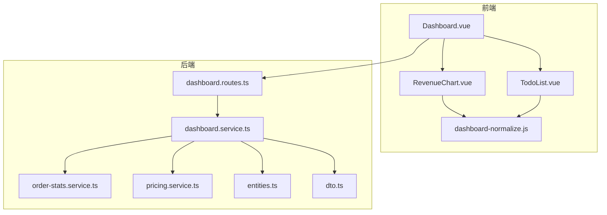
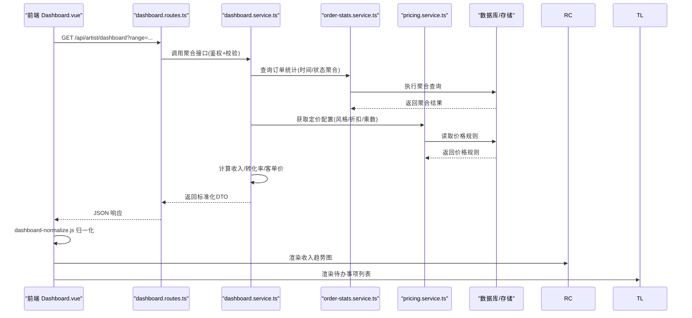
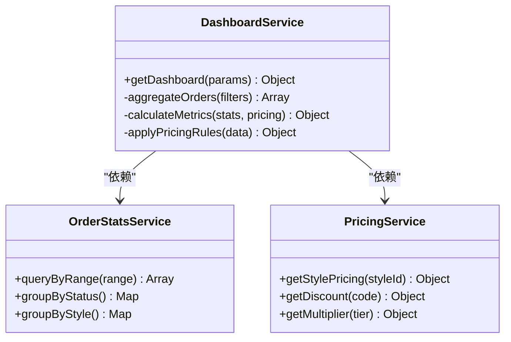
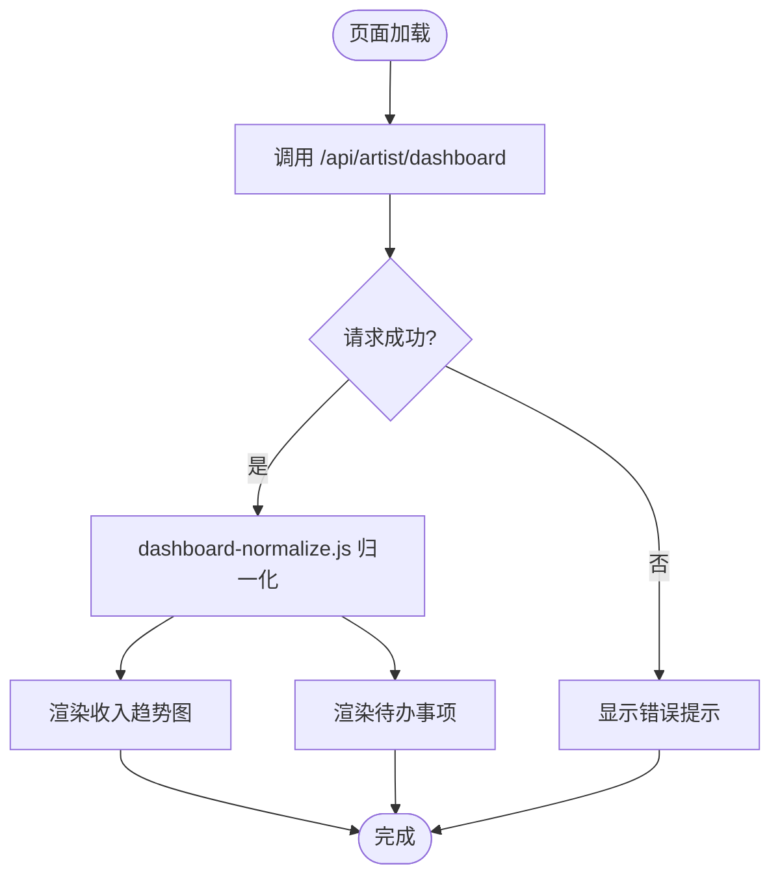
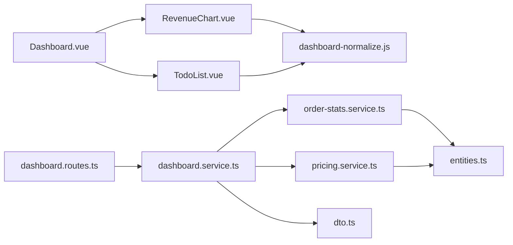

# 仪表盘与分析
> 修订版（2026-08-07，四号）：本文件为外部 repowiki 原文 仪表盘与分析.md 的仓库内修订版（修补批 #10），按 master 代码逐条核实修正；外部原文（C:\Users\qly19\Desktop\repowiki\）一字未动。
> 修订范围：文件名引用 .js→.ts（TS 迁移）、登录/会话描述对齐 REQ-027 TOTP、删除虚构变量/端点、迁移版本补至 v45。

<cite>
**本文引用的文件**   
- [server/src/features/artist/dashboard.routes.ts](file://server/src/features/artist/dashboard.routes.ts)
- [server/src/features/artist/dashboard.service.ts](file://server/src/features/artist/dashboard.service.ts)
- [server/src/features/order/order-stats.service.ts](file://server/src/features/order/order-stats.service.ts)
- [server/src/features/pricing/pricing.service.ts](file://server/src/features/pricing/pricing.service.ts)
- [web/src/views/artist/Dashboard.vue](file://web/src/views/artist/Dashboard.vue)
- [web/src/components/artist/dashboard/RevenueChart.vue](file://web/src/components/artist/dashboard/RevenueChart.vue)
- [web/src/components/artist/dashboard/TodoList.vue](file://web/src/components/artist/dashboard/TodoList.vue)
- [web/src/utils/dashboard-normalize.js](file://web/src/utils/dashboard-normalize.js)
- [server/src/types/entities.ts](file://server/src/types/entities.ts)
- [server/src/shared/dto.ts](file://server/src/shared/dto.ts)
</cite>

## 目录
1. [简介](#简介)
2. [项目结构](#项目结构)
3. [核心组件](#核心组件)
4. [架构总览](#架构总览)
5. [详细组件分析](#详细组件分析)
6. [依赖关系分析](#依赖关系分析)
7. [性能考量](#性能考量)
8. [故障排查指南](#故障排查指南)
9. [结论](#结论)
10. [附录](#附录)

## 简介
本文件为“阿里画师约稿管理平台”的仪表盘与分析模块提供系统化文档。内容覆盖：
- 数据统计引擎：收入统计、订单分析与性能指标收集
- 可视化图表组件：收入趋势图、订单分布图、待办事项列表
- 数据更新机制：REST 拉取（无 WebSocket）
- 与订单系统、定价系统的数据集成
- 数据分析最佳实践与性能优化建议

目标读者包括前端开发者、后端工程师、产品与运营人员，力求以循序渐进的方式呈现技术细节与实践指导。

## 项目结构
仪表盘与分析模块由前后端协同实现：
- 后端服务层负责聚合订单与定价数据，计算统计指标，并通过 API 暴露给前端
- 前端视图与组件负责请求数据、归一化展示、渲染图表与交互

**图示来源** 
- [web/src/views/artist/Dashboard.vue](file://web/src/views/artist/Dashboard.vue)
- [web/src/components/artist/dashboard/RevenueChart.vue](file://web/src/components/artist/dashboard/RevenueChart.vue)
- [web/src/components/artist/dashboard/TodoList.vue](file://web/src/components/artist/dashboard/TodoList.vue)
- [web/src/utils/dashboard-normalize.js](file://web/src/utils/dashboard-normalize.js)
- [server/src/features/artist/dashboard.routes.ts](file://server/src/features/artist/dashboard.routes.ts)
- [server/src/features/artist/dashboard.service.ts](file://server/src/features/artist/dashboard.service.ts)
- [server/src/features/order/order-stats.service.ts](file://server/src/features/order/order-stats.service.ts)
- [server/src/features/pricing/pricing.service.ts](file://server/src/features/pricing/pricing.service.ts)
- [server/src/types/entities.ts](file://server/src/types/entities.ts)
- [server/src/shared/dto.ts](file://server/src/shared/dto.ts)

**章节来源**
- [server/src/features/artist/dashboard.routes.ts](file://server/src/features/artist/dashboard.routes.ts)
- [server/src/features/artist/dashboard.service.ts](file://server/src/features/artist/dashboard.service.ts)
- [web/src/views/artist/Dashboard.vue](file://web/src/views/artist/Dashboard.vue)

## 核心组件
- 仪表盘路由与控制器：统一入口，鉴权、参数校验、调用服务层并返回标准化响应
- 仪表盘服务层：聚合订单统计与定价信息，计算收入、转化率、平均客单价等指标
- 订单统计服务：按时间维度、状态维度聚合订单数据，支持分页与过滤
- 定价服务：获取风格档位、折扣、乘数等价格相关配置，用于收入换算与对比
- 前端视图 Dashboard.vue：页面编排、数据拉取、错误处理与刷新策略
- 收入趋势图 RevenueChart.vue：折线/面积图渲染，时间轴缩放与交互
- 待办事项 TodoList.vue：未完成订单、交付提醒、优先级排序
- 数据归一化工具 dashboard-normalize.js：将后端原始数据转换为前端图表与列表所需格式

**章节来源**
- [server/src/features/artist/dashboard.routes.ts](file://server/src/features/artist/dashboard.routes.ts)
- [server/src/features/artist/dashboard.service.ts](file://server/src/features/artist/dashboard.service.ts)
- [server/src/features/order/order-stats.service.ts](file://server/src/features/order/order-stats.service.ts)
- [server/src/features/pricing/pricing.service.ts](file://server/src/features/pricing/pricing.service.ts)
- [web/src/views/artist/Dashboard.vue](file://web/src/views/artist/Dashboard.vue)
- [web/src/components/artist/dashboard/RevenueChart.vue](file://web/src/components/artist/dashboard/RevenueChart.vue)
- [web/src/components/artist/dashboard/TodoList.vue](file://web/src/components/artist/dashboard/TodoList.vue)
- [web/src/utils/dashboard-normalize.js](file://web/src/utils/dashboard-normalize.js)

## 架构总览
仪表盘与分析模块采用“视图-服务-领域服务”的分层架构，前后端通过 REST API 通信（GET /api/artist/dashboard/revenue|todo|activity）。全库无 WebSocket——数据更新为页面加载/刷新时 REST 拉取。

**图示来源** 
- [web/src/views/artist/Dashboard.vue](file://web/src/views/artist/Dashboard.vue)
- [server/src/features/artist/dashboard.routes.ts](file://server/src/features/artist/dashboard.routes.ts)
- [server/src/features/artist/dashboard.service.ts](file://server/src/features/artist/dashboard.service.ts)
- [server/src/features/order/order-stats.service.ts](file://server/src/features/order/order-stats.service.ts)
- [server/src/features/pricing/pricing.service.ts](file://server/src/features/pricing/pricing.service.ts)

## 详细组件分析

### 仪表盘服务层（dashboard.service.ts）
职责：
- 聚合订单统计与定价信息，生成统一的仪表盘数据
- 计算关键指标：总收入、订单数、转化率、平均客单价、趋势序列
- 支持时间范围过滤、状态过滤、风格过滤

复杂度与优化：
- 聚合查询尽量使用数据库侧 GROUP BY、窗口函数减少内存计算
- 对高频字段建立索引（如创建时间、状态、风格ID）
- 缓存热点数据（最近7天/30天），降低重复计算

错误处理：
- 参数校验失败返回明确错误码
- 数据库异常捕获并降级为默认空数据或缓存值

**章节来源**
- [server/src/features/artist/dashboard.service.ts](file://server/src/features/artist/dashboard.service.ts)
- [server/src/shared/dto.ts](file://server/src/shared/dto.ts)

#### 类关系图

**图示来源** 
- [server/src/features/artist/dashboard.service.ts](file://server/src/features/artist/dashboard.service.ts)
- [server/src/features/order/order-stats.service.ts](file://server/src/features/order/order-stats.service.ts)
- [server/src/features/pricing/pricing.service.ts](file://server/src/features/pricing/pricing.service.ts)

### 仪表盘路由（dashboard.routes.ts）
职责：
- 定义 REST 接口路径与参数
- 鉴权中间件、速率限制、输入校验
- 调用服务层并返回统一 DTO

关键点：
- 参数边界检查（时间范围、页大小、排序字段）
- 错误映射到标准 HTTP 状态码
- 日志记录关键请求与耗时

**章节来源**
- [server/src/features/artist/dashboard.routes.ts](file://server/src/features/artist/dashboard.routes.ts)
- [server/src/shared/dto.ts](file://server/src/shared/dto.ts)

### 订单统计服务（order-stats.service.ts）
职责：
- 按时间范围、状态、风格等维度聚合订单
- 提供基础统计：总数、完成数、取消数、退款数
- 输出趋势数组（日期→数值映射）

性能要点：
- 使用物化视图或预聚合表提升查询速度
- 大表分库分表时按时间分区
- 避免 N+1 查询，批量加载关联数据

**章节来源**
- [server/src/features/order/order-stats.service.ts](file://server/src/features/order/order-stats.service.ts)

### 定价服务（pricing.service.ts）
职责：
- 管理风格档位、折扣码、乘数策略
- 将原始订单金额转换为实际收入（考虑折扣与乘数）
- 提供价格规则查询与校验

集成点：
- 与订单系统联动，确保计价一致性
- 与活动系统联动，动态生效折扣

**章节来源**
- [server/src/features/pricing/pricing.service.ts](file://server/src/features/pricing/pricing.service.ts)

### 前端视图 Dashboard.vue
职责：
- 页面初始化、数据拉取、错误提示
- 组合子组件（收入图、待办列表、统计卡片）
- 刷新策略（手动刷新/重新进入页面拉取——无 WebSocket 推送）

交互流程：

**图示来源** 
- [web/src/views/artist/Dashboard.vue](file://web/src/views/artist/Dashboard.vue)
- [web/src/utils/dashboard-normalize.js](file://web/src/utils/dashboard-normalize.js)

**章节来源**
- [web/src/views/artist/Dashboard.vue](file://web/src/views/artist/Dashboard.vue)

### 收入趋势图 RevenueChart.vue
职责：
- 接收归一化后的时间序列数据
- 渲染折线/面积图，支持缩放、悬停提示
- 响应式布局与主题适配

数据契约：
- 输入：[{date, value}] 数组
- 输出：图表实例与交互事件

**章节来源**
- [web/src/components/artist/dashboard/RevenueChart.vue](file://web/src/components/artist/dashboard/RevenueChart.vue)

### 待办事项 TodoList.vue
职责：
- 展示未完成订单、交付提醒、优先级排序
- 支持筛选、搜索、快速操作（标记完成、备注）

数据契约：
- 输入：[{id, title, dueDate, priority, status}] 数组
- 输出：用户操作回调（完成、删除、编辑）

**章节来源**
- [web/src/components/artist/dashboard/TodoList.vue](file://web/src/components/artist/dashboard/TodoList.vue)

### 数据归一化工具 dashboard-normalize.js
职责：
- 将后端 DTO 转换为前端组件所需结构
- 处理缺失字段、类型转换、单位换算
- 提供默认值与容错逻辑

**章节来源**
- [web/src/utils/dashboard-normalize.js](file://web/src/utils/dashboard-normalize.js)

## 依赖关系分析

**图示来源** 
- [web/src/views/artist/Dashboard.vue](file://web/src/views/artist/Dashboard.vue)
- [web/src/components/artist/dashboard/RevenueChart.vue](file://web/src/components/artist/dashboard/RevenueChart.vue)
- [web/src/components/artist/dashboard/TodoList.vue](file://web/src/components/artist/dashboard/TodoList.vue)
- [web/src/utils/dashboard-normalize.js](file://web/src/utils/dashboard-normalize.js)
- [server/src/features/artist/dashboard.routes.ts](file://server/src/features/artist/dashboard.routes.ts)
- [server/src/features/artist/dashboard.service.ts](file://server/src/features/artist/dashboard.service.ts)
- [server/src/features/order/order-stats.service.ts](file://server/src/features/order/order-stats.service.ts)
- [server/src/features/pricing/pricing.service.ts](file://server/src/features/pricing/pricing.service.ts)
- [server/src/types/entities.ts](file://server/src/types/entities.ts)
- [server/src/shared/dto.ts](file://server/src/shared/dto.ts)

**章节来源**
- [server/src/features/artist/dashboard.routes.ts](file://server/src/features/artist/dashboard.routes.ts)
- [server/src/features/artist/dashboard.service.ts](file://server/src/features/artist/dashboard.service.ts)
- [server/src/features/order/order-stats.service.ts](file://server/src/features/order/order-stats.service.ts)
- [server/src/features/pricing/pricing.service.ts](file://server/src/features/pricing/pricing.service.ts)
- [server/src/types/entities.ts](file://server/src/types/entities.ts)
- [server/src/shared/dto.ts](file://server/src/shared/dto.ts)
- [web/src/views/artist/Dashboard.vue](file://web/src/views/artist/Dashboard.vue)
- [web/src/components/artist/dashboard/RevenueChart.vue](file://web/src/components/artist/dashboard/RevenueChart.vue)
- [web/src/components/artist/dashboard/TodoList.vue](file://web/src/components/artist/dashboard/TodoList.vue)
- [web/src/utils/dashboard-normalize.js](file://web/src/utils/dashboard-normalize.js)

## 性能考量
- 后端聚合查询优化
  - 使用数据库索引与分区表，避免全表扫描
  - 预计算常用指标（日/周/月汇总），减少实时计算压力
  - 缓存热点数据（Redis），设置合理过期策略
- 前端渲染优化
  - 图表按需加载与懒渲染，避免首屏阻塞
  - 大数据集采样与降采样，保持交互流畅
  - 防抖/节流频繁操作（搜索、筛选）
- 网络传输优化
  - 压缩响应体（gzip/brotli）
  - 增量更新与分页加载，减少单次负载
- 监控与可观测性
  - 记录关键接口耗时与错误率
  - 前端埋点用户行为与性能指标（FCP、LCP）

[本节为通用指导，不直接分析具体文件]

## 故障排查指南
常见问题与定位步骤：
- 仪表盘数据为空或异常
  - 检查后端接口是否返回正确 DTO 结构
  - 确认前端归一化逻辑是否处理了缺失字段
  - 查看数据库连接与权限是否正常
- 收入趋势图不更新
  - 验证时间范围参数是否正确传递
  - 检查图表组件数据绑定与响应式更新
  - 确认是否有缓存导致旧数据未失效
- 待办事项列表不同步
  - 本系统无 WebSocket；确认前端是否正确在加载时调用 /api/artist/dashboard/todo
  - 检查缓存或归一化逻辑是否处理了缺失字段

**章节来源**
- [server/src/features/artist/dashboard.routes.ts](file://server/src/features/artist/dashboard.routes.ts)
- [server/src/features/artist/dashboard.service.ts](file://server/src/features/artist/dashboard.service.ts)
- [web/src/views/artist/Dashboard.vue](file://web/src/views/artist/Dashboard.vue)
- [web/src/utils/dashboard-normalize.js](file://web/src/utils/dashboard-normalize.js)

## 埋点数据看板（v44 tracking，⚪ 补充）

> 本模块在原文档撰写时尚未实现；v44 迁移（tracking_events_anon_tokens）已落地埋点能力，以下为 master 代码实测（server/src/features/tracking/）。

- 匿名凭证：`POST /api/anon-token` 签发匿名 token（anon_tokens 表），埋点事件可关联匿名访客。
- 事件上报：`POST /api/events` 批量写入 events 表（name/ts/version/artist_id/anon_id 等）。
- 统计汇总：`GET /api/admin/tracking/summary`（管理员）、`GET /api/artist/tracking/summary`（登录画师）按 days 窗口聚合；`getStatsMode()` / `setStatsMode()` 控制三态统计模式（埋点开关），`getArtistStatsVisible()` 控制画师侧可见性。
- 配置：`GET/PUT /api/admin/tracking-config`（管理员）读取/更新配置。
- 与仪表盘关系：仪表盘（revenue/todo/activity）是画师工作台业务指标；埋点看板是独立于订单数据的行为统计（客户端访客行为），前端看板页面待接入（后端已就绪）。

**图表来源**：[server/src/features/tracking/tracking.routes.ts](file://server/src/features/tracking/tracking.routes.ts)、[server/src/features/tracking/tracking.service.ts](file://server/src/features/tracking/tracking.service.ts)

## 结论
仪表盘与分析模块通过清晰的分层架构与模块化设计，实现了收入统计、订单分析与可视化展示的核心能力。结合性能优化与实时监控，能够稳定支撑画师工作台的数据需求。未来可扩展更多分析维度与实时交互功能，进一步提升用户体验与决策效率。

[本节为总结性内容，不直接分析具体文件]

## 附录
- 数据模型参考：entities.ts 定义了订单、风格、定价等核心实体
- DTO 规范：dto.ts 规定了接口响应结构与字段约束
- 单元测试：建议为服务层与工具函数补充覆盖率测试

**章节来源**
- [server/src/types/entities.ts](file://server/src/types/entities.ts)
- [server/src/shared/dto.ts](file://server/src/shared/dto.ts)