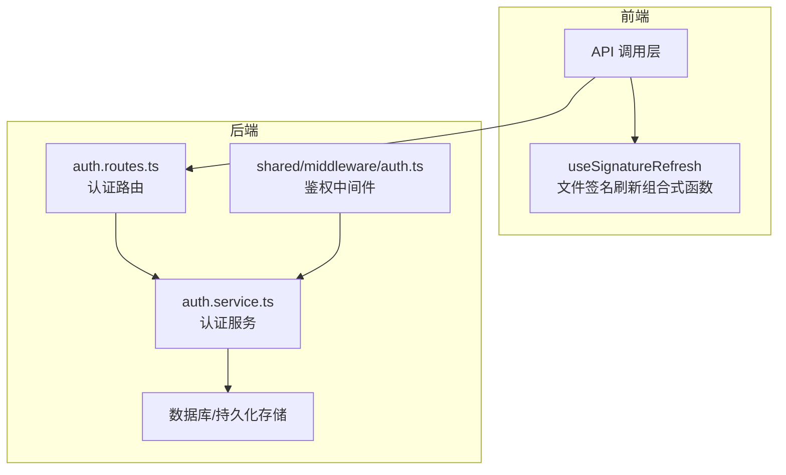
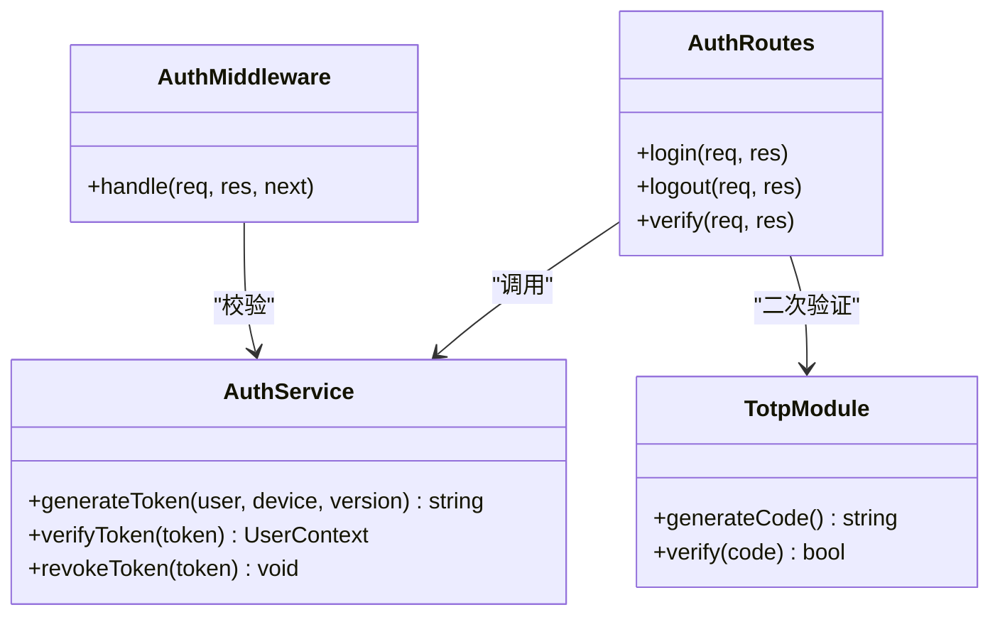
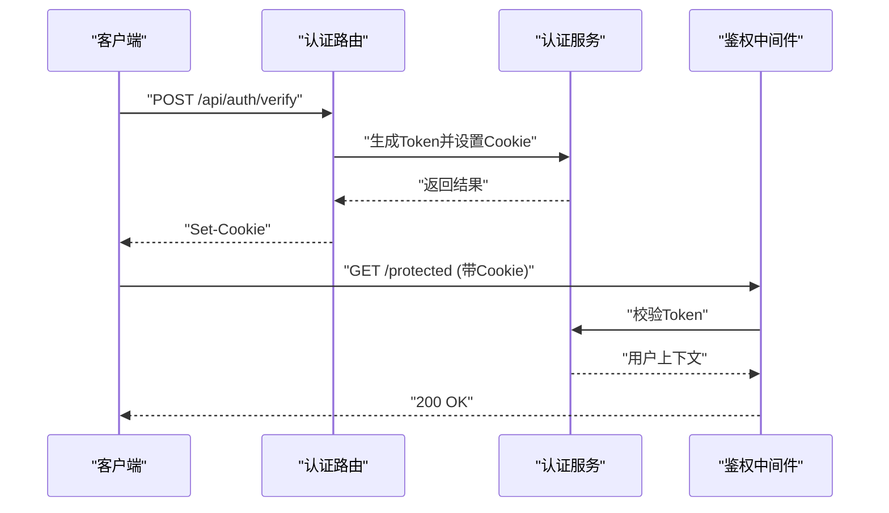

# 会话管理
> 修订版（2026-08-07，四号）：本文件为外部 repowiki 原文 会话管理.md 的仓库内修订版（修补批 #2），按 master 代码逐条核实修正；外部原文（C:\Users\qly19\Desktop\repowiki\）一字未动。
> 修订范围：文件名引用 .js→.ts（TS 迁移）、登录/会话描述对齐 REQ-027 TOTP、删除虚构变量/端点、迁移版本补至 v45。

<cite>
**本文引用的文件**   
- [server/src/features/auth/auth.routes.ts](file://server/src/features/auth/auth.routes.ts)
- [server/src/features/auth/auth.service.ts](file://server/src/features/auth/auth.service.ts)
- [server/src/shared/middleware/auth.ts](file://server/src/shared/middleware/auth.ts)
- [server/src/features/auth/totp.ts](file://server/src/features/auth/totp.ts)
- [server/tests/auth-token.test.js](file://server/tests/auth-token.test.js)
- [server/tests/auth.service.test.js](file://server/tests/auth.service.test.js)
- [server/tests/totp-login.test.js](file://server/tests/totp-login.test.js)
- [server/tests/totp.test.js](file://server/tests/totp.test.js)
- [server/package.json](file://server/package.json)
- [web/src/composables/useSignatureRefresh.js](file://web/src/composables/useSignatureRefresh.js)
</cite>

## 目录
1. [简介](#简介)
2. [项目结构](#项目结构)
3. [核心组件](#核心组件)
4. [架构总览](#架构总览)
5. [详细组件分析](#详细组件分析)
6. [依赖分析](#依赖分析)
7. [性能考虑](#性能考虑)
8. [故障排查指南](#故障排查指南)
9. [结论](#结论)
10. [附录](#附录)

## 简介
本技术文档围绕基于 Cookie 的会话管理机制，系统化阐述 Token 生成算法、签名验证与安全存储策略；完整说明会话生命周期（创建、过期处理与清理；**无刷新接口**）；记录安全配置项（httpOnly、sameSite、secure 等）；解释多设备登录支持与令牌版本控制机制；并提供端到端示例路径，覆盖会话创建、验证与销毁流程。同时给出会话存储策略、性能优化与故障恢复方案，帮助读者在理解设计的同时落地实施。

## 项目结构
本项目采用前后端分离架构：
- 后端（Node.js/Fastify）提供认证与会话相关 API，使用中间件完成鉴权，服务层封装 Token 签发与校验逻辑。
- 前端（Vue/Vite）通过组合式函数处理文件签名刷新与请求拦截，配合服务端 Cookie 实现会话。



图表来源
- [server/src/features/auth/auth.routes.ts](file://server/src/features/auth/auth.routes.ts)
- [server/src/features/auth/auth.service.ts](file://server/src/features/auth/auth.service.ts)
- [server/src/shared/middleware/auth.ts](file://server/src/shared/middleware/auth.ts)
- [web/src/composables/useSignatureRefresh.js](file://web/src/composables/useSignatureRefresh.js)

章节来源
- [server/src/features/auth/auth.routes.ts](file://server/src/features/auth/auth.routes.ts)
- [server/src/features/auth/auth.service.ts](file://server/src/features/auth/auth.service.ts)
- [server/src/shared/middleware/auth.ts](file://server/src/shared/middleware/auth.ts)
- [web/src/composables/useSignatureRefresh.js](file://web/src/composables/useSignatureRefresh.js)

## 核心组件
- 认证路由（auth.routes.ts）：暴露登录、登出接口（无刷新接口），负责解析请求参数、设置响应头与 Cookie。
- 认证服务（auth.service.ts）：封装 Token 生成、校验、撤销等核心逻辑，可能涉及用户信息、设备标识与版本控制。
- 鉴权中间件（shared/middleware/auth.ts）：统一解析 Cookie/Authorization，校验签名与有效期，注入当前用户上下文。
- TOTP 模块（totp.ts）：支持动态口令登录流程，与 Cookie 会话结合实现二次验证。
- 前端组合式函数（useSignatureRefresh.js）：**刷新文件签名 URL**（上传文件访问签名 15 分钟过期），不是会话刷新；会话过期时引导重新登录。

章节来源
- [server/src/features/auth/auth.routes.ts](file://server/src/features/auth/auth.routes.ts)
- [server/src/features/auth/auth.service.ts](file://server/src/features/auth/auth.service.ts)
- [server/src/shared/middleware/auth.ts](file://server/src/shared/middleware/auth.ts)
- [server/src/features/auth/totp.ts](file://server/src/features/auth/totp.ts)
- [web/src/composables/useSignatureRefresh.js](file://web/src/composables/useSignatureRefresh.js)

## 架构总览
下图展示从前端发起登录到后端签发 Cookie 并返回，后续请求经中间件校验的完整链路。

```mermaid
sequenceDiagram
participant Client as "客户端"
participant Routes as "认证路由<br/>auth.routes.ts"
participant Service as "认证服务<br/>auth.service.ts"
participant Middleware as "鉴权中间件<br/>shared/middleware/auth.ts"
participant Store as "持久化存储"
Client->>Routes : "POST /api/auth/verify (QQ号 + TOTP 动态口令)"
Routes->>Service : "验证凭据并生成会话Token"
Service->>Store : "写入会话元数据(可选)"
Service-->>Routes : "返回Token与Cookie属性"
Routes-->>Client : "Set-Cookie : session=...; httpOnly; sameSite; secure"
Client->>Middleware : "携带Cookie访问受保护资源"
Middleware->>Service : "解析并校验Token签名/有效期/版本"
Service-->>Middleware : "返回用户上下文或错误"
Middleware-->>Client : "放行或返回401/403"
```

图表来源
- [server/src/features/auth/auth.routes.ts](file://server/src/features/auth/auth.routes.ts)
- [server/src/features/auth/auth.service.ts](file://server/src/features/auth/auth.service.ts)
- [server/src/shared/middleware/auth.ts](file://server/src/shared/middleware/auth.ts)

## 详细组件分析

### 认证路由（auth.routes.ts）
- 职责
  - 定义登录、登出 HTTP 端点（无刷新端点）。
  - 接收凭据，调用服务层生成 Token，设置 Cookie 属性。
  - 处理 TOTP 流程中的临时状态与最终绑定。
- 关键行为
  - 登录成功后设置会话 Cookie（artist_token），包含 httpOnly、sameSite、secure 等安全属性。
  - 登出时清除 Cookie 并可选地通知服务端撤销 Token。
  - （无会话刷新接口——会话过期后需重新调用登录接口）
- 安全要点
  - 严格限制跨域与 SameSite 策略，避免 CSRF。
  - 强制 https 环境启用 secure 标志。
  - 对输入进行最小化校验，防止注入。

章节来源
- [server/src/features/auth/auth.routes.ts](file://server/src/features/auth/auth.routes.ts)

### 认证服务（auth.service.ts）
- 职责
  - 生成 Token（含版本号、设备标识、时间戳、签名）。
  - 校验 Token 签名、有效期、版本一致性。
  - 支持撤销（登出通过递增 token_version 使旧令牌失效）。
  - 可选持久化会话元数据（如黑名单、设备列表）。
- 算法与数据结构
  - Token 结构建议包含：用户ID、设备ID、版本、签发时间、过期时间、随机盐、签名。
  - 签名算法建议使用 HMAC-SHA256，密钥来自环境变量或密钥管理服务。
  - 版本控制字段用于灰度升级与批量撤销。
- 复杂度与性能
  - 签名计算为 O(n)，n 为负载大小；缓存热点用户上下文可降低重复查询。
  - （无会话刷新——过期后重新登录）

章节来源
- [server/src/features/auth/auth.service.ts](file://server/src/features/auth/auth.service.ts)

### 鉴权中间件（shared/middleware/auth.ts）
- 职责
  - 解析请求中的 Cookie/Authorization。
  - 调用服务层校验 Token，注入用户上下文。
  - 处理未授权与权限不足的统一错误响应。
- 处理流程
  - 优先读取 Cookie 中的会话 Token，其次回退 Authorization。
  - 校验失败返回 401/403，成功则挂载 ctx.user。
  - 支持按路由白名单跳过鉴权。

章节来源
- [server/src/shared/middleware/auth.ts](file://server/src/shared/middleware/auth.ts)

### TOTP 模块（totp.ts）
- 职责
  - 生成一次性验证码、校验 TOTP 值。
  - 与登录流程集成，完成二次验证后签发会话。
- 安全要点
  - 使用标准 TOTP 算法（RFC 6238），时间窗口容差合理设置。
  - 防重放与频率限制，避免暴力破解。

章节来源
- [server/src/features/auth/totp.ts](file://server/src/features/auth/totp.ts)

### 前端签名刷新组合式函数（useSignatureRefresh.js）
- 职责
  - 刷新文件签名 URL（受保护文件访问签名过期后重新向 /api/artist/refresh-signatures 申请）；与会话刷新无关。
  - 维护本地刷新状态，避免并发签名请求风暴。
- 交互流程
  - 捕获错误 -> 401 时跳转登录页重新登录（无刷新令牌机制）。

章节来源
- [web/src/composables/useSignatureRefresh.js](file://web/src/composables/useSignatureRefresh.js)

### 类图（代码级关系）


图表来源
- [server/src/features/auth/auth.routes.ts](file://server/src/features/auth/auth.routes.ts)
- [server/src/features/auth/auth.service.ts](file://server/src/features/auth/auth.service.ts)
- [server/src/shared/middleware/auth.ts](file://server/src/shared/middleware/auth.ts)
- [server/src/features/auth/totp.ts](file://server/src/features/auth/totp.ts)

### 序列图（登录与鉴权）


图表来源
- [server/src/features/auth/auth.routes.ts](file://server/src/features/auth/auth.routes.ts)
- [server/src/features/auth/auth.service.ts](file://server/src/features/auth/auth.service.ts)
- [server/src/shared/middleware/auth.ts](file://server/src/shared/middleware/auth.ts)

### 流程图（登录与鉴权——无会话刷新）
（本系统无会话刷新接口；客户端收到 401 后跳转登录页重新登录，不调用任何刷新端点。）

### 安全配置清单（Cookie 属性）
- httpOnly：禁止脚本访问，降低 XSS 风险。
- sameSite：推荐 Strict 或 Lax，防范 CSRF。
- secure：仅在 HTTPS 下传输。
- domain/path：精确限定作用域，避免泄露到其他子域或路径。
- maxAge/expiry：合理设置过期时间，平衡用户体验与安全。

[本节为通用指导，不直接分析具体文件]

### 多设备登录与令牌版本控制
- 多设备支持
  - Token 中包含设备标识，服务端可维护设备列表与在线状态。
  - 支持按设备维度撤销或强制下线。
- 版本控制
  - Token 版本字段用于灰度升级与批量撤销；旧版本 Token 逐步淘汰。
  - 登出时递增 token_version，确保旧令牌全部失效。

[本节为通用指导，不直接分析具体文件]

### 端到端示例路径（不含代码片段）
- 会话创建
  - 登录接口：[server/src/features/auth/auth.routes.ts](file://server/src/features/auth/auth.routes.ts)
  - Token 生成与设置：[server/src/features/auth/auth.service.ts](file://server/src/features/auth/auth.service.ts)
- 会话验证
  - 鉴权中间件：[server/src/shared/middleware/auth.ts](file://server/src/shared/middleware/auth.ts)
  - 服务层校验：[server/src/features/auth/auth.service.ts](file://server/src/features/auth/auth.service.ts)
- 会话过期处理
  - 无刷新接口：useSignatureRefresh.js 是「文件签名 URL」刷新（web/src/composables/useSignatureRefresh.js），不是会话刷新；会话过期后客户端跳转登录页重新登录
- 会话销毁
  - 登出接口与 Cookie 清除：[server/src/features/auth/auth.routes.ts](file://server/src/features/auth/auth.routes.ts)
  - 可选黑名单/撤销：[server/src/features/auth/auth.service.ts](file://server/src/features/auth/auth.service.ts)

章节来源
- [server/src/features/auth/auth.routes.ts](file://server/src/features/auth/auth.routes.ts)
- [server/src/features/auth/auth.service.ts](file://server/src/features/auth/auth.service.ts)
- [server/src/shared/middleware/auth.ts](file://server/src/shared/middleware/auth.ts)
- [web/src/composables/useSignatureRefresh.js](file://web/src/composables/useSignatureRefresh.js)