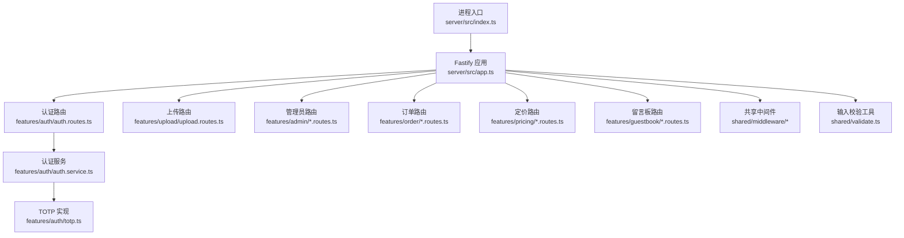
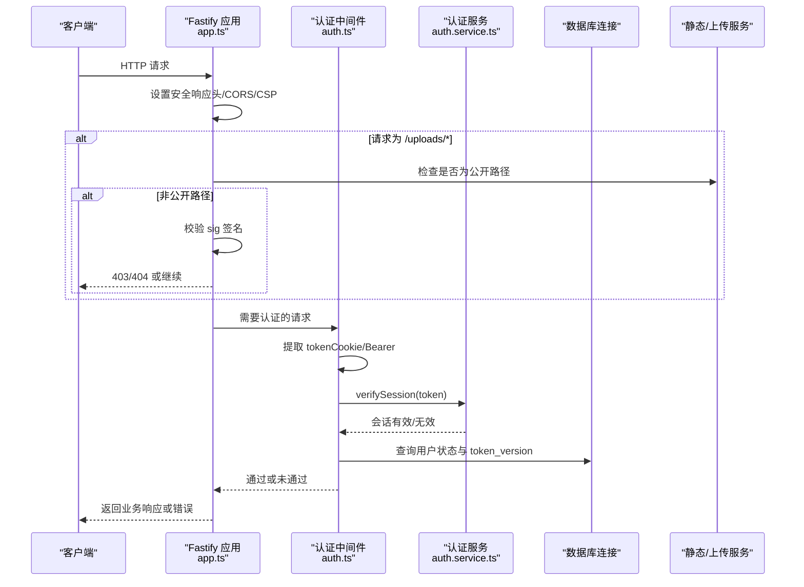
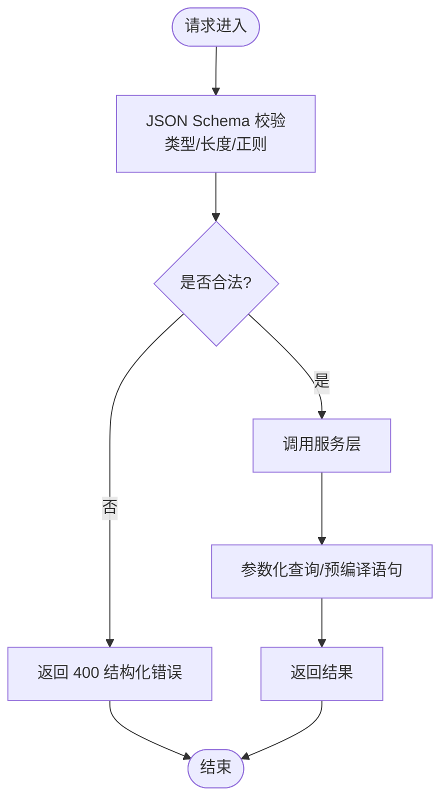
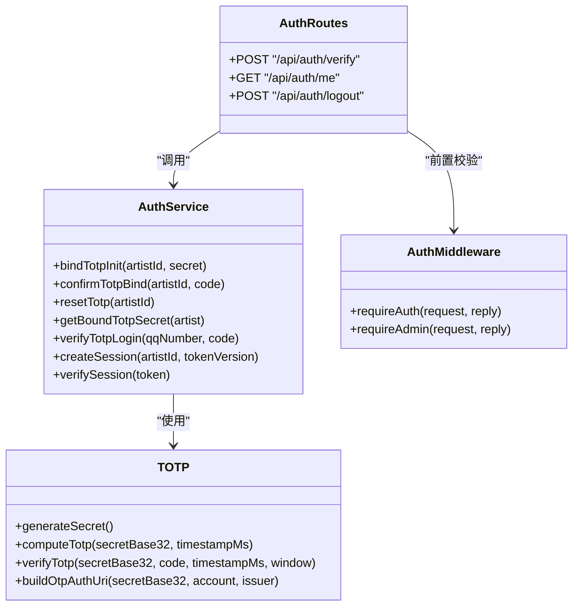
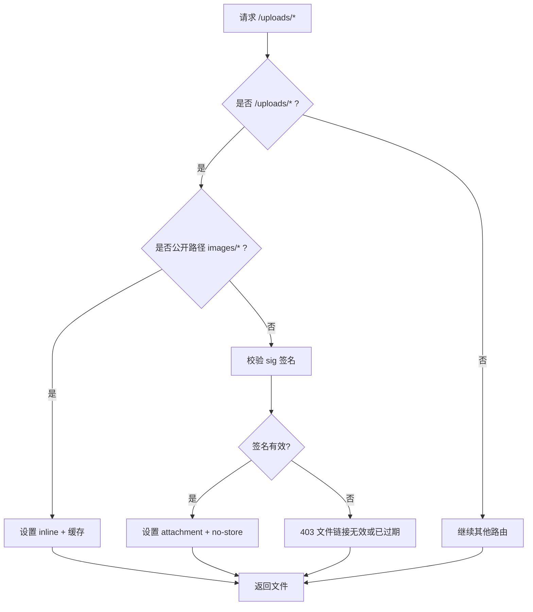
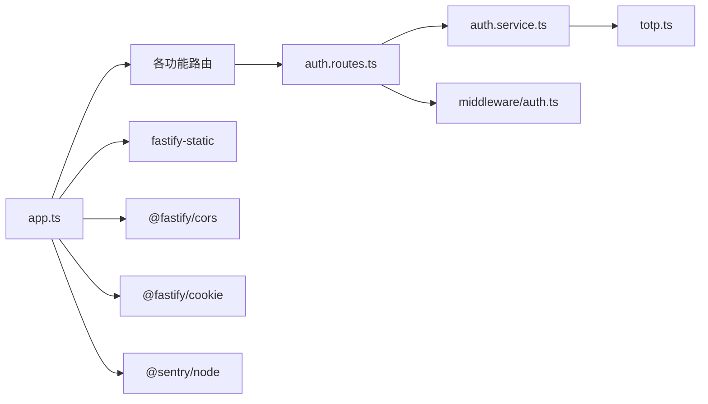

# 安全架构
> 修订版（2026-08-07，四号）：本文件为外部 repowiki 原文 安全架构.md 的仓库内修订版（修补批 #5），按 master 代码逐条核实修正；外部原文（C:\Users\qly19\Desktop\repowiki\）一字未动。
> 修订范围：文件名引用 .js→.ts（TS 迁移）、登录/会话描述对齐 REQ-027 TOTP、删除虚构变量/端点、迁移版本补至 v45。

<cite>
**本文引用的文件**   
- [server/src/app.ts](file://server/src/app.ts)
- [server/src/index.ts](file://server/src/index.ts)
- [server/src/shared/middleware/auth.ts](file://server/src/shared/middleware/auth.ts)
- [server/src/shared/middleware/rate-limit.ts](file://server/src/shared/middleware/rate-limit.ts)
- [server/src/features/auth/auth.routes.ts](file://server/src/features/auth/auth.routes.ts)
- [server/src/features/auth/auth.service.ts](file://server/src/features/auth/auth.service.ts)
- [server/src/features/auth/totp.ts](file://server/src/features/auth/totp.ts)
- [server/src/shared/validate.ts](file://server/src/shared/validate.ts)
</cite>

## 目录
1. [简介](#简介)
2. [项目结构](#项目结构)
3. [核心组件](#核心组件)
4. [架构总览](#架构总览)
5. [详细组件分析](#详细组件分析)
6. [依赖关系分析](#依赖关系分析)
7. [性能考量](#性能考量)
8. [故障排查指南](#故障排查指南)
9. [结论](#结论)
10. [附录](#附录)

## 简介
本安全架构文档面向“阿里画师约稿管理平台”，围绕多层安全防护体系展开，覆盖输入验证、SQL 注入防护、XSS 防护、CSRF 保护、认证与授权（TOTP 动态口令、HMAC 签名会话 Token、管理员角色判定）、文件安全策略、网络安全配置（HTTPS、CORS、CSP、速率限制），并给出威胁模型、漏洞扫描策略与安全审计流程建议。同时涵盖数据加密、隐私保护与合规性要求。

## 项目结构
后端采用 Fastify 应用框架，按功能域拆分路由与服务，共享中间件与工具集中在 shared 目录；认证与 TOTP 逻辑位于 features/auth；上传与静态资源由 app.ts 统一处理；全局错误处理、响应头、CORS、Cookie、Sentry 等安全相关设置在应用构建阶段完成。

图表来源 
- [server/src/app.ts:17-318](file://server/src/app.ts#L17-L318)
- [server/src/index.ts:1-62](file://server/src/index.ts#L1-L62)

章节来源
- [server/src/app.ts:17-318](file://server/src/app.ts#L17-L318)
- [server/src/index.ts:1-62](file://server/src/index.ts#L1-L62)

## 核心组件
- 应用构建与全局安全头：在应用启动时注册 Cookie、CORS、CSP、安全响应头、静态资源与上传路径访问控制、全局错误处理器与 Sentry 集成。
- 认证与授权中间件：从 httpOnly Cookie 或 Authorization Header 提取 Token，校验会话有效性、账号状态与版本失效，支持管理员角色判定。
- 速率限制：基于滑动时间窗的内存限流器，防止暴力破解与接口滥用。
- 认证服务与 TOTP：实现 QQ+TOTP 登录、绑定流程、防爆破锁定、HMAC 签名会话 Token 创建与校验。
- 输入校验工具：统一的长度截断与格式校验，降低注入与越界风险。

章节来源
- [server/src/app.ts:118-202](file://server/src/app.ts#L118-L202)
- [server/src/shared/middleware/auth.ts:1-96](file://server/src/shared/middleware/auth.ts#L1-96)
- [server/src/shared/middleware/rate-limit.ts:1-57](file://server/src/shared/middleware/rate-limit.ts#L1-L57)
- [server/src/features/auth/auth.routes.ts:1-96](file://server/src/features/auth/auth.routes.ts#L1-L96)
- [server/src/features/auth/auth.service.ts:1-213](file://server/src/features/auth/auth.service.ts#L1-L213)
- [server/src/features/auth/totp.ts:1-164](file://server/src/features/auth/totp.ts#L1-L164)
- [server/src/shared/validate.ts:1-51](file://server/src/shared/validate.ts#L1-L51)

## 架构总览
下图展示请求进入后的安全处理链路：CORS/CSP/安全头 → 上传路径签名校验 → 认证中间件 → 业务路由 → 全局错误处理与监控上报。

图表来源 
- [server/src/app.ts:125-202](file://server/src/app.ts#L125-L202)
- [server/src/shared/middleware/auth.ts:22-60](file://server/src/shared/middleware/auth.ts#L22-L60)
- [server/src/features/auth/auth.service.ts:178-213](file://server/src/features/auth/auth.service.ts#L178-L213)

## 详细组件分析

### 输入验证与 SQL 注入防护
- 输入校验工具提供长度截断与格式校验，避免超长字符串与非法字符进入业务层。
- 路由层使用 JSON Schema 对请求体进行严格校验（类型、长度、正则），减少非法输入到达服务层的概率。
- 数据库访问通过预编译语句与参数化查询（在服务层执行），避免拼接 SQL 导致的注入风险。

图表来源 
- [server/src/features/auth/auth.routes.ts:26-38](file://server/src/features/auth/auth.routes.ts#L26-L38)
- [server/src/shared/validate.ts:28-51](file://server/src/shared/validate.ts#L28-L51)

章节来源
- [server/src/features/auth/auth.routes.ts:26-38](file://server/src/features/auth/auth.routes.ts#L26-L38)
- [server/src/shared/validate.ts:28-51](file://server/src/shared/validate.ts#L28-L51)

### XSS 攻击防护
- 全局响应头设置 Content-Security-Policy，限制脚本与资源加载来源，移除不安全 eval 以提升安全性。
- 静态资源与上传路径分别设置合适的 Content-Disposition 与缓存策略，降低恶意脚本执行面。
- 前端资源分发遵循同源策略，敏感资源强制下载且禁止缓存。

章节来源
- [server/src/app.ts:138-160](file://server/src/app.ts#L138-L160)
- [server/src/app.ts:181-202](file://server/src/app.ts#L181-L202)

### CSRF 保护
- 认证 Token 存储在 httpOnly Cookie 中，JavaScript 不可读取，降低被 XSS 窃取的风险。
- Cookie 设置 SameSite=Lax，生产环境启用 Secure，结合 CORS 白名单与同源策略，缓解跨站请求伪造。

章节来源
- [server/src/features/auth/auth.routes.ts:56-63](file://server/src/features/auth/auth.routes.ts#L56-L63)
- [server/src/app.ts:125-136](file://server/src/app.ts#L125-L136)

### 认证与授权机制（TOTP + HMAC 签名会话 Token + 管理员判定）
- TOTP 动态口令登录：基于 RFC 6238/4226/4648 的实现，支持密钥生成、绑定、校验与二维码 URI 构建。
- 防爆破：连续错误达到阈值后临时锁定账号，锁定期间拒绝所有尝试。
- 会话 Token：HMAC-SHA256 签名（auth.service.ts createSession），payload 含用户 ID、时间戳与 token_version，服务端校验签名与有效期，登出/重置通过递增 token_version 主动失效。
- 管理员判定：权限通过比较 QQ 号与平台配置（ADMIN_QQ），未通过则返回 403。

图表来源 
- [server/src/features/auth/auth.routes.ts:1-96](file://server/src/features/auth/auth.routes.ts#L1-L96)
- [server/src/features/auth/auth.service.ts:74-168](file://server/src/features/auth/auth.service.ts#L74-L168)
- [server/src/features/auth/totp.ts:74-144](file://server/src/features/auth/totp.ts#L74-L144)
- [server/src/shared/middleware/auth.ts:35-95](file://server/src/shared/middleware/auth.ts#L35-L95)

章节来源
- [server/src/features/auth/auth.routes.ts:1-96](file://server/src/features/auth/auth.routes.ts#L1-L96)
- [server/src/features/auth/auth.service.ts:121-168](file://server/src/features/auth/auth.service.ts#L121-L168)
- [server/src/features/auth/totp.ts:129-144](file://server/src/features/auth/totp.ts#L129-L144)
- [server/src/shared/middleware/auth.ts:35-95](file://server/src/shared/middleware/auth.ts#L35-L95)

### 文件安全策略（上传验证、路径遍历防护、访问权限控制）
- 上传目录分为公开与签名两类：images/ 为公开路径，references/deliverables/notes 等需携带有效签名才能访问。
- 访问钩子在 onRequest 阶段校验 URL 前缀与签名，失败直接返回 403。
- 静态资源响应头区分 inline/attachment 与缓存策略，防止恶意内容被浏览器直接渲染。
- 启动时执行孤儿文件回收，将无引用文件移入回收站，避免磁盘膨胀。

图表来源 
- [server/src/app.ts:167-202](file://server/src/app.ts#L167-L202)

章节来源
- [server/src/app.ts:167-202](file://server/src/app.ts#L167-L202)

### 网络安全配置（HTTPS、CORS、CSP、速率限制）
- HTTPS：生产环境建议使用反向代理（如 Caddy/Nginx）终止 TLS，应用信任代理 IP 以正确获取客户端真实地址。
- CORS：生产环境必须设置 CORS_ORIGIN，否则默认 same-origin；开发环境允许任意来源便于调试。
- CSP：统一设置安全响应头，限制脚本、样式、图片、字体与连接源，移除不安全 eval。
- 速率限制：基于滑动时间窗的内存限流器，针对登录等关键接口进行限流，防止暴力破解与刷接口。

章节来源
- [server/src/app.ts:125-136](file://server/src/app.ts#L125-L136)
- [server/src/app.ts:138-160](file://server/src/app.ts#L138-L160)
- [server/src/shared/middleware/rate-limit.ts:1-57](file://server/src/shared/middleware/rate-limit.ts#L1-L57)

## 依赖关系分析
- 应用构建依赖数据库初始化、Sentry 监控、静态资源与上传服务。
- 认证路由依赖认证服务与中间件，服务层依赖 TOTP 实现与数据库连接。
- 中间件依赖认证服务与艺术家服务，用于校验会话与角色。

图表来源 
- [server/src/app.ts:254-264](file://server/src/app.ts#L254-L264)
- [server/src/features/auth/auth.routes.ts:1-10](file://server/src/features/auth/auth.routes.ts#L1-L10)
- [server/src/features/auth/auth.service.ts:1-10](file://server/src/features/auth/auth.service.ts#L1-L10)

章节来源
- [server/src/app.ts:254-264](file://server/src/app.ts#L254-L264)

## 性能考量
- 速率限制使用内存 Map 存储时间戳数组，定期清理过期桶，避免内存泄漏。
- 孤儿文件回收定时任务使用 unref 避免阻塞进程退出。
- 静态资源缓存策略区分长缓存与短缓存，提升加载性能。
- Sentry 仅捕获错误，不启用性能追踪，降低开销。

章节来源
- [server/src/shared/middleware/rate-limit.ts:40-57](file://server/src/shared/middleware/rate-limit.ts#L40-L57)
- [server/src/app.ts:114-116](file://server/src/app.ts#L114-L116)
- [server/src/app.ts:204-220](file://server/src/app.ts#L204-L220)

## 故障排查指南
- 全局错误处理器统一返回结构化错误码与中文消息，500 级别错误不泄露内部细节，仅记录日志并上报 Sentry。
- 未捕获异常与未处理的 Promise 拒绝会记录日志并优雅关闭，防止僵尸进程。
- 健康检查端点可用于快速确认服务状态。

章节来源
- [server/src/app.ts:222-252](file://server/src/app.ts#L222-L252)
- [server/src/index.ts:13-25](file://server/src/index.ts#L13-L25)
- [server/src/app.ts:265-267](file://server/src/app.ts#L265-L267)

## 结论
本安全架构通过多层防护（输入校验、CSP、CORS、速率限制、Token 校验、文件签名）与严格的认证授权（TOTP、HMAC Token、RBAC）构建了较为完善的安全体系。建议在部署层面补充 HTTPS 与 WAF，持续进行漏洞扫描与安全审计，确保合规性与数据安全。

## 附录
- 威胁模型建议：识别外部攻击面（API、上传、静态资源）、内部权限边界（管理员与普通画师）、数据敏感性（用户信息、订单、作品）。
- 漏洞扫描策略：定期使用 SAST/DAST 工具扫描代码与运行态，关注注入、XSS、CSRF、路径遍历等常见漏洞。
- 安全审计流程：建立变更评审、依赖更新审查、日志与监控告警、事件响应预案。
- 数据加密与隐私：敏感字段加密存储，最小化日志中的 PII，遵循隐私法规与合规要求。