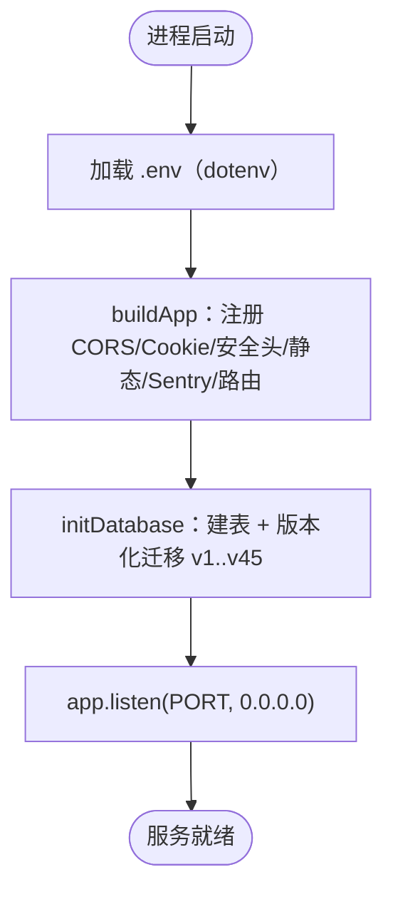

# 快速开始指南

> 本文按 `artist-commission` master 当前代码重写（2026-08-07，四号）。
> 外部原版「快速开始指南.md」存在 3 处致命过时：①「tsx 运行 index.js」——实际入口为 `src/index.ts`（index.js 不存在）；②「.env 填写 SIGN_SECRET」——该变量全库零命中（文件访问签名密钥实为 `SESSION_SECRET`）；③「node server/src/db/seed.js」——种子脚本已改名 `seed.ts`，照原文命令必失败。
> 重写依据：`docs/comms/04-to-01-repowiki非认证-交付-20260807.md` 🔴 7-9 项 + 对照 master 代码逐一实测。

<cite>
**本文引用的文件**
- [.env.example](file://artist-commission/.env.example)（环境变量唯一权威清单）
- [docker-compose.yml](file://artist-commission/docker-compose.yml)（一键编排 Web + Caddy）
- [Dockerfile](file://artist-commission/Dockerfile)（多阶段构建）
- [entrypoint.sh](file://artist-commission/entrypoint.sh)（容器启动脚本）
- [server/package.json](file://artist-commission/server/package.json)（后端脚本：dev/start/db:seed 等）
- [server/src/index.ts](file://artist-commission/server/src/index.ts)（后端入口）
- [server/src/app.ts](file://artist-commission/server/src/app.ts)（应用装配）
- [server/src/db/connection.ts](file://artist-commission/server/src/db/connection.ts)（SQLite 连接）
- [server/src/db/init.js](file://artist-commission/server/src/db/init.js)（建表 + 版本化迁移，最新 v45）
- [server/src/db/seed.ts](file://artist-commission/server/src/db/seed.ts)（开发用种子数据）
- [web/vite.config.js](file://artist-commission/web/vite.config.js)（前端开发服务器与代理）
- [docs/开发→生产切换指南.md](file://artist-commission/docs/开发→生产切换指南.md)（开发/生产切换细则）
</cite>

## 目录
1. [人话总览](#人话总览)
2. [项目结构](#项目结构)
3. [方式一：Docker Compose 一键启动（推荐）](#方式一docker-compose-一键启动推荐)
4. [方式二：本地开发（不跑 Docker）](#方式二本地开发不跑-docker)
5. [环境变量（以 .env.example 为准）](#环境变量以-envexample-为准)
6. [验证安装是否成功](#验证安装是否成功)
7. [常见问题排查](#常见问题排查)

## 人话总览

**一句话**：这是一个「画师约稿管理平台」——画师在上面展示作品、接单、管理订单；客户下单付款；管理员管理全站。技术上是前后端分离的单体应用：前端 Vue 3（`web/`），后端 Fastify + TypeScript（`server/`），数据存在一个 SQLite 文件里（不用装数据库）。部署用 Docker Compose 一键拉起，Caddy 自动配 HTTPS。

**两条启动路径**（按需选一条）：

| 目的 | 用哪个 | 说明 |
|------|--------|------|
| 快速看到全站效果 | Docker Compose | `docker compose up -d --build`，一条命令，含数据库和 Caddy |
| 改前端/后端代码调试 | 本地开发 | 前端 Vite（5173）+ 后端 tsx watch（3000），改代码热更新 |

> ⚠️ 外部旧文档说「生产环境用 PostgreSQL/MySQL」——**错误**。本项目数据库只有 SQLite（`better-sqlite3`），无任何其他数据库支持。

## 项目结构

```
artist-commission/
├── web/                  # 前端：Vue 3 + Vite + Element Plus
│   ├── src/              # 页面与组件
│   └── vite.config.js    # 开发服务器 5173，代理 /api、/uploads 到 3000
├── server/               # 后端：Fastify + TypeScript（100% TS，唯一 .js 豁免为 db/init.js）
│   ├── src/
│   │   ├── index.ts      # 启动入口（读 PORT，监听 0.0.0.0）
│   │   ├── app.ts        # 应用装配：CORS/Cookie/安全头/静态资源/Sentry/错误处理
│   │   ├── db/
│   │   │   ├── connection.ts  # SQLite 连接（DB_PATH / :memory:）
│   │   │   ├── init.js        # 建表 + 迁移（v1..v45）
│   │   │   └── seed.ts        # 开发种子数据（手动执行）
│   │   ├── features/     # 业务模块：auth/order/pricing/upload/admin/tracking...
│   │   └── shared/       # 中间件（auth/rate-limit）、错误码、文件签名
│   └── package.json      # 脚本：dev / start / db:seed / test / lint / typecheck
├── Dockerfile            # 多阶段构建（node:22-slim）
├── docker-compose.yml    # web + caddy 编排
├── Caddyfile             # 反向代理（{$DOMAIN} 单主域，C48 决策放弃子域名）
├── entrypoint.sh         # 容器启动：cd /app/server && exec npx tsx src/index.ts
└── .env.example          # 环境变量模板（复制为 .env）
```

**后端启动流程**（`server/src/index.ts` → `app.ts`）：



## 方式一：Docker Compose 一键启动（推荐）

**前提**：装有 Docker（Desktop 或 Engine）且 compose 可用。

1. **克隆代码**并进入项目根目录。
2. **创建 .env**：`cp .env.example .env`，然后编辑填必填项：

   ```bash
   SESSION_SECRET=<随机 32+ 字符，自己编一串长的>   # 会话 + 文件签名 + Cookie 签名共用
   COOKIE_SECRET=<随机 32+ 字符>                    # Cookie 签名
   ADMIN_QQ=<你的 QQ 号>                            # 首次部署自动创建管理员
   DOMAIN=<你的域名>                                # 本地测试可先填 localhost
   ```

   > ⚠️ **没有 SIGN_SECRET 这个变量**（外部旧文档虚构）。文件访问签名用的就是 `SESSION_SECRET`。
3. **启动**：

   ```bash
   docker compose up -d --build
   ```

4. **验证**：

   ```bash
   curl http://localhost:3000/api/health
   ```

   返回 `ok` 即后端正常。浏览器访问 `http://localhost:3000` 看前端页面。

5. **（可选）灌开发用种子数据**：

   ```bash
   docker compose exec web npm run db:seed
   ```

   > ⚠️ 外部旧文档写 `node server/src/db/seed.js`——**该文件已改名 `seed.ts`，照旧命令必失败**。正确做法就是上面的 `npm run db:seed`（等价于在容器 `/app/server` 下执行 `tsx src/db/seed.ts`）。

**端口说明（重要）**：当前 compose 默认把容器 3000 映射到宿主机 3000（方便本地直接访问），同时 Caddy 也起着 80/443。**生产部署时要把 compose 里的 `ports` 两行注释掉、只保留 `expose`**，让流量只走 Caddy（详见 `wiki-生产部署.md`）。

## 方式二：本地开发（不跑 Docker）

**前提**：Node.js v22（与生产镜像一致）。

1. **后端**：

   ```bash
   cd server
   npm install
   npm run dev        # tsx --watch src/index.ts，热重载，端口 3000
   ```

2. **前端**（另开终端）：

   ```bash
   cd web
   npm install
   npm run dev        # Vite，端口 5173
   ```

3. 浏览器访问 `http://localhost:5173`。Vite 会把 `/api` 和 `/uploads` 代理到后端 3000（见 `web/vite.config.js`），无需配 CORS。

> 本地开发首次运行会自动建库（`./data/commission.db`，相对 server 目录）。默认数据库路径 `./data/commission.db`、上传目录 `./uploads`，都可用环境变量覆盖。

## 环境变量（以 .env.example 为准）

**.env.example 是唯一权威清单**。下表为实际生效变量（均已在 master 代码中核实）：

| 变量 | 必填 | 作用 | 备注 |
|------|------|------|------|
| `SESSION_SECRET` | 是 | 会话签名 + 文件访问签名（HMAC）+ Cookie 签名 | 生产环境必须 ≥32 字符，缺失直接启动失败（fail-fast） |
| `COOKIE_SECRET` | 是 | httpOnly Cookie 签名验证 | 生产必须 ≥32 字符 |
| `ADMIN_QQ` | 生产是 | 首次部署自动创建管理员账号 | 生产缺失且无管理员时启动抛错退出 |
| `NODE_ENV` | 否 | `production`（默认）/ `development` | 决定 Sentry 是否上报、TOTP 开发密钥等 |
| `AUTH_DEV_MODE` | 否 | `true` 时 TOTP 绑定接口返回明文密钥 `_dev_secret` | **生产必须 false 或删除** |
| `DB_PATH` | 否 | SQLite 文件路径 | 默认 `/app/data/commission.db`（容器） |
| `UPLOAD_DIR` | 否 | 上传目录 | 默认 `/app/uploads` |
| `CORS_ORIGIN` | 否 | 跨域白名单（逗号分隔） | 留空 = 禁止跨域（生产推荐同域部署） |
| `DOMAIN` | 否 | Caddy 主域名 | Caddyfile 用 `{$DOMAIN}` |
| `TZ` | 否 | 时区 | compose 已内置 `Asia/Shanghai` |
| `SENTRY_DSN_BACKEND` | 否 | 后端错误监控 DSN | 留空 = 完全禁用；开发环境自动跳过上报 |
| `VITE_SENTRY_DSN` | 否 | 前端错误监控 DSN（构建时注入） | Dockerfile 构建参数，留空 = 禁用 |

**不存在的变量**（外部旧文档虚构，勿填）：`SIGN_SECRET`、`JWT_SECRET`、`RATE_LIMIT_WINDOW_MS`、`RATE_LIMIT_MAX_REQUESTS`、`LOG_LEVEL`、`DATABASE_URL`、`STORAGE_PROVIDER`、`ACCESS_KEY`、`BUCKET`、`REGION`、`BOT_ENABLED`、`BOT_WS_URL`、`LOGIN_CODE_TTL`、`LOGIN_CODE_MAX_ATTEMPTS`。

## 验证安装是否成功

- [ ] `curl http://localhost:3000/api/health` 返回 `ok`
- [ ] 浏览器打开首页能看到前端页面
- [ ] 用 `ADMIN_QQ` + TOTP 动态口令能登录（首次需先绑 TOTP，流程见 `wiki-认证接口.md`）
- [ ] 上传一张作品，图片能正常展示（公开路径 `images/` 免签名；`references/`、`deliverables/` 需带 `sig` 签名参数）
- [ ] 重启容器后数据仍在（SQLite 卷持久化）

## 常见问题排查

| 现象 | 原因与处理 |
|------|-----------|
| 容器起不来 / 健康检查失败 | `docker compose logs web` 看日志；多半是 .env 必填项缺失（SESSION_SECRET/COOKIE_SECRET/ADMIN_QQ）触发 fail-fast |
| 登录或会话异常 | 检查 `SESSION_SECRET`、`COOKIE_SECRET` 是否已替换为随机长值 |
| TOTP 绑定返回了明文密钥 | `AUTH_DEV_MODE` 被设为 true；生产必须 false |
| 上传文件访问 403 | 非公开路径必须携带有效签名 `sig`（15 分钟有效），检查文件路径与权限 |
| 数据库迁移失败 | 查看迁移日志；迁移前会自动备份 `commission.db.bak.v<N>`，必要时恢复 |
| 本地前端调不通接口 | 确认后端 3000 在跑；Vite 代理目标为 `http://localhost:3000` |

---

*修订版维护于仓库内（docs/external-wiki/），外部原文（C:\Users\qly19\Desktop\repowiki\）未改动。*