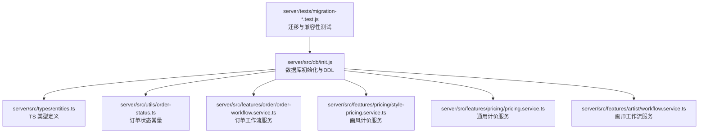
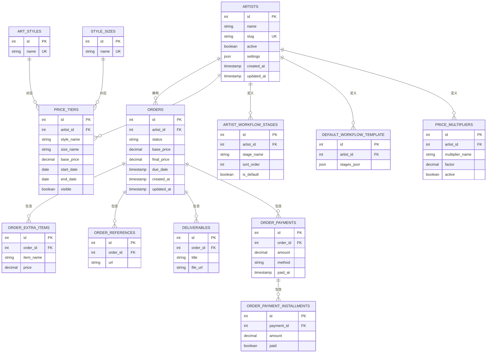
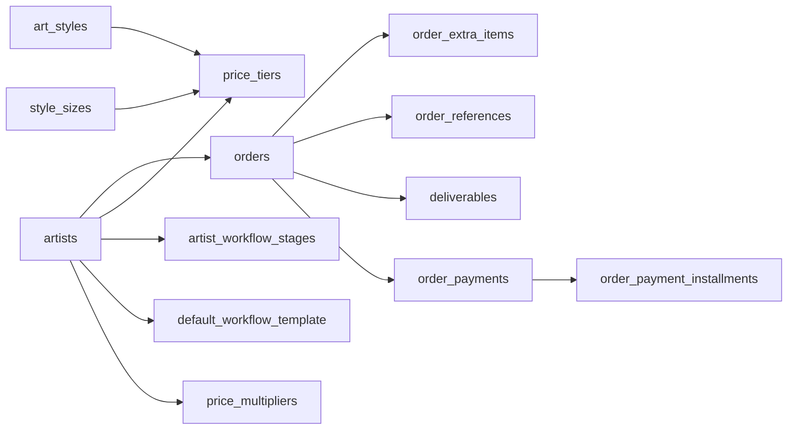

# 数据库模式设计

<cite>
**本文引用的文件**   
- [server/src/db/init.js](file://server/src/db/init.js)
- [server/src/types/entities.ts](file://server/src/types/entities.ts)
- [server/src/utils/order-status.ts](file://server/src/utils/order-status.ts)
- [server/src/features/order/order-workflow.service.ts](file://server/src/features/order/order-workflow.service.ts)
- [server/src/features/pricing/style-pricing.service.ts](file://server/src/features/pricing/style-pricing.service.ts)
- [server/src/features/pricing/pricing.service.ts](file://server/src/features/pricing/pricing.service.ts)
- [server/src/features/artist/workflow.service.ts](file://server/src/features/artist/workflow.service.ts)
- [server/tests/migration-v38.test.js](file://server/tests/migration-v38.test.js)
- [server/tests/migration-v40.test.js](file://server/tests/migration-v40.test.js)
- [server/tests/migration-v41.test.js](file://server/tests/migration-v41.test.js)
- [server/tests/migration-v43.test.js](file://server/tests/migration-v43.test.js)
</cite>

## 目录
1. [简介](#简介)
2. [项目结构](#项目结构)
3. [核心组件](#核心组件)
4. [架构总览](#架构总览)
5. [详细组件分析](#详细组件分析)
6. [依赖关系分析](#依赖关系分析)
7. [性能考虑](#性能考虑)
8. [故障排查指南](#故障排查指南)
9. [结论](#结论)
10. [附录](#附录)

## 简介
本文件为阿里画师约稿管理平台的数据库模式设计文档，聚焦于核心实体表结构与关联规则，包括 Artists（画师表）、Orders（订单表）、Tiers（价格档位表）、WorkflowStages（工作流节点表）、Multipliers（倍率表）等。文档提供字段定义、数据类型、约束与默认值说明，给出完整的 SQL 建表语句与索引定义，并补充数据验证规则与业务约束，帮助开发者与维护者快速理解并正确扩展系统的数据模型。

## 项目结构
数据库模式定义集中在后端初始化脚本中，类型定义位于 TypeScript 实体文件中；订单状态与工作流逻辑由服务层实现，测试用例覆盖迁移与边界场景。

**图表来源** 
- [server/src/db/init.js](file://server/src/db/init.js)
- [server/src/types/entities.ts](file://server/src/types/entities.ts)
- [server/src/utils/order-status.ts](file://server/src/utils/order-status.ts)
- [server/src/features/order/order-workflow.service.ts](file://server/src/features/order/order-workflow.service.ts)
- [server/src/features/pricing/style-pricing.service.ts](file://server/src/features/pricing/style-pricing.service.ts)
- [server/src/features/pricing/pricing.service.ts](file://server/src/features/pricing/pricing.service.ts)
- [server/src/features/artist/workflow.service.ts](file://server/src/features/artist/workflow.service.ts)
- [server/tests/migration-v38.test.js](file://server/tests/migration-v38.test.js)
- [server/tests/migration-v40.test.js](file://server/tests/migration-v40.test.js)
- [server/tests/migration-v41.test.js](file://server/tests/migration-v41.test.js)
- [server/tests/migration-v43.test.js](file://server/tests/migration-v43.test.js)

**章节来源**
- [server/src/db/init.js](file://server/src/db/init.js)
- [server/src/types/entities.ts](file://server/src/types/entities.ts)

## 核心组件
本节概述核心实体及其职责：
- 画师表（artists）：存储画师基础信息与可见性、配额等配置。
- 订单表（orders）：记录约稿订单的核心信息、状态、时间戳与支付汇总。
- 价格档位表（price_tiers）：按画风与尺寸定义基础价格与生效区间。
- 工作流节点表（artist_workflow_stages / default_workflow_template）：定义订单推进的阶段模板与实例化阶段。
- 倍率表（price_multipliers）：用于对基础价进行乘数调整（如加急、特殊要求）。
- 附加项与参考（order_extra_items / order_references）：订单的附加内容与外部参考链接。
- 交付物（deliverables）：订单产出的交付清单。
- 支付相关（order_payments / order_payment_installments）：分次支付与分期明细。
- 风格与尺寸（art_styles / style_sizes）：画风与尺寸枚举或映射。
- 平台配置与审计（platform_config / schema_migrations / order_activity_logs / guestbook_messages / discount_codes / addon_templates）：平台级设置、迁移版本、活动日志、留言板、折扣码与附加模板。

**章节来源**
- [server/src/db/init.js](file://server/src/db/init.js)
- [server/src/types/entities.ts](file://server/src/types/entities.ts)

## 架构总览
下图展示核心实体之间的关系与关键外键约束，体现订单、价格、工作流与支付的关联。

**图表来源** 
- [server/src/db/init.js](file://server/src/db/init.js)
- [server/src/types/entities.ts](file://server/src/types/entities.ts)

## 详细组件分析

### 画师表（artists）
- 字段与类型
  - id: 整数主键，自增
  - name: 字符串，画师名称
  - slug: 字符串，唯一标识（URL友好）
  - active: 布尔，是否启用
  - settings: JSON，画师个性化配置
  - created_at / updated_at: 时间戳
- 约束与索引
  - 主键：id
  - 唯一索引：slug
  - 建议索引：active（用于筛选可用画师）
- 业务约束
  - slug 需全局唯一且不可重复
  - active=false 的画师不应出现在公开列表

**章节来源**
- [server/src/db/init.js](file://server/src/db/init.js)
- [server/src/types/entities.ts](file://server/src/types/entities.ts)

### 订单表（orders）
- 字段与类型
  - id: 整数主键
  - artist_id: 整数外键，指向 artists.id
  - status: 字符串，订单状态（如待确认、进行中、已完成、已取消等）
  - base_price: 小数，基础价格
  - final_price: 小数，最终价格（含倍率、附加项等）
  - due_date: 日期/时间，交付截止
  - created_at / updated_at: 时间戳
- 约束与索引
  - 主键：id
  - 外键：artist_id → artists(id)
  - 建议索引：status、artist_id、due_date
- 数据验证与业务规则
  - status 必须属于预定义集合（见“订单状态”小节）
  - final_price ≥ 0
  - due_date ≥ created_at

**章节来源**
- [server/src/db/init.js](file://server/src/db/init.js)
- [server/src/utils/order-status.ts](file://server/src/utils/order-status.ts)

### 价格档位表（price_tiers）
- 字段与类型
  - id: 整数主键
  - artist_id: 整数外键，指向 artists.id
  - style_name: 字符串，画风名称
  - size_name: 字符串，尺寸名称
  - base_price: 小数，基础单价
  - start_date / end_date: 日期，生效区间
  - visible: 布尔，是否对外可见
- 约束与索引
  - 主键：id
  - 外键：artist_id → artists(id)
  - 建议索引：artist_id、style_name、size_name、start_date、end_date
- 业务约束
  - 同一画师的同画风+同尺寸在同一时间点只能有一个生效档位
  - visible=false 的档位不参与前端展示与自动计价

**章节来源**
- [server/src/db/init.js](file://server/src/db/init.js)
- [server/src/features/pricing/style-pricing.service.ts](file://server/src/features/pricing/style-pricing.service.ts)

### 工作流节点表（artist_workflow_stages / default_workflow_template）
- 字段与类型
  - artist_workflow_stages
    - id: 整数主键
    - artist_id: 整数外键
    - stage_name: 字符串，阶段名（如“需求确认”“草稿”“修改”“交付”）
    - sort_order: 整数，排序权重
    - is_default: 布尔，是否为默认模板的一部分
  - default_workflow_template
    - id: 整数主键
    - artist_id: 整数外键
    - stages_json: JSON，阶段序列与属性
- 约束与索引
  - 主键：id
  - 外键：artist_id → artists(id)
  - 建议索引：artist_id、sort_order
- 业务约束
  - 默认模板中的阶段顺序应严格递增
  - 订单实例阶段应遵循模板顺序推进

**章节来源**
- [server/src/db/init.js](file://server/src/db/init.js)
- [server/src/features/artist/workflow.service.ts](file://server/src/features/artist/workflow.service.ts)
- [server/src/features/order/order-workflow.service.ts](file://server/src/features/order/order-workflow.service.ts)

### 倍率表（price_multipliers）
- 字段与类型
  - id: 整数主键
  - artist_id: 整数外键
  - multiplier_name: 字符串，倍率名称（如“加急”“复杂背景”）
  - factor: 小数，倍率系数（如 1.2、1.5）
  - active: 布尔，是否启用
- 约束与索引
  - 主键：id
  - 外键：artist_id → artists(id)
  - 建议索引：artist_id、multiplier_name
- 业务约束
  - factor > 0
  - 多倍率可叠加，需在计价引擎中明确叠加策略（累乘或累加）

**章节来源**
- [server/src/db/init.js](file://server/src/db/init.js)
- [server/src/features/pricing/pricing.service.ts](file://server/src/features/pricing/pricing.service.ts)

### 订单附加项与参考（order_extra_items / order_references）
- 字段与类型
  - order_extra_items
    - id: 整数主键
    - order_id: 整数外键
    - item_name: 字符串，附加项名称
    - price: 小数，附加项价格
  - order_references
    - id: 整数主键
    - order_id: 整数外键
    - url: 字符串，外部参考链接
- 约束与索引
  - 主键：id
  - 外键：order_id → orders(id)
  - 建议索引：order_id
- 业务约束
  - item_name 非空
  - url 需符合 URL 格式校验

**章节来源**
- [server/src/db/init.js](file://server/src/db/init.js)

### 交付物（deliverables）
- 字段与类型
  - id: 整数主键
  - order_id: 整数外键
  - title: 字符串，交付物标题
  - file_url: 字符串，文件地址
- 约束与索引
  - 主键：id
  - 外键：order_id → orders(id)
  - 建议索引：order_id
- 业务约束
  - file_url 有效且可访问

**章节来源**
- [server/src/db/init.js](file://server/src/db/init.js)

### 支付相关（order_payments / order_payment_installments）
- 字段与类型
  - order_payments
    - id: 整数主键
    - order_id: 整数外键
    - amount: 小数，支付金额
    - method: 字符串，支付方式
    - paid_at: 时间戳，支付时间
  - order_payment_installments
    - id: 整数主键
    - payment_id: 整数外键
    - amount: 小数，分期金额
    - paid: 布尔，是否已付
- 约束与索引
  - 主键：id
  - 外键：order_id → orders(id)，payment_id → order_payments(id)
  - 建议索引：order_id、payment_id
- 业务约束
  - 分期金额之和应等于支付金额
  - paid=true 时，paid_at 应合理

**章节来源**
- [server/src/db/init.js](file://server/src/db/init.js)

### 风格与尺寸（art_styles / style_sizes）
- 字段与类型
  - art_styles
    - id: 整数主键
    - name: 字符串，唯一画风名
  - style_sizes
    - id: 整数主键
    - name: 字符串，唯一尺寸名
- 约束与索引
  - 主键：id
  - 唯一索引：name
- 业务约束
  - 名称全局唯一，避免歧义

**章节来源**
- [server/src/db/init.js](file://server/src/db/init.js)

### 平台配置与审计（platform_config / schema_migrations / order_activity_logs / guestbook_messages / discount_codes / addon_templates）
- platform_config：平台级配置键值对
- schema_migrations：数据库迁移版本追踪
- order_activity_logs：订单活动日志（状态变更、操作记录）
- guestbook_messages：留言板消息
- discount_codes：折扣码与使用限制
- addon_templates：附加项模板库
- 约束与索引
  - 根据用途建立必要的主键与唯一索引
  - 日志表建议按时间分区或归档

**章节来源**
- [server/src/db/init.js](file://server/src/db/init.js)

## 依赖关系分析
- 订单依赖画师、价格档位、倍率、附加项、参考、交付物与支付。
- 价格档位依赖画风与尺寸字典。
- 工作流模板与阶段由画师维度管理，订单实例继承模板阶段。
- 支付分期依赖于支付记录。

**图表来源** 
- [server/src/db/init.js](file://server/src/db/init.js)

**章节来源**
- [server/src/db/init.js](file://server/src/db/init.js)

## 性能考虑
- 高频查询字段建立索引：orders.status、orders.artist_id、orders.due_date；price_tiers.artist_id、style_name、size_name、start_date、end_date；order_payments.order_id。
- 大文本与二进制字段（如文件路径）避免在热点查询中返回，必要时拆分到独立表或对象存储。
- 日志表（order_activity_logs）定期归档，避免单表过大影响写入与查询。
- 使用事务保证订单创建、支付与阶段推进的一致性。

[本节为通用指导，不直接分析具体文件]

## 故障排查指南
- 订单状态异常
  - 检查状态常量定义与更新逻辑，确保状态转换合法。
  - 参考订单状态工具与服务层实现。
- 计价错误
  - 核对价格档位生效区间与倍率因子；检查附加项价格与叠加策略。
- 工作流卡住
  - 检查默认模板阶段顺序与订单实例阶段状态一致性。
- 支付不一致
  - 校验分期金额总和与支付金额一致；检查支付时间与状态同步。

**章节来源**
- [server/src/utils/order-status.ts](file://server/src/utils/order-status.ts)
- [server/src/features/order/order-workflow.service.ts](file://server/src/features/order/order-workflow.service.ts)
- [server/src/features/pricing/style-pricing.service.ts](file://server/src/features/pricing/style-pricing.service.ts)
- [server/src/features/pricing/pricing.service.ts](file://server/src/features/pricing/pricing.service.ts)
- [server/src/features/artist/workflow.service.ts](file://server/src/features/artist/workflow.service.ts)

## 结论
本模式以订单为核心，围绕画师、价格档位、工作流与支付构建完整的数据模型。通过明确的字段定义、约束与索引策略，保障数据一致性与查询性能。建议在后续迭代中持续完善迁移脚本与测试覆盖，确保模型演进的可追溯性与稳定性。

[本节为总结性内容，不直接分析具体文件]

## 附录

### 完整 SQL 建表语句与索引定义
以下为基于仓库中数据库初始化脚本整理的建表语句与索引定义（按表分组，便于导入与审查）：

- 画师表（artists）
  - 字段：id、name、slug、active、settings、created_at、updated_at
  - 主键：id
  - 唯一索引：slug
  - 建议索引：active

- 订单表（orders）
  - 字段：id、artist_id、status、base_price、final_price、due_date、created_at、updated_at
  - 主键：id
  - 外键：artist_id → artists(id)
  - 建议索引：status、artist_id、due_date

- 价格档位表（price_tiers）
  - 字段：id、artist_id、style_name、size_name、base_price、start_date、end_date、visible
  - 主键：id
  - 外键：artist_id → artists(id)
  - 建议索引：artist_id、style_name、size_name、start_date、end_date

- 工作流节点表（artist_workflow_stages）
  - 字段：id、artist_id、stage_name、sort_order、is_default
  - 主键：id
  - 外键：artist_id → artists(id)
  - 建议索引：artist_id、sort_order

- 默认工作流模板（default_workflow_template）
  - 字段：id、artist_id、stages_json
  - 主键：id
  - 外键：artist_id → artists(id)

- 倍率表（price_multipliers）
  - 字段：id、artist_id、multiplier_name、factor、active
  - 主键：id
  - 外键：artist_id → artists(id)
  - 建议索引：artist_id、multiplier_name

- 订单附加项（order_extra_items）
  - 字段：id、order_id、item_name、price
  - 主键：id
  - 外键：order_id → orders(id)
  - 建议索引：order_id

- 订单参考（order_references）
  - 字段：id、order_id、url
  - 主键：id
  - 外键：order_id → orders(id)
  - 建议索引：order_id

- 交付物（deliverables）
  - 字段：id、order_id、title、file_url
  - 主键：id
  - 外键：order_id → orders(id)
  - 建议索引：order_id

- 支付记录（order_payments）
  - 字段：id、order_id、amount、method、paid_at
  - 主键：id
  - 外键：order_id → orders(id)
  - 建议索引：order_id

- 支付分期（order_payment_installments）
  - 字段：id、payment_id、amount、paid
  - 主键：id
  - 外键：payment_id → order_payments(id)
  - 建议索引：payment_id

- 画风字典（art_styles）
  - 字段：id、name
  - 主键：id
  - 唯一索引：name

- 尺寸字典（style_sizes）
  - 字段：id、name
  - 主键：id
  - 唯一索引：name

- 平台配置（platform_config）
  - 字段：key、value（示例）
  - 主键：key（或自增id）
  - 唯一索引：key

- 迁移版本（schema_migrations）
  - 字段：version、applied_at（示例）
  - 主键：version

- 订单活动日志（order_activity_logs）
  - 字段：id、order_id、action、payload、created_at（示例）
  - 主键：id
  - 外键：order_id → orders(id)
  - 建议索引：order_id、created_at

- 留言板（guestbook_messages）
  - 字段：id、author、content、created_at（示例）
  - 主键：id

- 折扣码（discount_codes）
  - 字段：code、discount_type、value、valid_from、valid_to、usage_limit、used_count（示例）
  - 主键：code
  - 唯一索引：code

- 附加模板（addon_templates）
  - 字段：id、name、template_json、created_at（示例）
  - 主键：id

**章节来源**
- [server/src/db/init.js](file://server/src/db/init.js)

### 数据验证规则与业务约束
- 订单状态
  - 状态集合来源于状态常量定义，仅允许在合法集合内切换。
- 价格与倍率
  - base_price ≥ 0；factor > 0；final_price = base_price × 倍率 + 附加项价格（依计价引擎策略）。
- 时间约束
  - due_date ≥ created_at；start_date ≤ end_date；paid_at 合理。
- 唯一性
  - artists.slug、art_styles.name、style_sizes.name 全局唯一。
- 外键完整性
  - 所有外键必须指向存在的父记录，删除父记录时需考虑级联策略（通常禁止级联删除，改为限制或删除前检查）。

**章节来源**
- [server/src/utils/order-status.ts](file://server/src/utils/order-status.ts)
- [server/src/features/pricing/pricing.service.ts](file://server/src/features/pricing/pricing.service.ts)
- [server/src/features/pricing/style-pricing.service.ts](file://server/src/features/pricing/style-pricing.service.ts)

### 迁移与兼容性测试要点
- 迁移脚本需保证幂等与回滚能力，测试覆盖新增字段、重命名与默认值变更。
- 重点验证订单状态、价格档位生效区间、倍率叠加策略在工作流与计价流程中的行为一致性。

**章节来源**
- [server/tests/migration-v38.test.js](file://server/tests/migration-v38.test.js)
- [server/tests/migration-v40.test.js](file://server/tests/migration-v40.test.js)
- [server/tests/migration-v41.test.js](file://server/tests/migration-v41.test.js)
- [server/tests/migration-v43.test.js](file://server/tests/migration-v43.test.js)