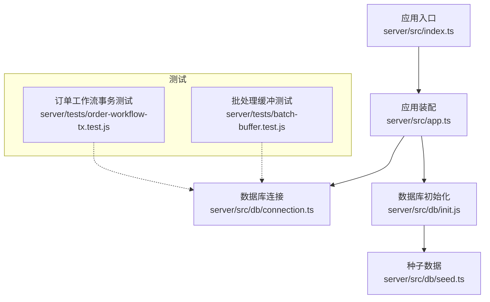
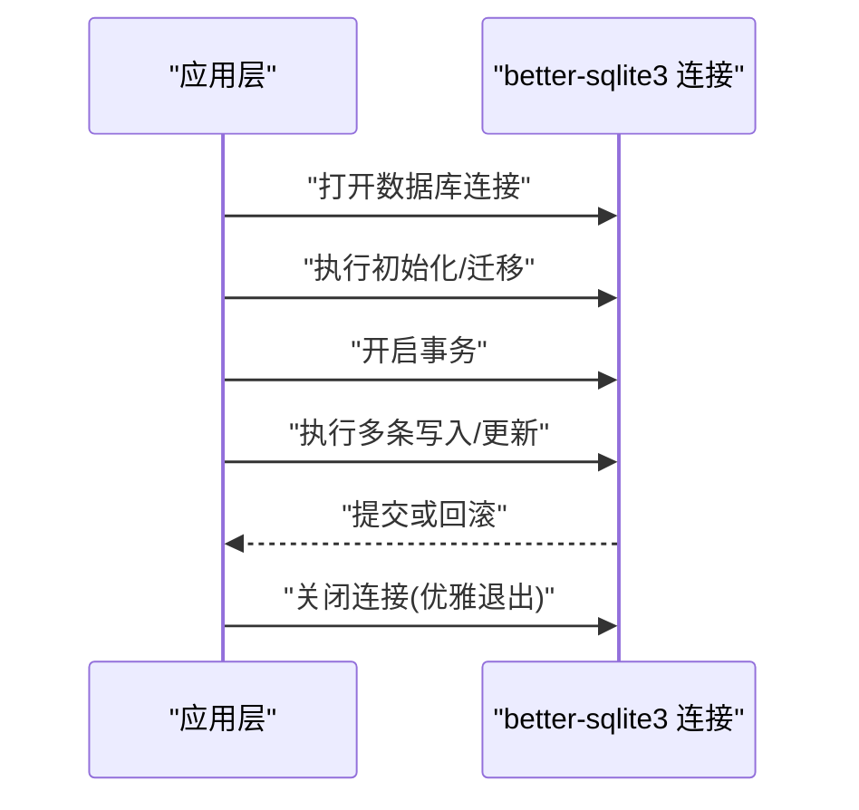
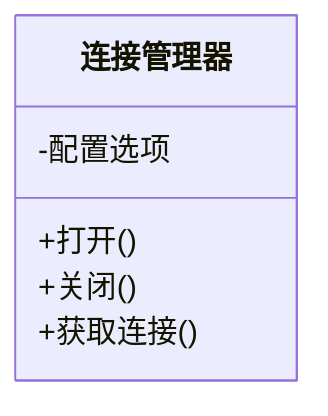
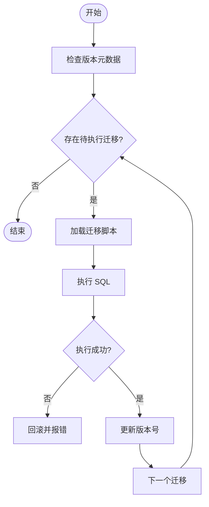
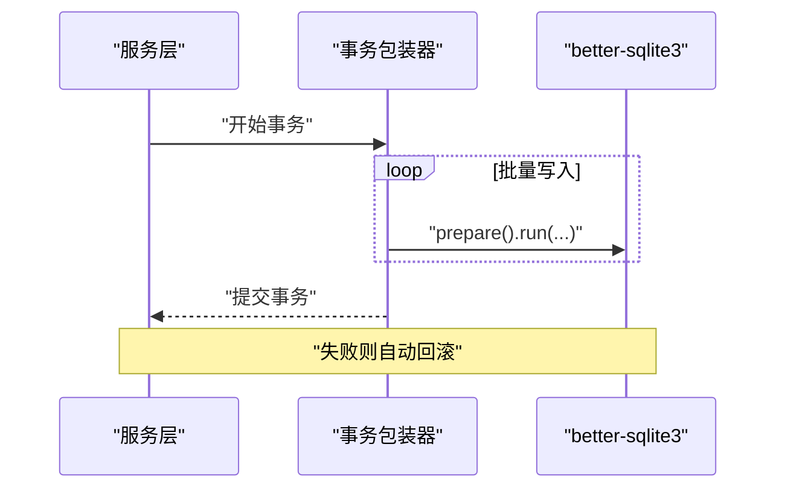
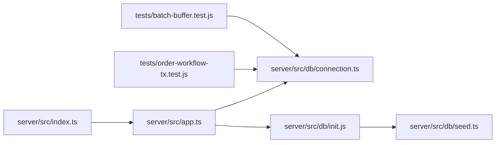

# 数据访问模式
> 修订版（2026-08-07，四号）：本文件为外部 repowiki 原文 数据访问模式.md 的仓库内修订版（修补批 #9），按 master 代码逐条核实修正；外部原文（C:\Users\qly19\Desktop\repowiki\）一字未动。
> 修订范围：文件名引用 .js→.ts（TS 迁移）、登录/会话描述对齐 REQ-027 TOTP、删除虚构变量/端点、迁移版本补至 v45。

<cite>
**本文引用的文件**   
- [server/src/db/connection.ts](file://artist-commission/server/src/db/connection.ts)
- [server/src/db/init.js](file://artist-commission/server/src/db/init.js)
- [server/src/db/seed.ts](file://artist-commission/server/src/db/seed.ts)
- [server/src/app.ts](file://artist-commission/server/src/app.ts)
- [server/src/index.ts](file://artist-commission/server/src/index.ts)
- [server/package.json](file://artist-commission/server/package.json)
- [server/tests/order-workflow-tx.test.js](file://artist-commission/server/tests/order-workflow-tx.test.js)
- [server/tests/batch-buffer.test.js](file://artist-commission/server/tests/batch-buffer.test.js)
</cite>

## 目录
1. [简介](#简介)
2. [项目结构](#项目结构)
3. [核心组件](#核心组件)
4. [架构总览](#架构总览)
5. [详细组件分析](#详细组件分析)
6. [依赖关系分析](#依赖关系分析)
7. [性能考量](#性能考量)
8. [故障排查指南](#故障排查指南)
9. [结论](#结论)
10. [附录](#附录)

## 简介
本文件面向阿里画师约稿管理平台的数据访问层，聚焦基于 better-sqlite3 的连接管理、事务与查询优化实践。文档覆盖连接池配置（在 SQLite 上下文下的最佳替代方案）、事务管理、CRUD 与复杂查询模式、批量操作策略、缓存与索引建议、一致性保证、并发控制与错误处理，并提供可落地的最佳实践与调优指南。

## 项目结构
数据访问相关代码集中在 server/src/db 目录，包含连接初始化、数据库初始化脚本与种子数据；应用入口负责加载配置并启动服务；测试用例覆盖了事务与批处理的典型场景。

图表来源
- [server/src/index.ts](file://artist-commission/server/src/index.ts)
- [server/src/app.ts](file://artist-commission/server/src/app.ts)
- [server/src/db/connection.ts](file://artist-commission/server/src/db/connection.ts)
- [server/src/db/init.js](file://artist-commission/server/src/db/init.js)
- [server/src/db/seed.ts](file://artist-commission/server/src/db/seed.ts)
- [server/tests/order-workflow-tx.test.js](file://artist-commission/server/tests/order-workflow-tx.test.js)
- [server/tests/batch-buffer.test.js](file://artist-commission/server/tests/batch-buffer.test.js)

章节来源
- [server/src/db/connection.ts](file://artist-commission/server/src/db/connection.ts)
- [server/src/db/init.js](file://artist-commission/server/src/db/init.js)
- [server/src/db/seed.ts](file://artist-commission/server/src/db/seed.ts)
- [server/src/app.ts](file://artist-commission/server/src/app.ts)
- [server/src/index.ts](file://artist-commission/server/src/index.ts)

## 核心组件
- 连接管理：封装 better-sqlite3 的数据库实例创建与基础配置，提供统一的打开/关闭语义。
- 初始化流程：执行建表与迁移脚本，确保 schema 一致性与版本演进。
- 种子数据：为开发与演示环境准备初始数据，便于快速验证功能。
- 事务与批处理：通过 better-sqlite3 的事务 API 与批量插入策略提升一致性与吞吐。

章节来源
- [server/src/db/connection.ts](file://artist-commission/server/src/db/connection.ts)
- [server/src/db/init.js](file://artist-commission/server/src/db/init.js)
- [server/src/db/seed.ts](file://artist-commission/server/src/db/seed.ts)

## 架构总览
better-sqlite3 是同步阻塞式驱动，天然适合 Node.js 单进程模型。本项目采用“单连接 + 事务”的模式，避免连接池带来的竞争与锁争用问题，同时通过短事务与批处理降低 I/O 开销。

图表来源
- [server/src/db/connection.ts](file://artist-commission/server/src/db/connection.ts)
- [server/src/db/init.js](file://artist-commission/server/src/db/init.js)

## 详细组件分析

### 连接管理（connection.ts）
- 职责：集中管理 better-sqlite3 实例的创建、参数配置与生命周期。
- 关键点：
  - 使用同步方式打开数据库文件，确保启动阶段即可就绪。
  - 设置必要的运行时选项（如 WAL 模式、超时、日志等），以改善并发与崩溃恢复能力。
  - 暴露统一的获取连接方法，供服务层调用。
  - 提供关闭方法，用于进程退出时的资源释放。
- 并发模型：SQLite 单写者模型，避免多连接导致的锁冲突；读多写少场景可通过 WAL 提升读取并行度。

图表来源
- [server/src/db/connection.ts](file://artist-commission/server/src/db/connection.ts)

章节来源
- [server/src/db/connection.ts](file://artist-commission/server/src/db/connection.ts)

### 初始化与迁移（init.js）
- 职责：按版本顺序执行建表与变更脚本，保证 schema 一致性。
- 关键点：
  - 检查并创建元数据表记录版本。
  - 逐条执行迁移脚本，失败时回滚并报错。
  - 支持幂等设计，避免重复执行导致异常。
- 建议：将大表重建拆分为增量脚本，减少停机时间。

图表来源
- [server/src/db/init.js](file://artist-commission/server/src/db/init.js)

章节来源
- [server/src/db/init.js](file://artist-commission/server/src/db/init.js)

### 种子数据（seed.ts）
- 职责：为开发/演示环境注入初始数据，便于快速验证业务逻辑。
- 关键点：
  - 清理或校验已有数据，避免重复注入。
  - 使用事务包裹批量插入，提高性能与一致性。
  - 提供开关或环境变量控制是否执行种子数据。

章节来源
- [server/src/db/seed.ts](file://artist-commission/server/src/db/seed.ts)

### 事务与批处理模式
- 事务：
  - 使用 better-sqlite3 的 transaction API 包裹一组写操作，确保原子性。
  - 短事务优先，减少锁持有时间，降低死锁概率。
- 批处理：
  - 合并多次 INSERT/UPDATE 为单次事务，显著降低 I/O 次数。
  - 对大批量数据采用分批次提交，避免长事务导致内存膨胀。

图表来源
- [server/tests/order-workflow-tx.test.js](file://artist-commission/server/tests/order-workflow-tx.test.js)
- [server/tests/batch-buffer.test.js](file://artist-commission/server/tests/batch-buffer.test.js)

章节来源
- [server/tests/order-workflow-tx.test.js](file://artist-commission/server/tests/order-workflow-tx.test.js)
- [server/tests/batch-buffer.test.js](file://artist-commission/server/tests/batch-buffer.test.js)

### CRUD 与复杂查询模式
- 标准 CRUD：
  - 使用 prepare 语句预编译 SQL，复用执行计划。
  - 统一参数绑定，避免注入风险。
- 复杂查询：
  - 合理使用 JOIN 与子查询，避免 N+1 查询。
  - 使用分页与限制返回字段，减少网络与序列化开销。
- 统计与报表：
  - 尽量在数据库侧聚合，避免在应用层计算。

章节来源
- [server/src/db/connection.ts](file://artist-commission/server/src/db/connection.ts)
- [server/src/db/init.js](file://artist-commission/server/src/db/init.js)

### 缓存策略
- 适用场景：读多写少、热点数据（如配置、字典、热门作品列表）。
- 策略建议：
  - 内存缓存：进程内 Map/LRU，注意失效与过期策略。
  - 外部缓存：Redis/Memcached，跨进程共享，需考虑一致性。
  - 读写分离：读路径走缓存，写路径更新缓存并设置合理 TTL。
- 注意事项：
  - 缓存穿透：空值缓存与布隆过滤器。
  - 缓存雪崩：随机过期与限流降级。
  - 一致性：先更新数据库再删除/更新缓存，或使用延迟双删。

[本节为概念性内容，不直接分析具体文件]

### 索引与查询优化
- 索引原则：
  - 高频过滤条件、排序与关联字段建立索引。
  - 复合索引遵循最左前缀原则。
  - 避免过度索引，影响写入性能。
- 查询优化：
  - 使用 EXPLAIN 分析执行计划。
  - 避免 SELECT *，仅选择必要字段。
  - 合理使用 LIMIT 与 OFFSET 进行分页。
- 存储引擎特性：
  - 启用 WAL 模式提升读取并发。
  - 调整 PRAGMA 参数（如 cache size、synchronous）平衡性能与持久性。

[本节为概念性内容，不直接分析具体文件]

### 数据一致性与并发控制
- 一致性：
  - 通过事务保证 ACID，关键业务必须包裹在事务中。
  - 使用唯一约束与外键约束防止脏数据。
- 并发控制：
  - SQLite 单写者模型，避免多进程并发写同一数据库文件。
  - 读多写少场景下，WAL 模式可提升读取并发。
  - 长事务与频繁锁竞争会导致性能下降，应缩短事务范围。

[本节为概念性内容，不直接分析具体文件]

### 错误处理机制
- 数据库错误：捕获 SQL 异常，记录上下文信息，向上抛出领域异常。
- 事务回滚：任何步骤失败立即回滚，确保状态一致。
- 重试策略：针对瞬时错误（如磁盘 IO 抖动）实现有限次重试。
- 监控告警：记录慢查询与异常堆栈，接入监控系统。

[本节为概念性内容，不直接分析具体文件]

## 依赖关系分析
- 应用入口与装配：index.ts 启动服务，app.ts 注册路由与中间件，db 模块作为基础设施被服务层依赖。
- 测试依赖：事务与批处理测试直接依赖 db 连接与事务 API，验证核心行为。

图表来源
- [server/src/index.ts](file://artist-commission/server/src/index.ts)
- [server/src/app.ts](file://artist-commission/server/src/app.ts)
- [server/src/db/connection.ts](file://artist-commission/server/src/db/connection.ts)
- [server/src/db/init.js](file://artist-commission/server/src/db/init.js)
- [server/src/db/seed.ts](file://artist-commission/server/src/db/seed.ts)
- [server/tests/order-workflow-tx.test.js](file://artist-commission/server/tests/order-workflow-tx.test.js)
- [server/tests/batch-buffer.test.js](file://artist-commission/server/tests/batch-buffer.test.js)

章节来源
- [server/src/index.ts](file://artist-commission/server/src/index.ts)
- [server/src/app.ts](file://artist-commission/server/src/app.ts)
- [server/src/db/connection.ts](file://artist-commission/server/src/db/connection.ts)
- [server/src/db/init.js](file://artist-commission/server/src/db/init.js)
- [server/src/db/seed.ts](file://artist-commission/server/src/db/seed.ts)
- [server/tests/order-workflow-tx.test.js](file://artist-commission/server/tests/order-workflow-tx.test.js)
- [server/tests/batch-buffer.test.js](file://artist-commission/server/tests/batch-buffer.test.js)

## 性能考量
- 连接与事务：
  - 单连接 + 短事务，避免长事务与锁竞争。
  - 批量写入合并到单个事务，减少 I/O 次数。
- 查询优化：
  - 使用 EXPLAIN 分析执行计划，优化索引与 SQL。
  - 避免 N+1 查询，使用 JOIN 或批量加载。
- 存储与配置：
  - 启用 WAL 模式提升读取并发。
  - 调整 PRAGMA 参数（cache size、synchronous）平衡性能与持久性。
- 缓存：
  - 热点数据使用内存缓存，设置合理 TTL 与失效策略。
  - 跨进程共享使用 Redis，注意一致性。

[本节为通用指导，不直接分析具体文件]

## 故障排查指南
- 常见问题：
  - 数据库锁定：检查是否存在长事务或多进程写同一文件。
  - 慢查询：使用 EXPLAIN 分析执行计划，添加合适索引。
  - 内存溢出：分批提交大数据集，避免一次性加载过多结果。
- 调试技巧：
  - 开启 SQL 日志，记录慢查询与异常。
  - 使用事务边界打印耗时，定位瓶颈。
  - 监控磁盘 IO 与锁等待事件。

[本节为通用指导，不直接分析具体文件]

## 结论
本项目基于 better-sqlite3 构建简洁高效的数据访问层，通过单连接、短事务与批处理策略，在保证一致性的同时提升性能。结合合理的索引、缓存与监控，可满足阿里画师约稿管理平台的读写需求。建议在扩展时保持事务短小、SQL 优化与索引设计的一致性，持续监控与调优。

[本节为总结性内容，不直接分析具体文件]

## 附录
- 依赖版本：参考 server/package.json 中的 better-sqlite3 版本与相关依赖。
- 测试用例：事务与批处理测试可作为参考实现，验证核心行为与边界情况。

章节来源
- [server/package.json](file://artist-commission/server/package.json)
- [server/tests/order-workflow-tx.test.js](file://artist-commission/server/tests/order-workflow-tx.test.js)
- [server/tests/batch-buffer.test.js](file://artist-commission/server/tests/batch-buffer.test.js)