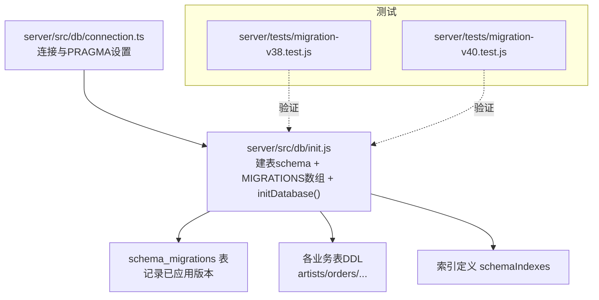
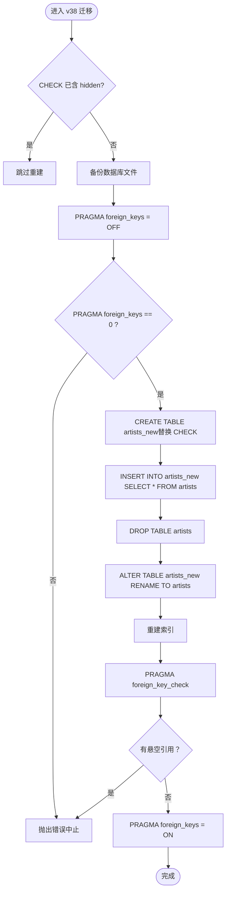
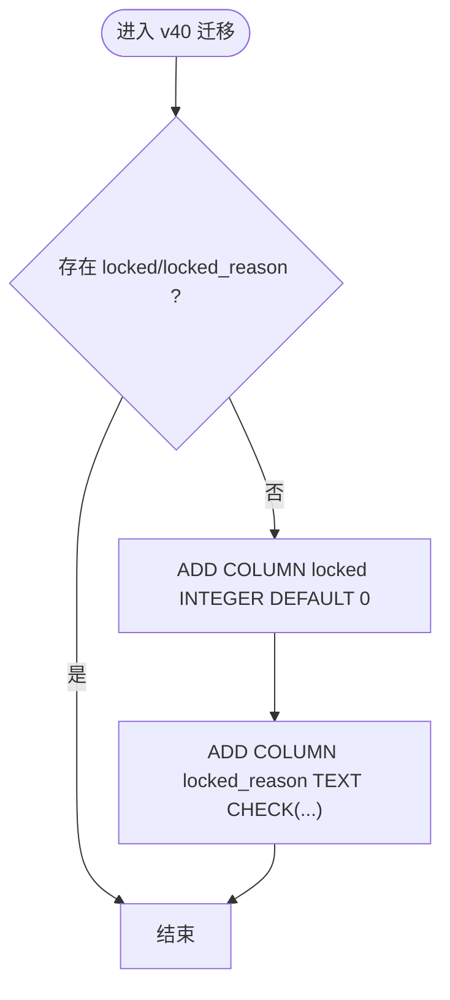
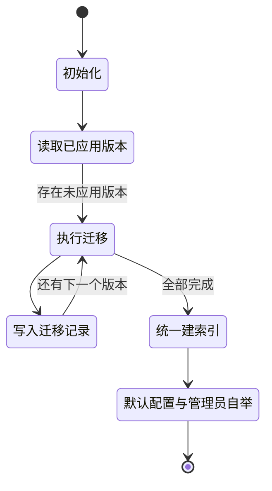
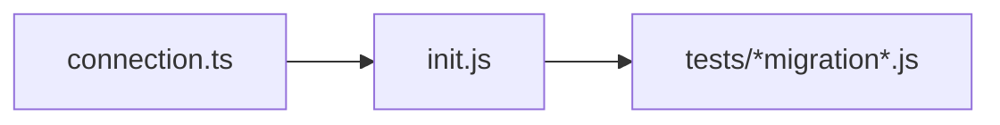

# 数据迁移管理
> 修订版（2026-08-07，四号）：本文件为外部 repowiki 原文 数据迁移管理.md 的仓库内修订版（修补批 #8），按 master 代码逐条核实修正；外部原文（C:\Users\qly19\Desktop\repowiki\）一字未动。
> 修订范围：文件名引用 .js→.ts（TS 迁移）、登录/会话描述对齐 REQ-027 TOTP、删除虚构变量/端点、迁移版本补至 v45。

<cite>
**本文引用的文件**   
- [init.js](file://server/src/db/init.js)
- [connection.ts](file://server/src/db/connection.ts)
- [migration-v38.test.js](file://server/tests/migration-v38.test.js)
- [migration-v40.test.js](file://server/tests/migration-v40.test.js)
</cite>

## 目录
1. [简介](#简介)
2. [项目结构](#项目结构)
3. [核心组件](#核心组件)
4. [架构总览](#架构总览)
5. [详细组件分析](#详细组件分析)
6. [依赖关系分析](#依赖关系分析)
7. [性能考量](#性能考量)
8. [故障排查指南](#故障排查指南)
9. [结论](#结论)
10. [附录](#附录)

## 简介
本文件面向阿里画师约稿管理平台的 SQLite 数据库版本化迁移机制，系统性说明从 v0.21 到 v45 的渐进式演进、迁移脚本编写规范、执行顺序与幂等策略、回滚与数据完整性保障、错误处理与日志记录，以及最佳实践与常见问题解决方案。读者无需深入代码即可理解并安全地实施后续迁移。

## 项目结构
本项目将数据库初始化与迁移逻辑集中在 server/src/db/init.js，连接与运行时环境配置在 server/src/db/connection.ts。测试用例覆盖关键迁移（如 v38、v40）的行为与安全性。



**图表来源** 
- [connection.ts:1-25](file://server/src/db/connection.ts#L1-L25)
- [init.js:9-427](file://server/src/db/init.js#L9-L427)
- [init.js:432-454](file://server/src/db/init.js#L432-L454)
- [init.js:1792-1824](file://server/src/db/init.js#L1792-L1824)

**章节来源**
- [connection.ts:1-25](file://server/src/db/connection.ts#L1-L25)
- [init.js:9-427](file://server/src/db/init.js#L9-L427)
- [init.js:432-454](file://server/src/db/init.js#L432-L454)
- [init.js:1792-1824](file://server/src/db/init.js#L1792-L1824)

## 核心组件
- 连接层（connection.ts）
  - 负责 better-sqlite3 实例创建、目录初始化、WAL/DELETE 模式选择、外键开关与 busy_timeout。
- 初始化与迁移（init.js）
  - schema：完整建表语句（包含历史迁移后的最终结构）。
  - schemaIndexes：独立索引定义，确保老库升级时列存在后再建索引。
  - MIGRATIONS：按 version 升序的迁移列表，每个迁移提供 up(database) 与可选 noTransaction 标记。
  - initDatabase(database)：执行建表、遍历迁移、写入 schema_migrations、追加索引与默认平台配置、管理员自举。

**章节来源**
- [connection.ts:1-25](file://server/src/db/connection.ts#L1-L25)
- [init.js:9-427](file://server/src/db/init.js#L9-L427)
- [init.js:432-454](file://server/src/db/init.js#L432-L454)
- [init.js:1792-1824](file://server/src/db/init.js#L1792-L1824)

## 架构总览
下图展示了启动时的数据库初始化与迁移流程，包括事务边界、幂等守卫、备份与日志输出。

```mermaid
sequenceDiagram
participant App as "应用进程"
participant Conn as "connection.ts"
participant DB as "SQLite 引擎"
participant Init as "init.js : initDatabase()"
participant Mig as "MIGRATIONS[version]"
participant Log as "控制台日志"
App->>Conn : 创建数据库连接
Conn-->>App : 返回 db 实例WAL/DELETE, FK=ON
App->>Init : 调用 initDatabase(db)
Init->>DB : EXEC schema建表
Init->>DB : 查询 schema_migrations 获取已应用版本集合
loop 遍历 MIGRATIONS按 version 升序
Init->>Mig : 判断是否已应用
alt 未应用
alt noTransaction = true
Mig->>DB : 直接执行 up()事务外
Init->>DB : INSERT schema_migrations(version,name)
else 普通迁移
Init->>DB : transaction{ up(); INSERT schema_migrations }
end
Mig-->>Log : 打印“已应用”日志
else 已应用
Init-->>Init : 跳过
end
end
Init->>DB : EXEC schemaIndexes统一建索引
Init->>DB : 插入 platform_config 默认值
Init-->>App : 完成必要时自动创建管理员账号
```

**图表来源** 
- [init.js:1792-1824](file://server/src/db/init.js#L1792-L1824)
- [init.js:460-1745](file://server/src/db/init.js#L460-L1745)

## 详细组件分析

### 迁移文件命名与版本管理
- 命名规范
  - 每个迁移对象包含唯一 version（整数）、name（字符串描述）、up(database) 函数，可选 noTransaction 标记。
  - name 采用小写下划线风格，语义清晰表达变更内容（例如 add_artist_code_column、installments_locked_columns）。
- 版本管理
  - 通过 schema_migrations(version, name, applied_at) 记录已应用版本，避免重复执行。
  - initDatabase() 读取已应用版本集合，按 MIGRATIONS 中 version 升序执行未应用的迁移。

**章节来源**
- [init.js:285-289](file://server/src/db/init.js#L285-L289)
- [init.js:460-1745](file://server/src/db/init.js#L460-L1745)
- [init.js:1792-1824](file://server/src/db/init.js#L1792-L1824)

### 执行顺序与幂等性
- 执行顺序
  - 严格遵循 MIGRATIONS 数组中的 version 升序；若某版本已记录则跳过。
- 幂等性
  - 所有 ALTER TABLE ADD COLUMN 前均使用 PRAGMA table_info 检查列是否存在，避免重复添加。
  - 重建类迁移（DROP/RENAME 父表）通过 noTransaction=true 并在迁移内部实现幂等守卫（如 v38 检测 CHECK 约束是否已含 hidden）。
  - 种子数据插入前检查 COUNT(*)，避免重复。

**章节来源**
- [init.js:460-1745](file://server/src/db/init.js#L460-L1745)
- [init.js:1792-1824](file://server/src/db/init.js#L1792-L1824)

### 渐进式迁移策略（v0.21 → 当前）
- v21 起引入“迁移前自动备份”模式：对文件型数据库在执行前复制 .bak.vN 文件，失败仅告警不中断。
- 典型演进阶段
  - v21 公告与点赞计数、v22 留言板、v23 月度额度、v24 收款流水与 paid_total_cents 换算、v25 档位可见性、v26 快捷按钮、v27 封面图、v28 随机模板、v29 开工日、v30 作品尺寸、v31 多封面排序、v32 折扣码、v33 节点实收金额、v34 留言语言、v35 操作日志、v36 多画风模型、v37 画风档位统一与 F5 旧模型迁移、v38 artists.status CHECK 补 hidden（需重建表）、v39 价格条目账本、v40 节点锁价列、v41 TOTP 登录与移除 login_codes、v42 社交平台表、v43 清理旧增项表、v44 埋点事件表 events + 匿名凭证 anon_tokens（tracking_events_anon_tokens）、v45 events.artist_id 索引（tracking_events_artist_index）。当前最新版本为 **v45**。
- 数据迁移与回填
  - 存量数据转换在迁移内完成（如 v24 计算 paid_total_cents、v36/v37 旧模型到新模型映射），保证向后兼容。

**章节来源**
- [init.js:1002-1745](file://server/src/db/init.js#L1002-L1745)

### 迁移脚本编写规范
- 基本结构
  - { version, name, up(database), noTransaction? }
- 幂等守卫
  - 使用 PRAGMA table_info 检查列/表是否存在，避免重复 DDL。
  - 种子数据前 COUNT(*) 守卫。
- 事务边界
  - 普通迁移：由运行器包裹 database.transaction()。
  - 重建类迁移：noTransaction=true，迁移内部自行控制 PRAGMA foreign_keys OFF/ON 与事务（遵循 SQLite 官方 12 步流程）。
- 备份与日志
  - 文件数据库迁移前 copyFileSync 生成 .bak.vN；console.log/console.warn 输出状态。
- 外键与完整性
  - 重建类迁移在 DROP/RENAME 前后执行 foreign_key_check 校验，发现悬空引用立即中止。

**章节来源**
- [init.js:460-1745](file://server/src/db/init.js#L460-L1745)

### 回滚机制与数据完整性保证
- 回滚策略
  - 无内置 down() 回滚；回滚方式为停服恢复 .bak.vN 备份后降级代码。
- 数据完整性
  - 外键开启（foreign_keys=ON），异常场景下通过 foreign_key_check 校验。
  - 重建类迁移（v38、v43）强制关闭外键后进行重建，完成后恢复外键并校验无悬空引用。
  - 索引在迁移后统一执行，避免老库升级因列缺失导致崩溃。

**章节来源**
- [init.js:1514-1580](file://server/src/db/init.js#L1514-L1580)
- [init.js:1714-1744](file://server/src/db/init.js#L1714-L1744)
- [init.js:1792-1824](file://server/src/db/init.js#L1792-L1824)

### 错误处理与日志记录策略
- 错误处理
  - 备份失败仅 console.warn 继续执行；重建类迁移在外键未正确关闭或检测到悬空引用时抛出 Error 中止。
  - 生产环境缺少管理员配置时主动抛错退出，防止静默死锁。
- 日志记录
  - 每步迁移成功输出“已应用”日志；备份成功/失败均有明确提示；异常路径输出警告或错误信息。

**章节来源**
- [init.js:749-783](file://server/src/db/init.js#L749-L783)
- [init.js:1514-1580](file://server/src/db/init.js#L1514-L1580)
- [init.js:1714-1744](file://server/src/db/init.js#L1714-L1744)
- [init.js:1826-1893](file://server/src/db/init.js#L1826-L1893)

### 关键迁移深度解析

#### v38：artists.status CHECK 补 hidden（重建表）
- 目标：为存量 artists 表 CHECK 约束增加 'hidden' 值。
- 风险：DROP/RENAME 父表会触发子表 CASCADE，必须事务外关闭外键并校验。
- 实现要点：
  - 幂等守卫：若 SQL 已含 'hidden' 则跳过。
  - 关闭外键并二次校验 PRAGMA foreign_keys。
  - 抓取现有索引，重建新表并拷贝数据，重命名后重建索引。
  - foreign_key_check 校验无悬空引用后恢复外键。



**图表来源** 
- [init.js:1514-1580](file://server/src/db/init.js#L1514-L1580)

**章节来源**
- [init.js:1514-1580](file://server/src/db/init.js#L1514-L1580)
- [migration-v38.test.js:1-65](file://server/tests/migration-v38.test.js#L1-L65)

#### v40：order_payment_installments 加锁价列
- 目标：新增 locked、locked_reason 列以持久化节点锁价状态。
- 特点：纯 ADD COLUMN，事务内安全；DEFAULT 与 CHECK 约束保证默认值与合法性。
- 幂等：列存在即跳过。



**图表来源** 
- [init.js:1618-1631](file://server/src/db/init.js#L1618-L1631)

**章节来源**
- [init.js:1618-1631](file://server/src/db/init.js#L1618-L1631)
- [migration-v40.test.js:1-66](file://server/tests/migration-v40.test.js#L1-L66)

#### v43：清理旧增项表（DROP 父表）
- 目标：删除 price_addons 与 addon_tiers 表（旧增项模型已废弃）。
- 风险：DROP 父表可能触发子表 CASCADE，需事务外关闭外键并校验。
- 实现要点：同 v38 的外键关闭与 foreign_key_check 校验流程。

**章节来源**
- [init.js:1714-1744](file://server/src/db/init.js#L1714-L1744)

### 概念总览（非代码映射）
- 迁移生命周期：启动 → 建表 → 读取已应用版本 → 逐条执行迁移 → 写记录 → 统一建索引 → 默认配置与管理员自举。
- 幂等与回滚：幂等守卫避免重复；回滚依赖备份文件恢复。



## 依赖关系分析
- connection.ts 提供 db 实例，init.js 消费该实例进行 DDL/DML 与迁移。
- 测试文件依赖 init.js 暴露的 MIGRATIONS 与 initDatabase，用于断言迁移行为与数据一致性。



**图表来源** 
- [connection.ts:1-25](file://server/src/db/connection.ts#L1-L25)
- [init.js:1792-1824](file://server/src/db/init.js#L1792-L1824)
- [migration-v38.test.js:1-65](file://server/tests/migration-v38.test.js#L1-L65)
- [migration-v40.test.js:1-66](file://server/tests/migration-v40.test.js#L1-L66)

**章节来源**
- [connection.ts:1-25](file://server/src/db/connection.ts#L1-L25)
- [init.js:1792-1824](file://server/src/db/init.js#L1792-L1824)
- [migration-v38.test.js:1-65](file://server/tests/migration-v38.test.js#L1-L65)
- [migration-v40.test.js:1-66](file://server/tests/migration-v40.test.js#L1-L66)

## 性能考量
- WAL 模式：非 Docker 环境启用 WAL 提升并发读写性能；Docker 环境自动降级为 DELETE 以避免共享内存问题。
- 索引延迟构建：索引在迁移后统一执行，避免老库升级时列不存在导致的失败。
- 外键开销：外键开启带来一致性保障，但重建类迁移需短暂关闭外键，应严格控制范围与时间。

**章节来源**
- [connection.ts:16-24](file://server/src/db/connection.ts#L16-L24)
- [init.js:1792-1824](file://server/src/db/init.js#L1792-L1824)

## 故障排查指南
- 常见错误
  - 外键未正确关闭：重建类迁移抛出“未能关闭外键”错误，检查 noTransaction 与 PRAGMA 调用顺序。
  - 悬空外键引用：foreign_key_check 返回非空，需修复数据后再重试。
  - 备份失败：仅警告，不影响迁移；确认磁盘空间与权限。
- 诊断步骤
  - 查看控制台日志定位具体迁移版本。
  - 检查 schema_migrations 记录确认已应用版本。
  - 核对 PRAGMA table_info 结果与列存在性。
  - 对 v38/v43 类迁移，确认 foreign_keys 状态与 foreign_key_check 结果。

**章节来源**
- [init.js:1514-1580](file://server/src/db/init.js#L1514-L1580)
- [init.js:1714-1744](file://server/src/db/init.js#L1714-L1744)
- [init.js:1792-1824](file://server/src/db/init.js#L1792-L1824)

## 结论
本项目的 SQLite 迁移体系以“幂等守卫 + 事务边界 + 备份与日志 + 外键校验”为核心，确保从 v0.21 至今的渐进式演进稳定可靠。通过严格的 noTransaction 规则与 SQLite 官方 12 步流程，避免了重建类迁移的数据丢失风险。建议后续迁移严格遵循本文规范，保持可回滚性与数据完整性。

## 附录
- 最佳实践清单
  - 始终使用 PRAGMA table_info 做幂等守卫。
  - 重建类迁移必须 noTransaction=true，并在迁移内部完成外键关闭与恢复。
  - 文件数据库迁移前生成 .bak.vN 备份，失败仅告警。
  - 种子数据插入前 COUNT(*) 守卫。
  - 索引在迁移后统一执行。
  - 对外键敏感操作后执行 foreign_key_check 校验。
- 常见问题速查
  - “外键未能关闭”：检查 noTransaction 与 PRAGMA 调用顺序。
  - “悬空外键引用”：修复数据后重试。
  - “备份失败”：检查磁盘与权限，不影响迁移继续。