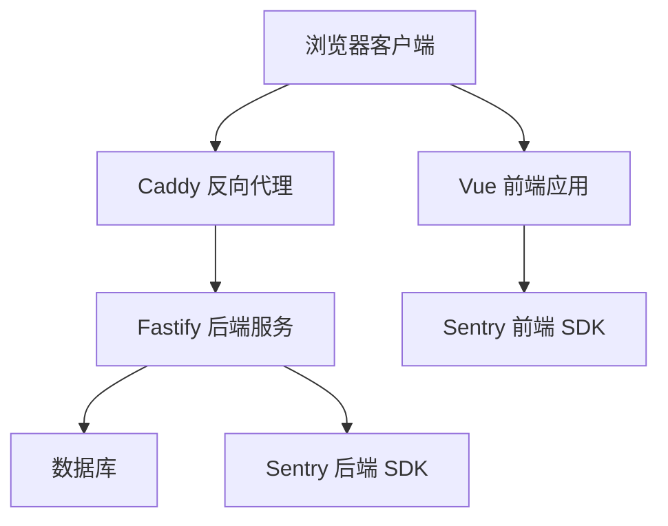
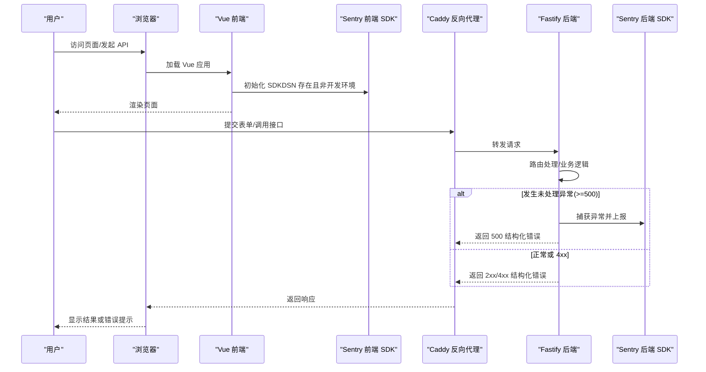
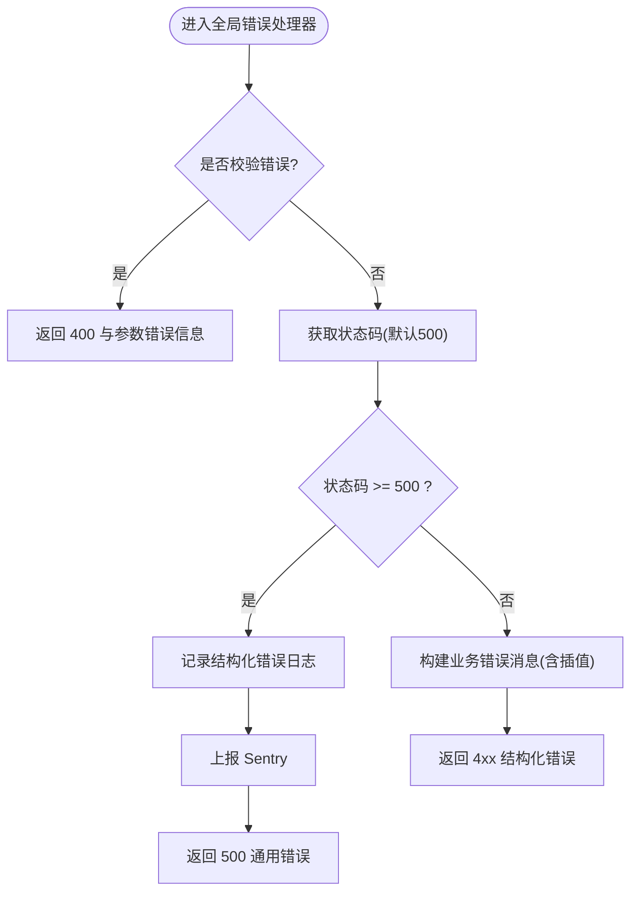
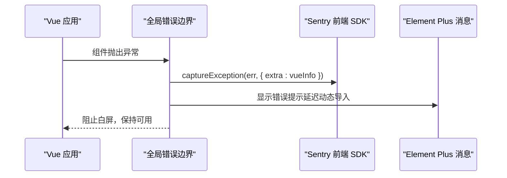
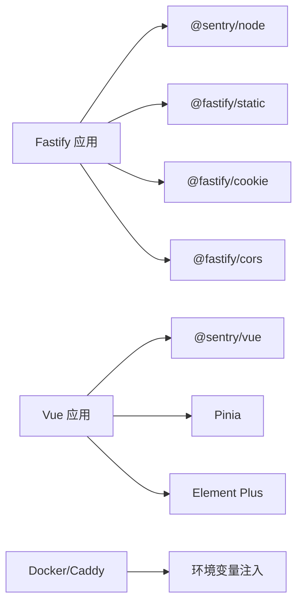

# 日志分析
> 修订版（2026-08-07，四号）：本文件为外部 repowiki 原文 日志分析.md 的仓库内修订版（修补批 #12），按 master 代码逐条核实修正；外部原文（C:\Users\qly19\Desktop\repowiki\）一字未动。
> 修订范围：文件名引用 .js→.ts（TS 迁移）、登录/会话描述对齐 REQ-027 TOTP、删除虚构变量/端点、迁移版本补至 v45。

<cite>
**本文引用的文件**   
- [server/src/app.ts](file://artist-commission/server/src/app.ts)
- [web/src/main.js](file://artist-commission/web/src/main.js)
- [server/src/shared/errors.ts](file://artist-commission/server/src/shared/errors.ts)
- [Dockerfile](file://artist-commission/Dockerfile)
- [docker-compose.yml](file://artist-commission/docker-compose.yml)
- [docs/archive/specs-done/plan-v021-engineering.md](file://artist-commission/docs/archive/specs-done/plan-v021-engineering.md)
</cite>

## 目录
1. [简介](#简介)
2. [项目结构](#项目结构)
3. [核心组件](#核心组件)
4. [架构总览](#架构总览)
5. [详细组件分析](#详细组件分析)
6. [依赖关系分析](#依赖关系分析)
7. [性能考量](#性能考量)
8. [故障排查指南](#故障排查指南)
9. [结论](#结论)
10. [附录](#附录)

## 简介
本指南面向阿里画师约稿管理平台的运维与研发人员，系统化说明应用日志、错误日志与性能日志的收集、查看与分析方法。重点覆盖：
- 前端与后端的错误上报机制（Sentry）
- 日志格式、关键字段含义与常用查询语句
- 生产环境日志收集策略、日志轮转配置建议
- 基于日志快速定位问题根因与复现路径的方法论

## 项目结构
本项目采用前后端分离架构：
- 后端：Fastify 应用，集中式错误处理与 Sentry 集成
- 前端：Vue 3 + Element Plus，全局错误边界与 Sentry 集成
- 部署：Docker 容器化，Caddy 反向代理，环境变量驱动功能开关

图表来源
- [server/src/app.ts:1-318](file://artist-commission/server/src/app.ts#L1-L318)
- [web/src/main.js:1-51](file://artist-commission/web/src/main.js#L1-L51)

章节来源
- [server/src/app.ts:1-318](file://artist-commission/server/src/app.ts#L1-L318)
- [web/src/main.js:1-51](file://artist-commission/web/src/main.js#L1-L51)

## 核心组件
- 后端错误处理与 Sentry 初始化：统一捕获未处理异常、结构化错误码、中文友好提示，并在 5xx 级别错误时上报 Sentry
- 前端全局错误边界：捕获 Vue 组件渲染错误与未处理异常，上报 Sentry 并给出用户友好提示
- 错误码与消息映射：集中定义业务错误码与用户可见消息，便于前端 i18n 与后端统一响应

章节来源
- [server/src/app.ts:204-220](file://artist-commission/server/src/app.ts#L204-L220)
- [server/src/app.ts:222-252](file://artist-commission/server/src/app.ts#L222-L252)
- [web/src/main.js:21-41](file://artist-commission/web/src/main.js#L21-L41)
- [server/src/shared/errors.ts:1-434](file://artist-commission/server/src/shared/errors.ts#L1-L434)

## 架构总览
下图展示请求从浏览器到后端的路径，以及错误在前后端的捕获与上报流程。

图表来源
- [server/src/app.ts:204-220](file://artist-commission/server/src/app.ts#L204-L220)
- [server/src/app.ts:222-252](file://artist-commission/server/src/app.ts#L222-L252)
- [web/src/main.js:21-41](file://artist-commission/web/src/main.js#L21-L41)

## 详细组件分析

### 后端错误处理与 Sentry 集成
- 条件启用：仅在 DSN 已配置且非 development 环境时初始化 Sentry，避免开发噪音与网络开销
- 版本标记：自动读取 package.json 版本号作为 release，便于按版本回溯
- 隐私保护：关闭默认 PII 采集（不上传用户 IP）
- 全局错误处理器：
  - 校验失败（validation）返回 400 与中文提示
  - 5xx 错误记录结构化日志并上报 Sentry，对外返回通用“服务器内部错误”
  - 4xx 业务错误使用统一错误码与可插值消息模板（detail 提供占位符值）

图表来源
- [server/src/app.ts:222-252](file://artist-commission/server/src/app.ts#L222-L252)

章节来源
- [server/src/app.ts:204-220](file://artist-commission/server/src/app.ts#L204-L220)
- [server/src/app.ts:222-252](file://artist-commission/server/src/app.ts#L222-L252)
- [server/src/shared/errors.ts:1-434](file://artist-commission/server/src/shared/errors.ts#L1-L434)

### 前端全局错误边界与 Sentry 集成
- 条件启用：仅当 VITE_SENTRY_DSN 存在时初始化 Sentry，否则零开销
- 环境区分：根据构建环境变量设置 environment（production/development）
- 全局错误边界：捕获组件抛错，控制台输出、上报 Sentry，并弹出友好提示（防抖）

图表来源
- [web/src/main.js:21-41](file://artist-commission/web/src/main.js#L21-L41)

章节来源
- [web/src/main.js:21-41](file://artist-commission/web/src/main.js#L21-L41)

### 错误码与消息映射
- AppError：统一业务错误类，包含 code、statusCode、detail
- 错误码常量：覆盖认证、画师、订单、价格、上传、管理员等模块
- 错误消息表：将 code 映射为中文用户友好消息，支持 {key} 插值

章节来源
- [server/src/shared/errors.ts:1-434](file://artist-commission/server/src/shared/errors.ts#L1-L434)

### 环境变量与构建注入
- 后端：SENTRY_DSN_BACKEND 控制 Sentry 初始化；NODE_ENV 控制环境
- 前端：VITE_SENTRY_DSN 由 Docker 构建注入，运行时通过 import.meta.env 读取
- CSP：服务端根据 `SENTRY_DSN_BACKEND || SENTRY_DSN`（app.ts:145，兼容旧名）动态拼接 connect-src，允许上报域名

章节来源
- [server/src/app.ts:140-147](file://artist-commission/server/src/app.ts#L140-L147)
- [server/src/app.ts:204-220](file://artist-commission/server/src/app.ts#L204-L220)
- [web/src/main.js:21-30](file://artist-commission/web/src/main.js#L21-L30)
- [Dockerfile:12-13](file://artist-commission/Dockerfile#L12-L13)
- [docker-compose.yml:12](file://artist-commission/docker-compose.yml#L12)

## 依赖关系分析
- 后端依赖：
  - Fastify 框架与插件（静态资源、Cookie、CORS）
  - @sentry/node SDK（错误上报）
  - 文件系统与路径工具（孤儿文件回收、静态资源分发）
- 前端依赖：
  - Vue 3、Pinia、Element Plus
  - @sentry/vue SDK（错误上报）
- 部署依赖：
  - Docker、Caddy（反向代理）、环境变量注入

图表来源
- [server/src/app.ts:1-318](file://artist-commission/server/src/app.ts#L1-L318)
- [web/src/main.js:1-51](file://artist-commission/web/src/main.js#L1-L51)
- [docker-compose.yml:12](file://artist-commission/docker-compose.yml#L12)

章节来源
- [server/src/app.ts:1-318](file://artist-commission/server/src/app.ts#L1-L318)
- [web/src/main.js:1-51](file://artist-commission/web/src/main.js#L1-L51)
- [docker-compose.yml:12](file://artist-commission/docker-compose.yml#L12)

## 性能考量
- 性能追踪关闭：前后端均设置 tracesSampleRate: 0，仅捕获错误，不产生性能数据开销
- 日志体积控制：5xx 错误才上报 Sentry，4xx 业务错误仅返回结构化响应，减少不必要上报
- 静态资源缓存：assets 长缓存 immutable，index.html no-cache，降低带宽与缓存失效成本
- 孤儿文件回收：每日定时扫描并移入回收站，释放磁盘空间

章节来源
- [server/src/app.ts:204-220](file://artist-commission/server/src/app.ts#L204-L220)
- [web/src/main.js:21-30](file://artist-commission/web/src/main.js#L21-L30)
- [server/src/app.ts:268-309](file://artist-commission/server/src/app.ts#L268-L309)
- [server/src/app.ts:35-116](file://artist-commission/server/src/app.ts#L35-L116)

## 故障排查指南

### 日志收集与查看
- 后端日志：
  - 启动与初始化：Sentry 启用、CSP 头、静态资源路径
  - 请求与错误：结构化错误日志（包含 url、err），5xx 错误会触发 Sentry 上报
  - 文件回收：孤儿文件回收统计与失败告警
- 前端日志：
  - 控制台输出：[Vue Error] 前缀的错误堆栈与上下文
  - Sentry 面板：按环境、release、错误类型筛选

常用查询语句（示例）
- 后端日志关键词：
  - “未处理的服务端错误” → 定位 5xx 异常
  - “孤儿文件回收” → 检查磁盘清理情况
  - “Sentry 已启用” → 确认监控开关
- 前端日志关键词：
  - “[Vue Error]” → 组件级异常
  - “页面出了点小问题，请刷新重试” → 用户侧提示

章节来源
- [server/src/app.ts:222-252](file://artist-commission/server/src/app.ts#L222-L252)
- [server/src/app.ts:35-116](file://artist-commission/server/src/app.ts#L35-L116)
- [web/src/main.js:33-41](file://artist-commission/web/src/main.js#L33-L41)

### 错误日志与 Sentry 使用
- 后端：
  - 初始化条件：SENTRY_DSN_BACKEND 非空且 NODE_ENV !== 'development'
  - 上报时机：5xx 错误通过 request.log.error 记录并 Sentry.captureException
  - 隐私与安全：sendDefaultPii: false，tracesSampleRate: 0
- 前端：
  - 初始化条件：VITE_SENTRY_DSN 存在
  - 上报时机：全局错误边界捕获异常，captureException(err, { extra: vueInfo })
  - 用户体验：动态导入 ElMessage 并提示，避免重复弹窗

章节来源
- [server/src/app.ts:204-220](file://artist-commission/server/src/app.ts#L204-L220)
- [server/src/app.ts:222-252](file://artist-commission/server/src/app.ts#L222-L252)
- [web/src/main.js:21-41](file://artist-commission/web/src/main.js#L21-L41)

### 日志格式与关键字段
- 后端结构化错误响应：
  - code：机器可读错误码（如 VALIDATION、INTERNAL、NOT_FOUND）
  - error：中文友好消息（可能包含 {key} 插值）
  - detail：可选上下文（如字段名、限制值）
- 后端错误日志：
  - err：异常对象（堆栈、类型）
  - url：请求路径
- 前端错误上下文：
  - extra.vueInfo：Vue 错误信息（组件、生命周期等）

章节来源
- [server/src/app.ts:222-252](file://artist-commission/server/src/app.ts#L222-L252)
- [server/src/shared/errors.ts:1-434](file://artist-commission/server/src/shared/errors.ts#L1-L434)
- [web/src/main.js:33-41](file://artist-commission/web/src/main.js#L33-L41)

### 生产环境日志收集策略
- 容器化部署：
  - Docker 构建注入 VITE_SENTRY_DSN，运行时由前端读取
  - docker-compose 中传递环境变量，确保前后端一致
- 反向代理：
  - Caddy 自动 HTTPS，统一入口，便于集中日志采集
- 日志轮转建议：
  - 使用容器日志驱动（如 json-file 或 journald）配合 logrotate
  - 按大小与时间切分，保留最近 N 天，压缩归档
  - 结合外部日志系统（ELK/Loki）进行聚合与检索

章节来源
- [Dockerfile:12-13](file://artist-commission/Dockerfile#L12-L13)
- [docker-compose.yml:12](file://artist-commission/docker-compose.yml#L12)
- [docker-compose.yml:42-63](file://artist-commission/docker-compose.yml#L42-L63)

### 性能分析方法
- 当前策略：关闭性能追踪（tracesSampleRate: 0），聚焦错误捕获
- 如需性能分析：
  - 后端：开启 @sentry/node 的 tracing，采样率按需调整
  - 前端：开启 @sentry/vue 的 tracing，关注首屏与关键交互耗时
  - 结合 APM 工具（如自建 Sentry Performance 或第三方）进行链路追踪

章节来源
- [server/src/app.ts:204-220](file://artist-commission/server/src/app.ts#L204-L220)
- [web/src/main.js:21-30](file://artist-commission/web/src/main.js#L21-L30)

### 快速定位问题根因与复现路径
- 步骤：
  1. 通过 Sentry 面板筛选错误类型与环境（production/development）
  2. 查看错误堆栈与上下文（后端 err/url，前端 vueInfo）
  3. 关联 release 版本号定位引入变更
  4. 复现路径：根据 URL、请求参数与用户操作序列还原
  5. 验证修复：回归测试与监控告警确认

章节来源
- [docs/archive/specs-done/plan-v021-engineering.md:55-95](file://artist-commission/docs/archive/specs-done/plan-v021-engineering.md#L55-L95)

## 结论
本项目通过前后端统一的错误处理与 Sentry 集成，实现了稳定的错误监控与上报能力。在生产环境中，结合环境变量开关、CSP 安全头与容器化部署，确保了隐私保护与零开销禁用。通过结构化错误码与中文友好消息，提升了用户与运维体验。未来可按需开启性能追踪，进一步完善 APM 能力。

## 附录
- 环境变量清单：
  - 后端：SENTRY_DSN_BACKEND、NODE_ENV、TRUST_PROXY、CORS_ORIGIN、UPLOAD_DIR、DB_PATH、SESSION_SECRET、COOKIE_SECRET、ADMIN_QQ
  - 前端：VITE_SENTRY_DSN（构建注入）
- 关键路径：
  - 后端入口：server/src/app.ts
  - 前端入口：web/src/main.js
  - 错误码定义：server/src/shared/errors.ts

章节来源
- [server/src/app.ts:1-318](file://artist-commission/server/src/app.ts#L1-L318)
- [web/src/main.js:1-51](file://artist-commission/web/src/main.js#L1-L51)
- [server/src/shared/errors.ts:1-434](file://artist-commission/server/src/shared/errors.ts#L1-L434)
- [Dockerfile:12-13](file://artist-commission/Dockerfile#L12-L13)
- [docker-compose.yml:12](file://artist-commission/docker-compose.yml#L12)