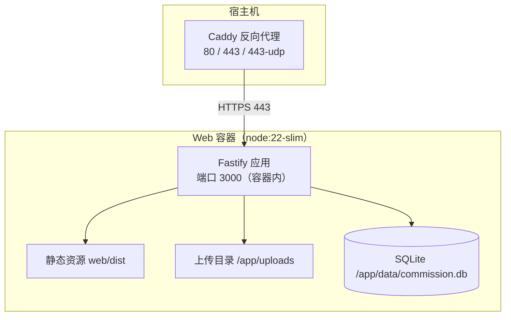

# 生产部署

> 本文按 `artist-commission` master 当前代码重写（2026-08-07，四号）。
> 外部原版「生产部署.md」存在 3 处与代码不符：①「必须修改 SIGN_SECRET」——该变量全库零命中，文件访问签名密钥实为 `SESSION_SECRET`（file-sign.ts）；②「Web 容器不直接映射宿主机端口」写成已成事实——compose 当前仍 `ports: 3000:3000`（注释注明生产需手动注释掉）；③「自动 HTTPS 与泛解析」——Caddyfile 仅 `{$DOMAIN}` 单主域（C48 决策已放弃子域名，统一路径访问）。
> 重写依据：`docs/comms/04-to-01-repowiki非认证-交付-20260807.md` 🔴 4-6 项 + 对照 master 代码逐一实测。

<cite>
**本文引用的文件**
- [docker-compose.yml](file://artist-commission/docker-compose.yml)
- [Caddyfile](file://artist-commission/Caddyfile)
- [Dockerfile](file://artist-commission/Dockerfile)
- [entrypoint.sh](file://artist-commission/entrypoint.sh)
- [.env.example](file://artist-commission/.env.example)
- [server/src/index.ts](file://artist-commission/server/src/index.ts)
- [server/src/app.ts](file://artist-commission/server/src/app.ts)
- [server/src/db/connection.ts](file://artist-commission/server/src/db/connection.ts)
- [server/src/db/init.js](file://artist-commission/server/src/db/init.js)
- [server/src/shared/file-sign.ts](file://artist-commission/server/src/shared/file-sign.ts)
- [server/src/shared/middleware/rate-limit.ts](file://artist-commission/server/src/shared/middleware/rate-limit.ts)
- [server/src/features/admin/health.routes.ts](file://artist-commission/server/src/features/admin/health.routes.ts)
- [server/src/features/admin/health.service.ts](file://artist-commission/server/src/features/admin/health.service.ts)
- [workspace/temp/db-backup.js](file://artist-commission/workspace/temp/db-backup.js)
- [docs/开发→生产切换指南.md](file://artist-commission/docs/开发→生产切换指南.md)
</cite>

## 目录
1. [人话总览](#人话总览)
2. [部署架构（当前代码现状）](#部署架构当前代码现状)
3. [生产 .env 配置（必填清单）](#生产-env-配置必填清单)
4. [域名与 HTTPS（Caddyfile 现状）](#域名与-httpscaddyfile-现状)
5. [端口现状与生产切换步骤](#端口现状与生产切换步骤)
6. [数据库与备份恢复](#数据库与备份恢复)
7. [静态资源与上传访问控制](#静态资源与上传访问控制)
8. [监控与健康检查](#监控与健康检查)
9. [安全加固清单](#安全加固清单)
10. [运维操作指南](#运维操作指南)
11. [生产部署检查清单](#生产部署检查清单)

## 人话总览

**一句话**：生产环境 = 一个 Web 容器（前端静态文件 + 后端 API 都在这一个容器里，端口 3000）+ 一个 Caddy 反向代理容器（自动 HTTPS）。数据是 SQLite 文件，放在挂载卷里。流量路径：用户浏览器 → Caddy(80/443) → web:3000 → SQLite/上传目录。

**三个最容易踩的坑**（外部旧文档都写错了，本文已修正）：

1. **没有 `SIGN_SECRET` 这个变量**。文件访问签名用的密钥就是 `SESSION_SECRET`（见 `server/src/shared/file-sign.ts` 的 `getSecret()`，生产未设置直接启动报错）。
2. **compose 现在仍然映射宿主机 3000 端口**（`ports: "3000:3000"`），生产部署需要**手动注释掉那两行**、只保留 `expose`。这不是文档里的"默认行为"，是要做的操作。
3. **没有泛解析（wildcard）**。Caddyfile 只配了一个主域名 `{$DOMAIN}`；C48 决策已放弃子域名方案，画师主页通过路径访问（`{$DOMAIN}/artist/:subdomain`）。

## 部署架构（当前代码现状）



**compose 服务清单**（`docker-compose.yml`）：

| 服务 | 镜像 | 端口 | 卷 |
|------|------|------|-----|
| `web` | 本地构建（Dockerfile） | `ports 3000:3000` + `expose 3000` | `./data:/app/data`、`./uploads:/app/uploads` |
| `caddy` | `caddy:2-alpine` | `80`、`443`、`443/udp`（HTTP/3） | `./Caddyfile:/etc/caddy/Caddyfile:ro`、caddy_data、caddy_config |

- `web` 通过 `env_file: .env` 注入全部环境变量（compose 会全量注入，SENTRY 变量名以代码读取为准，见第 8 节）。
- `web` 容器内 `environment` 固定覆盖：`NODE_ENV=production`、`DB_PATH=/app/data/commission.db`、`UPLOAD_DIR=/app/uploads`、`TRUST_PROXY=172.16.0.0/12,10.0.0.0/8,192.168.0.0/16`、`TZ=Asia/Shanghai`。**不要**在 compose 里硬编码 `AUTH_DEV_MODE`（注释明确：由 .env 控制，否则会覆盖）。
- `healthcheck` 每 30s 探测 `http://127.0.0.1:3000/api/health`，`caddy` 依赖 `web` 健康后才启动。

**容器启动脚本**（`entrypoint.sh`）：`cd /app/server && exec npx tsx src/index.ts`。入口是 **`index.ts`**（外部旧文档写 index.js 已不存在）。`initDatabase` 已在应用装配时自动执行（建表 + 迁移），无需手动调用。

**镜像**（`Dockerfile`）：node:22-slim 多阶段——先构建前端 `web/dist`，再装后端 production 依赖（`npm install --omit=dev`），升级 npm 工具链修已知漏洞，`USER node` 非 root 运行，`data/`、`uploads/` 显式 chown 给 node 用户。

## 生产 .env 配置（必填清单）

以 `.env.example` 为唯一权威。生产必须修改的项：

| 变量 | 要求 | 说明 |
|------|------|------|
| `DOMAIN` | 必填 | 你的域名，Caddyfile 用 `{$DOMAIN}` 生成站点 |
| `SESSION_SECRET` | 必填，≥32 字符 | 会话签名 + **文件访问签名** + Cookie 签名；生产缺失或过短会 fail-fast 或健康检查告警 |
| `COOKIE_SECRET` | 必填，≥32 字符 | httpOnly Cookie 签名验证 |
| `ADMIN_QQ` | 必填（首次部署） | 自动创建管理员账号；生产缺失且无管理员时启动抛错退出 |
| `NODE_ENV` | `production` | compose 已固定，无需改 |
| `AUTH_DEV_MODE` | **必须 false 或删除** | 生产下为 true 会泄露 TOTP 密钥明文（绑定接口返回 `_dev_secret`） |
| `CORS_ORIGIN` | 按需 | 留空 = 禁止跨域（前端与 API 同域部署，推荐） |
| `TZ` | `Asia/Shanghai` | compose 已内置 |

> ⚠️ 外部旧文档的「必须修改：…SIGN_SECRET…」——**没有这个变量**。文件签名 URL 用的就是 `SESSION_SECRET`（file-sign.ts `getSecret()`：生产未设置直接 throw，开发环境回退到 `dev-secret-change-in-production`）。

**`TRUST_PROXY`**：compose 已内置 `172.16.0.0/12,10.0.0.0/8,192.168.0.0/16`（仅信任 Docker 内网段，防 X-Forwarded-For 伪造）。非 Docker 环境按自己的反代网段调整。

## 域名与 HTTPS（Caddyfile 现状）

**当前 Caddyfile 全文事实**：

```
{$DOMAIN} {
    encode zstd gzip          # 环境批 B1：启用压缩（zstd 优先，回退 gzip）
    reverse_proxy web:3000
}
```

- **单主域，无泛解析**。文件内注释明确：「主域名（唯一入口）」「C48 决策：放弃子域名方案，统一路径访问。未来需要时 Caddy rewrite 转发，不做进应用层」。画师主页路径 = `{$DOMAIN}/artist/:subdomain`。
- 自动 HTTPS：Caddy 自动申请/续期 Let's Encrypt 证书（80 端口用于 ACME 挑战，443 提供 HTTPS，443/udp 提供 HTTP/3）。
- 要加子域名或更多站点，改 Caddyfile（compose 已挂载只读），不用动应用层。

**若改用 Nginx**（仅建议，非现网配置）：TLS 1.2+/1.3、HSTS、OCSP Stapling、HTTP/2/3、正确设置 `X-Forwarded-For`/`Host`/`Scheme`/`Port`，并确保 `TRUST_PROXY` 与网段匹配。

## 端口现状与生产切换步骤

**现状**：`docker-compose.yml` 的 `web` 服务目前同时有：

```yaml
ports:
  - "3000:3000"     # 开发环境：方便本地浏览器直接访问
expose:
  - "3000"          # 生产：仅供容器网络内访问
```

文件内注释明确要求：「**生产部署：注释掉 ports 两行，仅保留 expose（走 Caddy 反向代理）**」。

**生产切换步骤**：

1. 编辑 `docker-compose.yml`，注释掉 `ports` 两行，保留 `expose`。
2. 确认 `.env` 中 `DOMAIN`、`SESSION_SECRET`、`COOKIE_SECRET`、`ADMIN_QQ` 已填好，`AUTH_DEV_MODE` 未设或为 false。
3. 重建并启动：

   ```bash
   docker compose up -d --build
   ```

4. 验证：浏览器访问 `https://你的域名.com`；`https://你的域名.com/api/health` 返回 `ok`。
5. （可选）确认宿主机 3000 不再监听（`ss -tlnp | grep 3000` 无结果），所有流量走 80/443。

> 若先部署过旧版且 `.env` 里填了 `SIGN_SECRET`：它不会被读取，无副作用，但建议删除以免误导。

## 数据库与备份恢复

- **引擎**：SQLite（better-sqlite3），**无 PostgreSQL/MySQL**。文件默认 `/app/data/commission.db`（`DB_PATH` 可覆盖；`:memory:` 仅测试用）。
- **WAL 处理**：`connection.ts` 检测 Docker 环境（`DOCKER` 或 `/etc/.dockerenv` 存在等）自动用 `journal_mode = DELETE`——因为 Docker Desktop Windows 的 bind mount 不支持 WAL 共享内存，数据会困在 WAL 文件里丢失；本地开发用 WAL。另外 `foreign_keys = ON`、`busy_timeout = 5000`。
- **迁移**：启动时自动执行（`init.js`），按版本号应用 `MIGRATIONS` 数组（最新 **v45**）；**每次迁移前自动备份**为 `commission.db.bak.v<N>`；索引在迁移后统一创建。
- **手动热备**：仓库内有 `workspace/temp/db-backup.js`（运维脚本，非正式工具），可定期执行；更推荐直接复制数据文件（SQLite 文件拷贝即可，先停写或接受极小窗口）。
- **恢复**：停容器 → 用备份替换 `/app/data/commission.db` → 确认属主为 node → 起容器 → 看迁移日志确认成功。
- **回滚**：回退镜像版本 + 恢复对应版本的数据库备份，确认迁移顺序一致（先看备份的 schema_migrations 版本）。

## 静态资源与上传访问控制

**前端静态资源**（`app.ts` 静态托管逻辑）：

- `web/dist/assets/*`：长缓存 `immutable`（文件名含哈希），发版即时生效靠 index.html 不缓存。
- `index.html`：`no-cache`。

**上传目录 `/uploads`**（`file-sign.ts` + `app.ts`）：

| 路径 | 策略 | 缓存 |
|------|------|------|
| `/uploads/images/`（公开，画师作品集） | 无需签名，inline 预览 | `public, max-age=86400` |
| `/uploads/references/`、`/uploads/deliverables/`、`/uploads/notes/`（敏感） | **必须带签名 `?sig=`**，否则 403 | `attachment` + `no-store` |

- 签名 = `base64url(payload).base64url(HMAC-SHA256)`，payload 含路径与过期时间，**TTL 15 分钟**，密钥 = `SESSION_SECRET`（生产未设置 fail-fast）。
- 路径校验先 `decodeURIComponent` 再判断，含 `..` 一律拒绝（防路径穿越）。

## 监控与健康检查

**Sentry 错误监控**（`app.ts`）：

- 后端变量名：**`SENTRY_DSN_BACKEND`**（外部旧文档写 `SENTRY_DSN`——兼容回退存在但 .env.example 只列 BACKEND，填 BACKEND 即可）。CSP 的 `connect-src` 会按 `SENTRY_DSN_BACKEND || SENTRY_DSN` 动态拼接上报域名（app.ts:145）。
- 条件：DSN 为空 → 完全禁用、零网络请求；`NODE_ENV=development` → 自动跳过上报。
- 配置：`release` 取自 package.json 版本号，`environment = NODE_ENV`，`tracesSampleRate: 0`（只报错误，不做性能追踪）。
- 前端变量：`VITE_SENTRY_DSN`（Dockerfile 构建时注入，web/src/main.js 使用）。

**健康检查**：

| 端点 | 用途 |
|------|------|
| `/api/health` | 容器健康探测（compose healthcheck 用），返回 `ok` |
| `/api/admin/health` | 管理员自检：8 项（数据库连接/迁移版本/上传目录/磁盘空间/数据完整性/备份状态/密钥/Node 环境），附诊断包下载 `/api/admin/health/download` |

**日志**：生产结构化 JSON（pino），容器内 `docker compose logs web` 查看；轮转建议用宿主级 logrotate 或容器平台日志驱动。未捕获异常记录后进程强制退出（防僵尸）。

## 安全加固清单

- **非 root 运行**：`USER node`，data/uploads 显式 chown（Dockerfile）。
- **安全响应头**：`X-Content-Type-Options`、`X-Frame-Options`、CSP、`Referrer-Policy`、`Permissions-Policy`、CORP 等（app.ts 安全头批）。
- **CSP**：移除 `unsafe-eval`；`connect-src 'self'` + 动态拼 Sentry 域名。
- **上传访问控制**：敏感路径签名校验（15 分钟 TTL）、禁止 MIME 嗅探、路径穿越防护。
- **限流**：per-IP 滑动日志限流（`rate-limit.ts`），所有公开接口统一使用（防撞库/刷接口）。**限流参数在各调用处硬编码，没有 RATE_LIMIT_* 环境变量**。
- **会话**：httpOnly Cookie + HMAC 签名 token（无 JWT）；登出 = bump token_version + 清 Cookie。
- **TRUST_PROXY**：仅信任 Docker 内网段（compose 已内置）。
- **AUTH_DEV_MODE=false**：生产不返回 TOTP 密钥明文。

## 运维操作指南

| 操作 | 命令 |
|------|------|
| 启动 | `docker compose up -d` |
| 停止 | `docker compose down`（保留卷；`-v` 会删卷，慎用） |
| 查看状态 | `docker compose ps` |
| 看日志 | `docker compose logs -f web` |
| 更新发布 | `docker compose up -d --build` |
| 健康自检 | `curl https://你的域名.com/api/admin/health` |
| 备份 | 迁移自动备份 `.bak.v<N>` + 定期复制 `data/commission.db` 或跑 `workspace/temp/db-backup.js` |
| 恢复 | 替换数据库文件并重启容器，确认权限与迁移 |
| 日志轮转 | 宿主级 logrotate 或平台日志驱动 |

## 生产部署检查清单

- [ ] `.env`：`DOMAIN`、`SESSION_SECRET`（≥32）、`COOKIE_SECRET`（≥32）、`ADMIN_QQ` 已填；**无 SIGN_SECRET/JWT_SECRET 等虚构项**
- [ ] `AUTH_DEV_MODE` 未设或为 false
- [ ] compose：`ports` 已注释，仅 `expose 3000`（流量只走 Caddy）
- [ ] Caddyfile：`{$DOMAIN}` 已指向你的域名（单主域，无泛解析）
- [ ] 80/443（+443/udp）已放行；`https://你的域名.com/api/health` 返回 `ok`
- [ ] `https://你的域名.com/api/admin/health` 8 项全 ok（或明确已知的 warn）
- [ ] `SESSION_SECRET` 已配置 → 健康检查第 7 项不报 fail
- [ ] 敏感上传路径（references/deliverables/notes）无签名返回 403
- [ ] 数据库迁移日志无报错；存在 `.bak.v<N>` 备份
- [ ] Sentry：`SENTRY_DSN_BACKEND` 已填（可选）且 CSP 未拦截上报

---

*修订版维护于仓库内（docs/external-wiki/），外部原文（C:\Users\qly19\Desktop\repowiki\）未改动。*