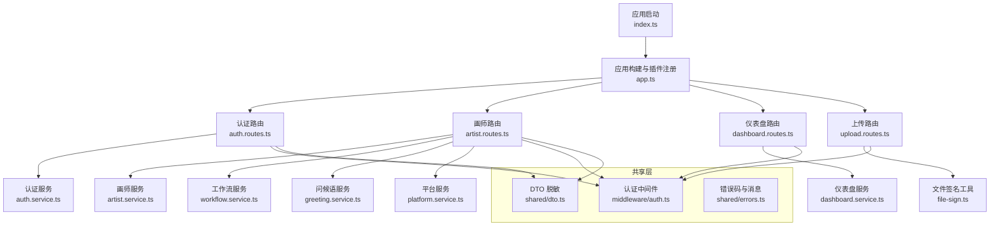
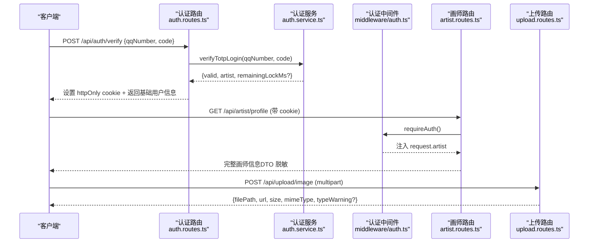
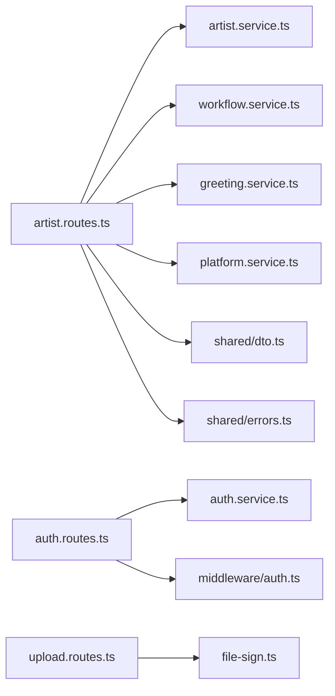

# 画师管理接口
> 修订版（2026-08-07，四号）：本文件为外部 repowiki 原文 画师管理接口.md 的仓库内修订版（修补批 #1），按 master 代码逐条核实修正；外部原文（C:\Users\qly19\Desktop\repowiki\）一字未动。
> 修订范围：文件名引用 .js→.ts（TS 迁移）、登录/会话描述对齐 REQ-027 TOTP、删除虚构变量/端点、迁移版本补至 v45。

<cite>
**本文引用的文件**   
- [server/src/app.ts](file://server/src/app.ts)
- [server/src/index.ts](file://server/src/index.ts)
- [server/src/features/artist/artist.routes.ts](file://server/src/features/artist/artist.routes.ts)
- [server/src/features/artist/dashboard.routes.ts](file://server/src/features/artist/dashboard.routes.ts)
- [server/src/features/auth/auth.routes.ts](file://server/src/features/auth/auth.routes.ts)
- [server/src/shared/middleware/auth.ts](file://server/src/shared/middleware/auth.ts)
- [server/src/shared/dto.ts](file://server/src/shared/dto.ts)
- [server/src/features/upload/upload.routes.ts](file://server/src/features/upload/upload.routes.ts)
- [server/src/shared/errors.ts](file://server/src/shared/errors.ts)
- [server/src/types/entities.ts](file://server/src/types/entities.ts)
</cite>

## 目录
1. [简介](#简介)
2. [项目结构](#项目结构)
3. [核心组件](#核心组件)
4. [架构总览](#架构总览)
5. [详细接口说明](#详细接口说明)
6. [依赖关系分析](#依赖关系分析)
7. [性能与安全考量](#性能与安全考量)
8. [故障排查指南](#故障排查指南)
9. [结论](#结论)
10. [附录：数据模型与错误码](#附录数据模型与错误码)

## 简介
本文件为“阿里画师约稿管理平台”的画师管理系统 API 接口文档，覆盖画师信息管理、主页设置、偏好配置、仪表盘数据、认证登录、文件上传等全部相关端点。文档包含 HTTP 方法、URL 模式、请求/响应结构、权限控制、数据模型定义、验证规则与错误处理示例，帮助前后端开发者快速对接与排障。

## 项目结构
后端基于 Fastify 构建，按功能模块划分路由与服务：
- 应用入口与全局中间件（CORS、安全头、静态资源、错误处理）
- 认证模块（TOTP 动态口令登录、会话管理）
- 画师模块（公开主页、后台资料、价格档位、作品、须知、问候语、工作流）
- 仪表盘模块（收入统计、待办合并、活动流）
- 上传模块（图片、参考图、交付文件、备注附图）
- 共享层（DTO 脱敏、错误码与消息、认证中间件）

**图表来源** 
- [server/src/index.ts:1-62](file://server/src/index.ts#L1-L62)
- [server/src/app.ts:17-266](file://server/src/app.ts#L17-L266)
- [server/src/features/auth/auth.routes.ts:1-96](file://server/src/features/auth/auth.routes.ts#L1-L96)
- [server/src/features/artist/artist.routes.ts:1-617](file://server/src/features/artist/artist.routes.ts#L1-L617)
- [server/src/features/artist/dashboard.routes.ts:1-51](file://server/src/features/artist/dashboard.routes.ts#L1-L51)
- [server/src/features/upload/upload.routes.ts:1-282](file://server/src/features/upload/upload.routes.ts#L1-L282)

**章节来源**
- [server/src/index.ts:1-62](file://server/src/index.ts#L1-L62)
- [server/src/app.ts:17-266](file://server/src/app.ts#L17-L266)

## 核心组件
- 认证中间件：统一从 httpOnly Cookie 或 Authorization Header 提取令牌，校验会话有效性、账号状态与 token_version，注入当前画师上下文。
- DTO 脱敏：对外返回的画师信息剔除敏感字段（如 TOTP 密钥、token_version、软删除标记等）。
- 错误处理：全局错误处理器将业务异常转换为结构化 JSON（code、error、detail），并对 5xx 隐藏内部细节。
- 文件上传：多路上传（图片、参考图、交付文件、备注附图），严格白名单与路径穿越防护，签名 URL 访问受控资源。

**章节来源**
- [server/src/shared/middleware/auth.ts:1-96](file://server/src/shared/middleware/auth.ts#L1-L96)
- [server/src/shared/dto.ts:1-29](file://server/src/shared/dto.ts#L1-L29)
- [server/src/app.ts:222-252](file://server/src/app.ts#L222-L252)
- [server/src/features/upload/upload.routes.ts:1-282](file://server/src/features/upload/upload.routes.ts#L1-L282)

## 架构总览
系统采用模块化路由 + 服务层分离的设计。所有 /api/* 路由由 app.ts 注册，各功能模块独立维护自身路由与业务逻辑。认证中间件作为前置守卫保护需要登录的接口；DTO 保证对外数据结构安全；错误码集中管理便于前端 i18n。

**图表来源** 
- [server/src/features/auth/auth.routes.ts:20-74](file://server/src/features/auth/auth.routes.ts#L20-L74)
- [server/src/shared/middleware/auth.ts:35-60](file://server/src/shared/middleware/auth.ts#L35-L60)
- [server/src/features/artist/artist.routes.ts:96-106](file://server/src/features/artist/artist.routes.ts#L96-L106)
- [server/src/features/upload/upload.routes.ts:148-177](file://server/src/features/upload/upload.routes.ts#L148-L177)

## 详细接口说明

### 认证与授权
- POST /api/auth/verify
  - 描述：QQ 号 + TOTP 动态口令登录，成功后设置 httpOnly Cookie。
  - 权限：无需登录
  - 请求体：{ qqNumber: string(5-15位数字), code: string(6位数字) }
  - 响应：{ isAdmin: boolean, artist: { id, name, subdomain, qqNumber } }
  - 限流：同 IP 10次/5分钟
  - 错误：401 未通过（含剩余锁定时间 detail）
- GET /api/auth/me
  - 描述：获取当前画师信息与管理员标记
  - 权限：需登录
  - 响应：{ ...publicArtistDTO(artist), isAdmin }
- POST /api/auth/logout
  - 描述：登出并失效所有旧令牌
  - 权限：需登录
  - 响应：{ message }

**章节来源**
- [server/src/features/auth/auth.routes.ts:20-94](file://server/src/features/auth/auth.routes.ts#L20-L94)
- [server/src/shared/middleware/auth.ts:35-60](file://server/src/shared/middleware/auth.ts#L35-L60)

### 画师公开接口
- GET /api/platforms
  - 描述：获取启用的社交平台列表（仅启用项）
  - 权限：无需登录
  - 响应：平台列表
- GET /api/artists
  - 描述：获取所有画师公开信息（排除管理员与 hidden）
  - 权限：无需登录
  - 响应：[{ id, name, subdomain, avatar, bio, status, customLinks }]
- GET /api/artists/:subdomain
  - 描述：获取画师公开主页（作品、价格、状态、须知、模板、外链、名额额度、公告等）
  - 权限：无需登录
  - 响应：{ id, name, subdomain, avatar, bio, status, templateId, paletteId, customLinks, notifyEnabled, contactQq, revisionNote, accentColor, orderTemplateId, inspirationTags, batchLimit, bufferLimit, formalCount, bufferCount, slotDisplay, effectiveStatus, monthlyQuota, quotaInfo, announcement, tiers, artworks, rules }
  - 注意：hidden 状态仅返回最小信息

**章节来源**
- [server/src/features/artist/artist.routes.ts:20-88](file://server/src/features/artist/artist.routes.ts#L20-L88)

### 画师后台接口（需登录）
- GET /api/artist/profile
  - 描述：获取当前登录画师的完整信息（含档位、作品、须知、名额显示）
  - 权限：需登录
  - 响应：{ ...publicArtistDTO(artist), tiers, artworks, rules, slotDisplay }
- PUT /api/artist/profile
  - 描述：更新画师资料（昵称、头像、简介、状态、外链、身份码、通知开关、模板、配色、备注、默认面板、强调色、下单模板、灵感标签、名额缓冲、自动递补、队列位置可见性、缓冲短名、公告、月度额度、快捷按钮、多画风开关）
  - 权限：需登录
  - 请求体字段（camelCase）：name, avatar, bio, status, customLinks, notifyEnabled, artistCode, contactQq, templateId, paletteId, revisionNote, dashboardDefaultPanel, accentColor, orderTemplateId, inspirationTags, batchLimit, bufferLimit, autoPromote, hideQueuePosition, hidePromoteNotify, bufferShortForm, announcement, announcementExpiresAt, monthlyQuota, quickActions, multiStyleEnabled
  - 校验要点：
    - customLinks：数组最多 8 条，每项仅允许 url（后端重推导 platformId）
    - paletteId：枚举值 paper/ink/dusk/moss
    - accentColor：仅允许预设色值或 null
    - batch_limit + buffer_limit ≥ 1
  - 响应：publicArtistDTO(updated)
- GET /api/artist/tiers
  - 描述：获取当前画师的价格档位
  - 权限：需登录
  - 响应：Tier[]
- POST /api/artist/tiers
  - 描述：新增档位
  - 权限：需登录
  - 请求体：{ name, price, description?, exampleImage?, workDays? }
  - 响应：Tier
- PUT /api/artist/tiers/:id
  - 描述：更新档位（归属校验）
  - 权限：需登录
  - 请求体：同上
  - 响应：Tier
- DELETE /api/artist/tiers/:id
  - 描述：删除档位（归属校验）
  - 权限：需登录
  - 响应：{ success: true }
- PUT /api/artist/tiers/:id/visibility
  - 描述：档位三态切换 visible/showcase/hidden
  - 权限：需登录
  - 请求体：{ visibility }
  - 响应：Tier
- PUT /api/artist/tiers/reorder
  - 描述：拖拽排序（ids 顺序重写 sort_order）
  - 权限：需登录
  - 请求体：{ ids: number[] }
  - 响应：更新后的档位列表
- GET /api/artist/artworks
  - 描述：获取当前画师作品（附带每作品的档位标注 id 列表）
  - 权限：需登录
  - 响应：Artwork[]（含 size_tag_ids）
- POST /api/artist/artworks
  - 描述：新增作品（imagePath 必填，路径归属校验）
  - 权限：需登录
  - 请求体：{ imagePath, title? }
  - 响应：Artwork
- DELETE /api/artist/artworks/:id
  - 描述：删除作品（归属校验）
  - 权限：需登录
  - 响应：{ success: true }
- PUT /api/artist/artworks/:id
  - 描述：编辑作品标题与自由描述
  - 权限：需登录
  - 请求体：{ title?, description? }
  - 响应：Artwork
- PUT /api/artist/artworks/:id/tags
  - 描述：批量设置档位标注（多选替换语义）
  - 权限：需登录
  - 请求体：{ sizeIds: number[] }
  - 响应：{ sizeIds }
- PUT /api/artist/artworks/:id/cover
  - 描述：设为封面（同画师其他作品自动取消）
  - 权限：需登录
  - 响应：Artwork
- DELETE /api/artist/artworks/:id/cover
  - 描述：取消封面
  - 权限：需登录
  - 响应：Artwork
- PUT /api/artist/artworks/cover-order
  - 描述：封面排序（多封面轮播顺序）
  - 权限：需登录
  - 请求体：{ orderedIds: number[] }
  - 响应：更新后的封面顺序
- GET /api/artist/rules
  - 描述：获取约稿须知
  - 权限：需登录
  - 响应：{ content, updated_at }
- PUT /api/artist/rules
  - 描述：更新约稿须知
  - 权限：需登录
  - 请求体：{ content }
  - 响应：{ content, updated_at }
- GET /api/artist/greeting
  - 描述：按时段随机抽取问候语
  - 权限：需登录
  - 响应：问候语文本
- GET /api/artist/workflow
  - 描述：获取流程节点列表
  - 权限：需登录
  - 响应：{ stages }
- POST /api/artist/workflow
  - 描述：添加节点
  - 权限：需登录
  - 请求体：{ name, description? }
  - 响应：新节点
- PUT /api/artist/workflow/:id
  - 描述：改名/改描述/切换收款/改话术/改随机开关
  - 权限：需登录
  - 请求体：{ name?, description?, takesPayment?, speechTemplate?, randomTemplate? }
  - 响应：更新后的节点
- DELETE /api/artist/workflow/:id
  - 描述：删除节点
  - 权限：需登录
  - 响应：成功
- PUT /api/artist/workflow/reorder
  - 描述：拖拽排序
  - 权限：需登录
  - 请求体：{ orderedIds: number[] }
  - 响应：{ stages }
- PUT /api/artist/workflow/payment
  - 描述：批量保存比例（basisPoints）
  - 权限：需登录
  - 请求体：{ nodes: [{ id, basisPoints }] }
  - 响应：{ stages }
- POST /api/artist/workflow/reset
  - 描述：恢复默认模板
  - 权限：需登录
  - 响应：{ stages }
- GET /api/artists/:subdomain/workflow
  - 描述：客户端可见的流程节点
  - 权限：无需登录（对 hidden 与管理员做 404）
  - 响应：{ stages }
- POST /api/public/artworks/:id/like
  - 描述：点赞 +1（IP 限流 5次/分钟/作品）
  - 权限：无需登录
  - 响应：{ likeCount }
- DELETE /api/public/artworks/:id/like
  - 描述：取消点赞 -1（IP 限流 5次/分钟/作品）
  - 权限：无需登录
  - 响应：{ likeCount }

**章节来源**
- [server/src/features/artist/artist.routes.ts:96-617](file://server/src/features/artist/artist.routes.ts#L96-L617)

### 仪表盘接口（需登录）
- GET /api/artist/dashboard/revenue?period=month|quarter|year
  - 描述：收入统计（柱状图数据 + 汇总 + 环比）
  - 权限：需登录
  - 查询参数：period（默认 month）
  - 响应：收入统计对象
- GET /api/artist/dashboard/todo
  - 描述：合并待办（6级排序）
  - 权限：需登录
  - 响应：{ items }
- GET /api/artist/dashboard/activity
  - 描述：最近活动流（前 10 条）
  - 权限：需登录
  - 响应：{ items }

**章节来源**
- [server/src/features/artist/dashboard.routes.ts:1-51](file://server/src/features/artist/dashboard.routes.ts#L1-L51)

### 文件上传接口
- POST /api/upload/image（需登录）
  - 描述：上传作品图/档位示例图（限 10MB，图片格式白名单）
  - 请求：multipart/form-data（单文件）
  - 响应：{ filePath, url, originalName, mimeType, size, typeWarning? }
- POST /api/upload/reference（无需登录）
  - 描述：上传参考图（限 10MB，图片格式白名单）
  - 请求：multipart/form-data（单文件）
  - 响应：{ filePath, url(签名), originalName, mimeType, size, typeWarning? }
- POST /api/upload/deliverable（需登录）
  - 描述：上传交付文件（限 50MB，更多格式，MIME 黑名单）
  - 请求：multipart/form-data（单文件）
  - 响应：{ filePath, url(签名), originalName, mimeType, size }
- POST /api/upload/note-image（需登录）
  - 描述：备注附图（限 10MB，图片格式白名单）
  - 请求：multipart/form-data（单文件）
  - 响应：{ filePath, url(签名), originalName, mimeType, size }

**章节来源**
- [server/src/features/upload/upload.routes.ts:148-282](file://server/src/features/upload/upload.routes.ts#L148-L282)

### 权限控制与鉴权流程
- 认证方式：httpOnly Cookie 优先，Authorization: Bearer 兜底
- 会话校验：verifySession(token) → 获取 session → 查画师 → 检查 deleted_at 与 token_version
- 管理员判定：比较 qq_number 与平台配置的管理员 QQ
- 未登录/过期/被禁用/令牌失效均返回 401 结构化错误

**章节来源**
- [server/src/shared/middleware/auth.ts:1-96](file://server/src/shared/middleware/auth.ts#L1-L96)

## 依赖关系分析
- 路由依赖服务：artist.routes.ts 依赖 artist.service.ts、workflow.service.ts、greeting.service.ts、platform.service.ts
- 认证依赖：auth.routes.ts 依赖 auth.service.ts 与 middleware/auth.ts
- 上传依赖：upload.routes.ts 依赖 file-sign.ts 进行签名 URL 生成
- 错误与 DTO：errors.ts 提供错误码与中文消息；dto.ts 提供 publicArtistDTO 脱敏

**图表来源** 
- [server/src/features/artist/artist.routes.ts:1-617](file://server/src/features/artist/artist.routes.ts#L1-L617)
- [server/src/features/auth/auth.routes.ts:1-96](file://server/src/features/auth/auth.routes.ts#L1-L96)
- [server/src/features/upload/upload.routes.ts:1-282](file://server/src/features/upload/upload.routes.ts#L1-L282)

**章节来源**
- [server/src/features/artist/artist.routes.ts:1-617](file://server/src/features/artist/artist.routes.ts#L1-L617)
- [server/src/features/auth/auth.routes.ts:1-96](file://server/src/features/auth/auth.routes.ts#L1-L96)
- [server/src/features/upload/upload.routes.ts:1-282](file://server/src/features/upload/upload.routes.ts#L1-L282)

## 性能与安全考量
- 性能
  - 静态资源缓存策略：assets 长缓存 immutable，其余短缓存；index.html no-cache
  - 上传限流：图片/参考图/交付/备注附图分别限流，防止滥用
  - 数据库查询列裁剪：公开接口避免返回敏感字段
- 安全
  - CORS：生产环境必须设置 CORS_ORIGIN，否则 same-origin
  - CSP：严格内容安全策略，限制脚本与连接源
  - 文件上传：扩展名与 MIME 双重白名单，路径穿越纵深防御，SVG/HTML 禁止
  - 私有文件访问：references/deliverables/notes 使用签名 URL，服务端校验签名
  - 错误处理：5xx 不泄露内部细节，4xx 返回结构化错误码与中文提示

**章节来源**
- [server/src/app.ts:125-160](file://server/src/app.ts#L125-L160)
- [server/src/app.ts:162-202](file://server/src/app.ts#L162-L202)
- [server/src/app.ts:222-252](file://server/src/app.ts#L222-L252)
- [server/src/features/upload/upload.routes.ts:18-36](file://server/src/features/upload/upload.routes.ts#L18-L36)

## 故障排查指南
- 常见错误码与含义
  - NOT_LOGGED_IN：未登录
  - SESSION_EXPIRED：登录已过期
  - ACCOUNT_NOT_FOUND：账号不存在
  - ACCOUNT_DISABLED：账号已被停用
  - TOKEN_REVOKED：登录状态已失效
  - ARTIST_NOT_FOUND：画师不存在
  - INVALID_STATUS：无效的状态值
  - LINKS_TOO_MANY：外链数量超过限制
  - ILLEGAL_FILE_TYPE：不支持的文件类型
  - UNSUPPORTED_FORMAT：不支持的文件格式
  - RATE_LIMITED：操作过于频繁
- 排查步骤
  - 确认是否携带有效 cookie 或 Authorization 头
  - 检查请求体字段是否符合 schema（长度、枚举、必填）
  - 查看错误码与 detail 中的上下文信息（如字段名、限制值）
  - 对于上传失败，检查文件格式、大小与 MIME 类型
  - 对于 5xx，查看服务端日志（前端不应展示内部错误）

**章节来源**
- [server/src/shared/errors.ts:21-227](file://server/src/shared/errors.ts#L21-L227)
- [server/src/shared/errors.ts:229-434](file://server/src/shared/errors.ts#L229-L434)
- [server/src/app.ts:222-252](file://server/src/app.ts#L222-L252)

## 结论
本接口文档覆盖了画师管理系统的核心能力：认证登录、画师资料与主页定制、价格档位与作品管理、约稿须知与工作流、仪表盘数据与文件上传。通过严格的权限控制、输入校验与错误处理机制，确保系统的安全性与可维护性。建议前端在调用时遵循统一的错误处理策略，并根据 DTO 返回结构渲染界面。

## 附录：数据模型与错误码

### 数据模型（核心实体）
- 画师（Artist）
  - 字段包括：id, qq_number, name, subdomain, artist_code, avatar, bio, status, contact_qq, token_version, totp_secret, totp_verified, totp_failed_attempts, totp_locked_until, deleted_at, weibo_url, bilibili_url, notify_enabled, template_id, palette_id, custom_page_path, dashboard_default_panel, revision_note, custom_links, accent_color, platform_urls, inspiration_tags, order_template_id, batch_limit, buffer_limit, auto_promote, hide_queue_position, hide_promote_notify, buffer_short_form, announcement, announcement_expires_at, monthly_quota, multi_style_enabled, created_at
- 价格档位（Tier）
  - 字段包括：id, artist_id, name, price, description, example_image, work_days, sort_order, visibility
- 订单（Order）
  - 字段包括：id, order_no, artist_id, tier_id, client_qq, client_name, description, priority, status, source, client_notify, queue_position, completed_at, price_snapshot, total_price_cents, usage_multiplier_id, rush_multiplier_id, queue_zone, current_stage_id, deadline, paid_total_cents, created_at, updated_at
- 工作流节点（WorkflowStage）
  - 字段包括：id, artist_id, name, description, sort_order, takes_payment, basis_points, speech_template, random_template

**章节来源**
- [server/src/types/entities.ts:1-147](file://server/src/types/entities.ts#L1-L147)

### 错误码与消息（节选）
- 认证：NOT_LOGGED_IN, SESSION_EXPIRED, ACCOUNT_NOT_FOUND, ACCOUNT_DISABLED, TOKEN_REVOKED, ADMIN_REQUIRED
- 画师：ARTIST_NOT_FOUND, NAME_EMPTY, CODE_FORMAT, CODE_TAKEN, QQ_TAKEN, SUBDOMAIN_TAKEN, INVALID_STATUS, INVALID_URL, SUBDOMAIN_FORMAT
- 上传：ILLEGAL_FILE_TYPE, UNSUPPORTED_FORMAT, ILLEGAL_PATH, MISSING_FILE
- 通用：VALIDATION, RATE_LIMITED, MISSING_PARAMS

**章节来源**
- [server/src/shared/errors.ts:21-227](file://server/src/shared/errors.ts#L21-L227)
- [server/src/shared/errors.ts:229-434](file://server/src/shared/errors.ts#L229-L434)