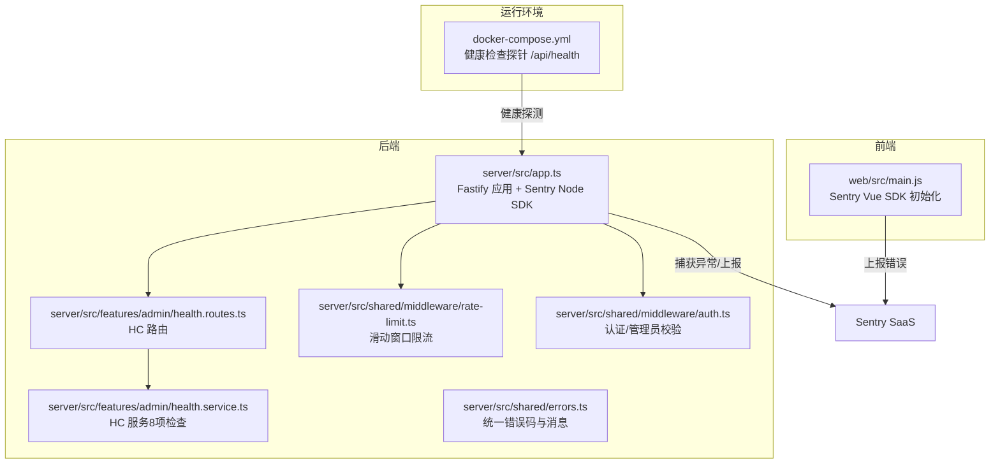
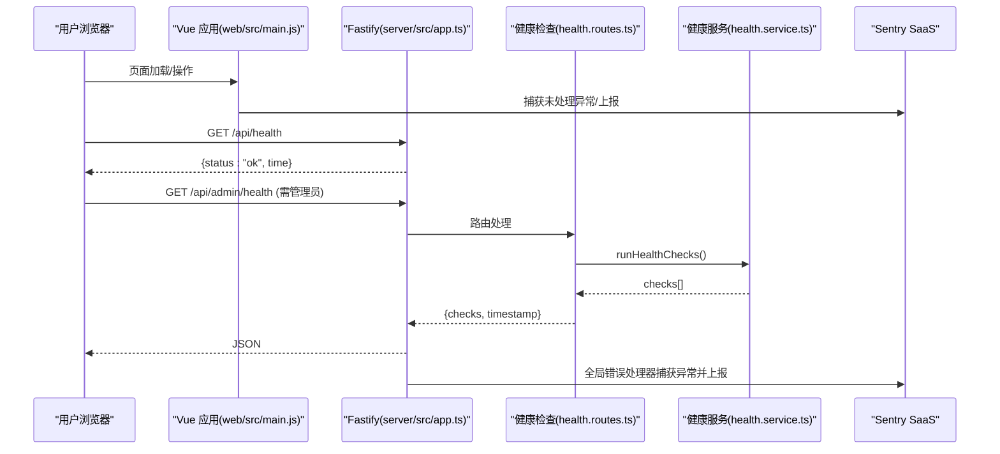
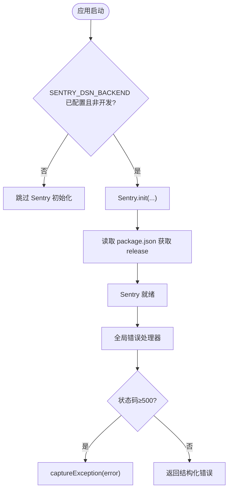
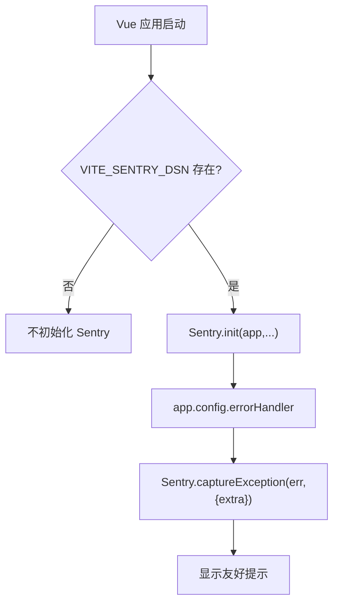
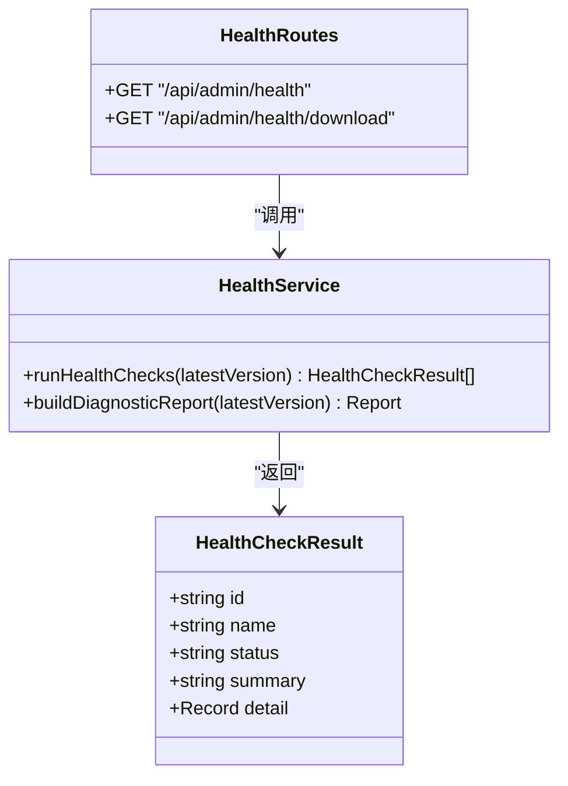
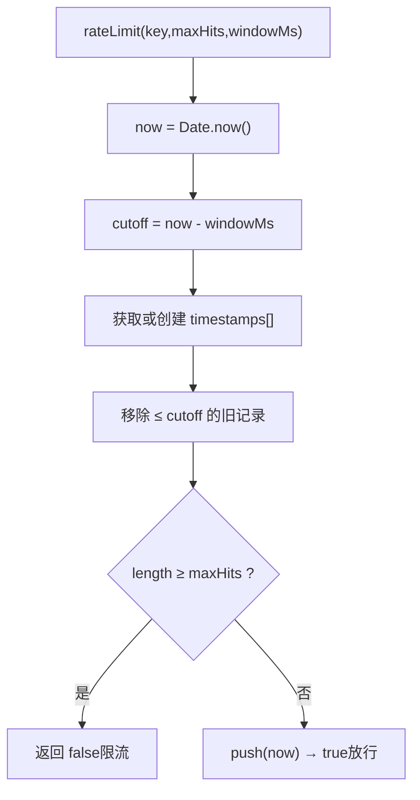
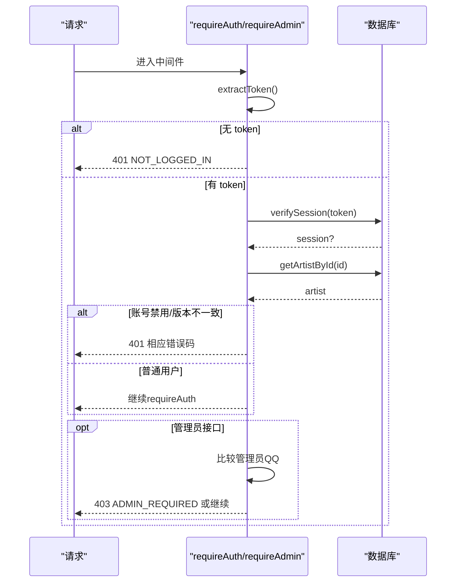
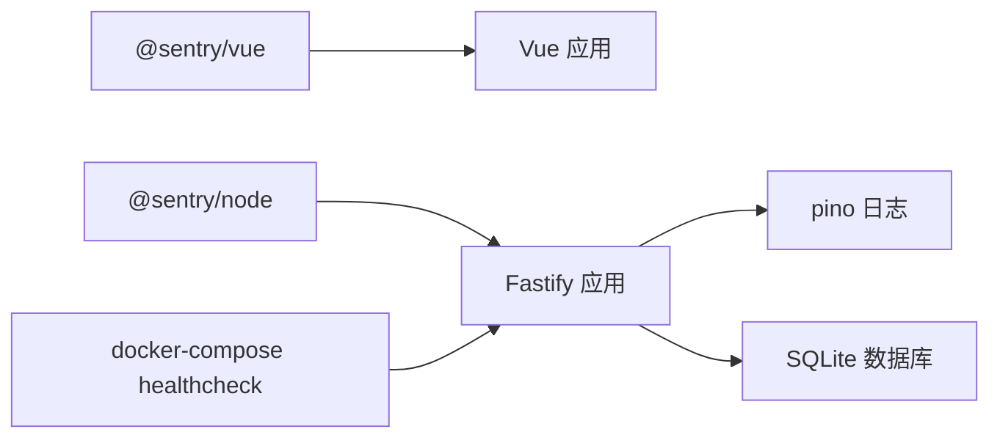

# 监控告警系统
> 修订版（2026-08-07，四号）：本文件为外部 repowiki 原文 监控告警系统.md 的仓库内修订版（修补批 #7），按 master 代码逐条核实修正；外部原文（C:\Users\qly19\Desktop\repowiki\）一字未动。
> 修订范围：文件名引用 .js→.ts（TS 迁移）、登录/会话描述对齐 REQ-027 TOTP、删除虚构变量/端点、迁移版本补至 v45。

<cite>
**本文引用的文件**   
- [server/src/app.ts](file://server/src/app.ts)
- [server/src/features/admin/health.routes.ts](file://server/src/features/admin/health.routes.ts)
- [server/src/features/admin/health.service.ts](file://server/src/features/admin/health.service.ts)
- [server/src/shared/middleware/rate-limit.ts](file://server/src/shared/middleware/rate-limit.ts)
- [server/src/shared/middleware/auth.ts](file://server/src/shared/middleware/auth.ts)
- [server/src/shared/errors.ts](file://server/src/shared/errors.ts)
- [web/src/main.js](file://web/src/main.js)
- [docker-compose.yml](file://docker-compose.yml)
- [docs/archive/specs-done/plan-v021-engineering.md](file://docs/archive/specs-done/plan-v021-engineering.md)
- [server/tests/health.test.js](file://server/tests/health.test.js)
- [server/tests/rate-limit.test.js](file://server/tests/rate-limit.test.js)
</cite>

## 目录
1. [引言](#引言)
2. [项目结构](#项目结构)
3. [核心组件](#核心组件)
4. [架构总览](#架构总览)
5. [详细组件分析](#详细组件分析)
6. [依赖关系分析](#依赖关系分析)
7. [性能与可观测性](#性能与可观测性)
8. [日志策略与轮转](#日志策略与轮转)
9. [速率限制与访问控制](#速率限制与访问控制)
10. [异常处理机制](#异常处理机制)
11. [健康检查与诊断](#健康检查与诊断)
12. [告警规则与通知渠道](#告警规则与通知渠道)
13. [故障响应流程](#故障响应流程)
14. [监控仪表板与关键指标](#监控仪表板与关键指标)
15. [性能基准测试方法](#性能基准测试方法)
16. [结论](#结论)

## 引言
本文件为阿里画师约稿管理平台的“监控告警系统”完整技术文档。内容覆盖：
- Sentry 错误追踪在前后端的集成配置、用户上下文收集与性能监控开关
- 应用健康检查端点、资源使用监控与请求性能分析
- 日志收集策略、日志格式规范与日志轮转建议
- 速率限制中间件、API 访问控制与统一异常处理
- 告警规则配置、通知渠道集成与故障响应流程
- 监控仪表板搭建、关键指标定义与性能基准测试方法

## 项目结构
后端基于 Fastify，前端基于 Vue 3；Sentry SDK 分别接入 Node 与 Vue；健康检查通过独立路由与服务实现；速率限制采用滑动窗口内存实现；认证与权限由中间件统一管控。

图表来源 
- [web/src/main.js:21-30](file://web/src/main.js#L21-L30)
- [server/src/app.ts:204-220](file://server/src/app.ts#L204-L220)
- [server/src/features/admin/health.routes.ts:12-29](file://server/src/features/admin/health.routes.ts#L12-L29)
- [server/src/features/admin/health.service.ts:176-205](file://server/src/features/admin/health.service.ts#L176-L205)
- [server/src/shared/middleware/rate-limit.ts:15-38](file://server/src/shared/middleware/rate-limit.ts#L15-L38)
- [server/src/shared/middleware/auth.ts:35-95](file://server/src/shared/middleware/auth.ts#L35-L95)
- [docker-compose.yml:35-40](file://docker-compose.yml#L35-L40)

章节来源
- [server/src/app.ts:1-318](file://server/src/app.ts#L1-L318)
- [web/src/main.js:1-51](file://web/src/main.js#L1-L51)
- [docker-compose.yml:1-64](file://docker-compose.yml#L1-L64)

## 核心组件
- 后端 Sentry 集成：按环境变量启用，自动读取 release 版本，关闭 PII 采集与性能追踪采样
- 前端 Sentry 集成：按构建时环境变量启用，设置环境标识，关闭性能追踪采样
- 健康检查服务：8 项检查（数据库、迁移、上传目录、磁盘、数据完整性、备份、密钥、Node 版本），支持诊断包下载
- 速率限制：滑动窗口算法，内存存储，定期清理过期桶
- 认证与权限：httpOnly cookie 优先，Bearer 兜底；管理员权限校验
- 统一错误处理：结构化错误码与中文友好提示，5xx 不泄露细节并上报 Sentry

章节来源
- [server/src/app.ts:204-252](file://server/src/app.ts#L204-L252)
- [web/src/main.js:21-41](file://web/src/main.js#L21-L41)
- [server/src/features/admin/health.service.ts:176-205](file://server/src/features/admin/health.service.ts#L176-L205)
- [server/src/shared/middleware/rate-limit.ts:15-57](file://server/src/shared/middleware/rate-limit.ts#L15-L57)
- [server/src/shared/middleware/auth.ts:35-95](file://server/src/shared/middleware/auth.ts#L35-L95)
- [server/src/shared/errors.ts:1-434](file://server/src/shared/errors.ts#L1-L434)

## 架构总览
下图展示从浏览器到后端的请求链路，以及错误上报与健康检查的交互。

图表来源 
- [web/src/main.js:21-41](file://web/src/main.js#L21-L41)
- [server/src/app.ts:265-266](file://server/src/app.ts#L265-L266)
- [server/src/features/admin/health.routes.ts:12-29](file://server/src/features/admin/health.routes.ts#L12-L29)
- [server/src/features/admin/health.service.ts:176-205](file://server/src/features/admin/health.service.ts#L176-L205)
- [server/src/app.ts:225-252](file://server/src/app.ts#L225-L252)

## 详细组件分析

### Sentry 错误追踪（后端）
- 启用条件：存在后端 DSN 且非 development 环境
- 配置要点：release 版本号自动读取；environment 取自 NODE_ENV；sendDefaultPii=false；tracesSampleRate=0
- 错误上报：全局错误处理器对 5xx 调用 captureException；其他错误走结构化响应

图表来源 
- [server/src/app.ts:204-220](file://server/src/app.ts#L204-L220)
- [server/src/app.ts:225-252](file://server/src/app.ts#L225-L252)

章节来源
- [server/src/app.ts:204-252](file://server/src/app.ts#L204-L252)

### Sentry 错误追踪（前端）
- 启用条件：VITE_SENTRY_DSN 存在
- 配置要点：environment 根据构建产物决定；tracesSampleRate=0
- 全局错误边界：捕获 Vue 渲染异常并上报，同时给出友好提示

图表来源 
- [web/src/main.js:21-41](file://web/src/main.js#L21-L41)

章节来源
- [web/src/main.js:21-41](file://web/src/main.js#L21-L41)

### 健康检查（HC）
- 路由：GET /api/admin/health（需管理员）、GET /api/admin/health/download（诊断包）
- 检查项：db、migration、uploads、disk、integrity、backup、secret、node
- 诊断包：包含检查结果与环境信息（不含敏感数据）

图表来源 
- [server/src/features/admin/health.routes.ts:12-29](file://server/src/features/admin/health.routes.ts#L12-L29)
- [server/src/features/admin/health.service.ts:176-205](file://server/src/features/admin/health.service.ts#L176-L205)

章节来源
- [server/src/features/admin/health.routes.ts:1-29](file://server/src/features/admin/health.routes.ts#L1-L29)
- [server/src/features/admin/health.service.ts:1-205](file://server/src/features/admin/health.service.ts#L1-L205)
- [server/tests/health.test.js:1-75](file://server/tests/health.test.js#L1-L75)

### 速率限制（滑动窗口）
- 算法：以时间戳数组记录每个 key 的请求时间，窗口内计数
- 清理：定时清理过期桶，防止内存膨胀
- 测试覆盖：窗口内超限拒绝、窗口过期放行、边界突发抑制、多 key 隔离、渐进过期

图表来源 
- [server/src/shared/middleware/rate-limit.ts:15-38](file://server/src/shared/middleware/rate-limit.ts#L15-L38)

章节来源
- [server/src/shared/middleware/rate-limit.ts:1-57](file://server/src/shared/middleware/rate-limit.ts#L1-L57)
- [server/tests/rate-limit.test.js:1-83](file://server/tests/rate-limit.test.js#L1-L83)

### 认证与访问控制
- Token 提取：优先 httpOnly cookie，其次 Authorization Bearer
- 会话校验：验证 token、账号状态、token 版本
- 管理员校验：比对 QQ 号与管理员配置

图表来源 
- [server/src/shared/middleware/auth.ts:22-95](file://server/src/shared/middleware/auth.ts#L22-L95)

章节来源
- [server/src/shared/middleware/auth.ts:1-96](file://server/src/shared/middleware/auth.ts#L1-L96)

### 统一异常处理
- 校验失败：返回 VALIDATION 与字段提示
- 5xx：记录错误日志并上报 Sentry，返回 INTERNAL
- 4xx：按 code 映射中文消息，支持 detail 插值

章节来源
- [server/src/app.ts:225-252](file://server/src/app.ts#L225-L252)
- [server/src/shared/errors.ts:1-434](file://server/src/shared/errors.ts#L1-L434)

## 依赖关系分析
- 后端依赖：@sentry/node、Fastify 插件、pino 日志
- 前端依赖：@sentry/vue、Vue 3、Element Plus
- 运行时依赖：Docker Compose 健康检查探针指向 /api/health

图表来源 
- [server/package-lock.json:4423-4495](file://server/package-lock.json#L4423-L4495)
- [docker-compose.yml:35-40](file://docker-compose.yml#L35-L40)

章节来源
- [server/package-lock.json:4423-4495](file://server/package-lock.json#L4423-L4495)
- [docker-compose.yml:1-64](file://docker-compose.yml#L1-L64)

## 性能与可观测性
- 性能追踪：当前关闭（tracesSampleRate=0），仅错误上报
- 可扩展点：如需性能监控，可在 Sentry 中开启 tracesSampleRate，并结合 OpenTelemetry 扩展（依赖已存在）
- 健康检查：提供轻量 /api/health 与管理员级 /api/admin/health，便于容器编排与外部监控

章节来源
- [server/src/app.ts:204-220](file://server/src/app.ts#L204-L220)
- [server/src/app.ts:265-266](file://server/src/app.ts#L265-L266)
- [server/src/features/admin/health.routes.ts:12-29](file://server/src/features/admin/health.routes.ts#L12-L29)

## 日志策略与轮转
- 日志框架：pino（JSON 输出），生产环境默认 JSON 格式
- 安全：避免在日志中输出敏感信息（如 IP、密码等）
- 轮转建议：结合容器编排或进程管理器（如 PM2）进行日志轮转与归档；或使用 pino 传输器将日志输出至集中式日志平台

章节来源
- [server/package-lock.json:4423-4495](file://server/package-lock.json#L4423-L4495)
- [docs/开发→生产切换指南.md:57-63](file://docs/开发→生产切换指南.md#L57-L63)

## 速率限制与访问控制
- 限流策略：滑动窗口，内存存储，键粒度可按 IP/接口组合
- 访问控制：统一中间件校验登录态与管理员权限
- 建议：对外部公开接口（如价格计算、上传参考图）启用更严格的限流策略

章节来源
- [server/src/shared/middleware/rate-limit.ts:1-57](file://server/src/shared/middleware/rate-limit.ts#L1-L57)
- [server/src/shared/middleware/auth.ts:1-96](file://server/src/shared/middleware/auth.ts#L1-L96)

## 异常处理机制
- 全局错误处理器：区分校验错误、业务错误与服务器错误
- 5xx 处理：记录错误日志、上报 Sentry、返回通用错误码
- 4xx 处理：按错误码映射中文消息，支持动态插值

章节来源
- [server/src/app.ts:225-252](file://server/src/app.ts#L225-L252)
- [server/src/shared/errors.ts:1-434](file://server/src/shared/errors.ts#L1-L434)

## 健康检查与诊断
- 健康检查端点：/api/health（公开）、/api/admin/health（管理员）
- 诊断包：/api/admin/health/download 返回 JSON 诊断包（含环境与检查结果）
- 容器健康检查：docker-compose 通过 /api/health 判定服务健康

章节来源
- [server/src/app.ts:265-266](file://server/src/app.ts#L265-L266)
- [server/src/features/admin/health.routes.ts:12-29](file://server/src/features/admin/health.routes.ts#L12-L29)
- [server/src/features/admin/health.service.ts:176-205](file://server/src/features/admin/health.service.ts#L176-L205)
- [docker-compose.yml:35-40](file://docker-compose.yml#L35-L40)

## 告警规则与通知渠道
- 错误告警：Sentry Alert Rule 触发邮件通知（计划阶段预留 QQ 机器人 webhook）
- 环境区分：development 不上报，production 正常上报
- 版本标记：release 来自 package.json 版本，便于定位问题版本

章节来源
- [docs/archive/specs-done/plan-v021-engineering.md:55-83](file://docs/archive/specs-done/plan-v021-engineering.md#L55-L83)
- [server/src/app.ts:204-220](file://server/src/app.ts#L204-L220)

## 故障响应流程
- 发现：Sentry 错误告警或健康检查失败
- 分级：依据错误类型与影响范围定级（P0-P3）
- 处置：回滚/热修复、临时降级、扩容
- 复盘：根因分析、改进措施、更新监控规则

[本节为概念性流程说明，不直接分析具体文件]

## 监控仪表板与关键指标
- 错误类指标：错误数、错误率、Top 错误、受影响用户比例
- 可用性指标：健康检查通过率、接口成功率、延迟分布
- 资源指标：磁盘空间、数据库连接、上传目录读写状态
- 建议：将 Sentry 事件聚合到可视化面板（如 Grafana + Loki/Prometheus），结合 /api/admin/health 结果作为自定义指标源

[本节为概念性指导，不直接分析具体文件]

## 性能基准测试方法
- 工具：wrk、autocannon、k6
- 场景：登录、下单、上传、查询列表
- 指标：QPS、P95/P99 延迟、错误率、CPU/内存占用
- 基线：在相同硬件与配置下建立基线，变更前后对比

[本节为概念性指导，不直接分析具体文件]

## 结论
本项目已具备完善的错误追踪、健康检查、限流与认证能力。Sentry 在后端与前端均已按环境变量可控启用，默认关闭性能追踪以降低开销。建议后续按需开启性能追踪、完善日志集中化与告警通知渠道，并建立稳定的监控仪表板与基准测试体系，持续提升系统稳定性与可观测性。