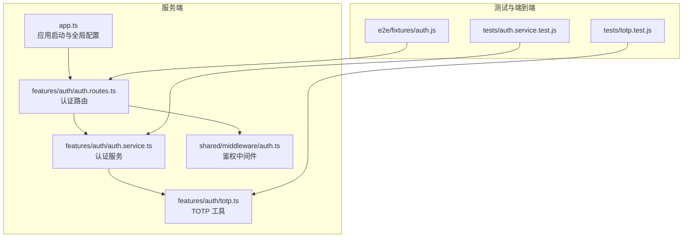
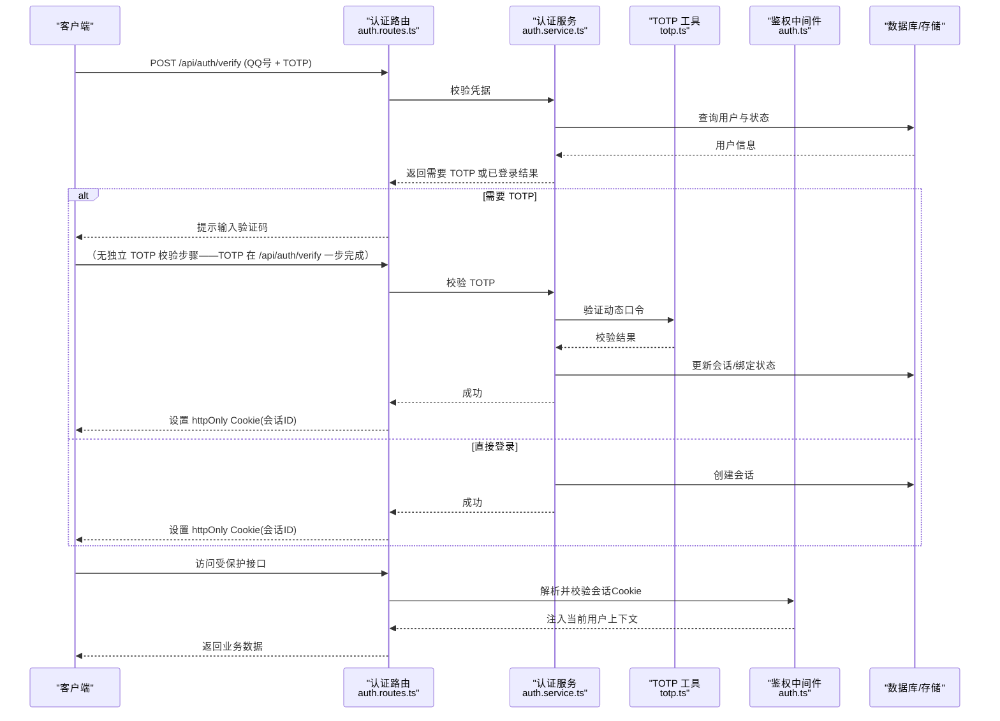
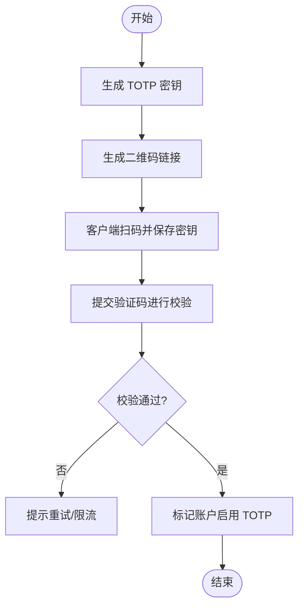
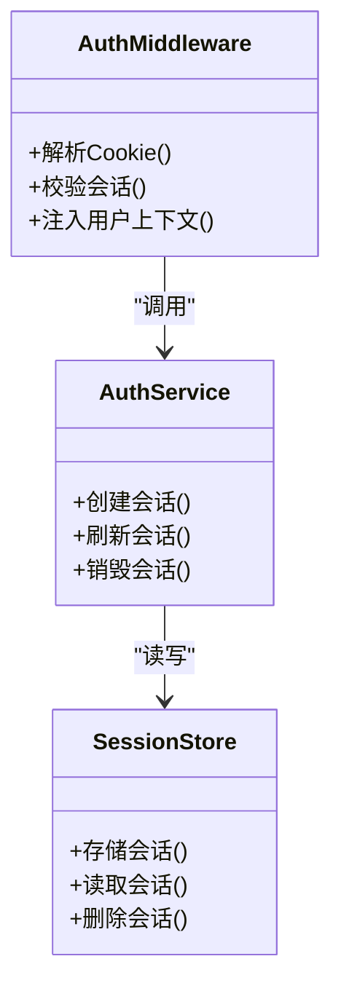
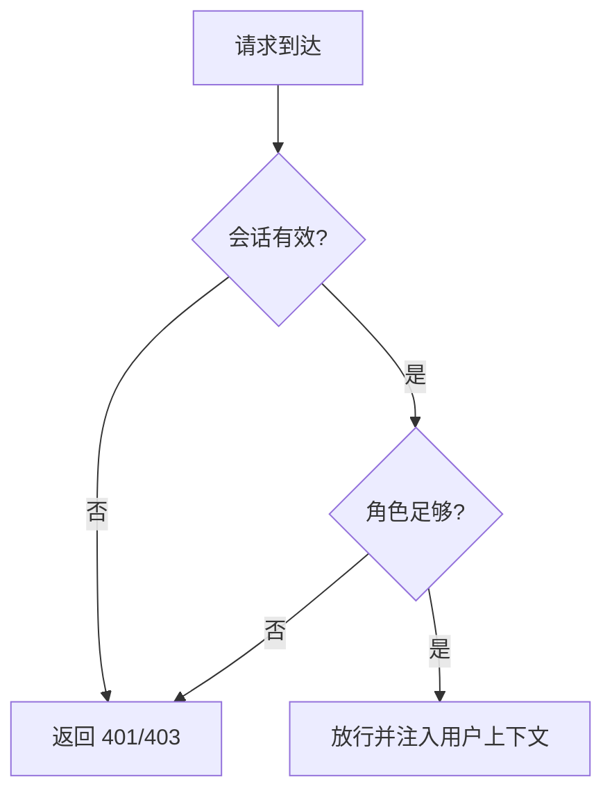
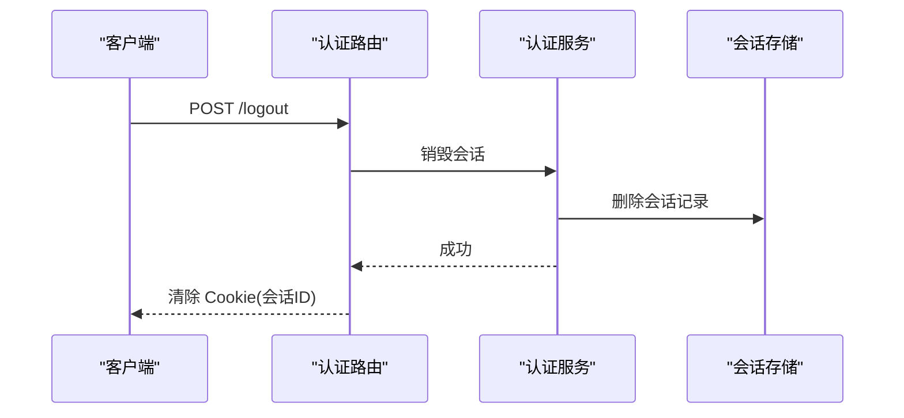
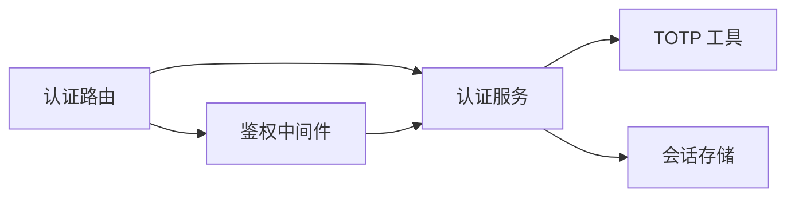

# 认证协议
> 修订版（2026-08-07，四号）：本文件为外部 repowiki 原文 认证协议.md 的仓库内修订版（修补批 #3），按 master 代码逐条核实修正；外部原文（C:\Users\qly19\Desktop\repowiki\）一字未动。
> 修订范围：文件名引用 .js→.ts（TS 迁移）、登录/会话描述对齐 REQ-027 TOTP、删除虚构变量/端点、迁移版本补至 v45。

<cite>
**本文引用的文件**   
- [server/src/features/auth/auth.routes.ts](file://server/src/features/auth/auth.routes.ts)
- [server/src/features/auth/auth.service.ts](file://server/src/features/auth/auth.service.ts)
- [server/src/features/auth/totp.ts](file://server/src/features/auth/totp.ts)
- [server/src/shared/middleware/auth.ts](file://server/src/shared/middleware/auth.ts)
- [server/tests/auth.service.test.js](file://server/tests/auth.service.test.js)
- [server/tests/totp.test.js](file://server/tests/totp.test.js)
- [e2e/fixtures/auth.js](file://e2e/fixtures/auth.js)
- [server/src/app.ts](file://server/src/app.ts)
</cite>

## 目录
1. [简介](#简介)
2. [项目结构](#项目结构)
3. [核心组件](#核心组件)
4. [架构总览](#架构总览)
5. [详细组件分析](#详细组件分析)
6. [依赖关系分析](#依赖关系分析)
7. [性能考虑](#性能考虑)
8. [故障排查指南](#故障排查指南)
9. [结论](#结论)
10. [附录](#附录)

## 简介
本认证协议文档面向阿里画师约稿管理平台的后端认证子系统，聚焦以下目标：
- TOTP 动态口令登录机制（验证码生成、验证流程与安全性）
- 基于 Cookie 的会话管理机制（httpOnly 设置、生命周期；无自动续期）
- 权限控制模型（画师权限、管理员权限与角色访问控制）
- 登录状态维护、登出流程与跨域认证配置
- 完整的认证流程图、API 调用示例与安全最佳实践

## 项目结构
认证相关代码主要位于 server 模块的 features/auth 与 shared/middleware 目录中，测试用例位于 server/tests 与 e2e/fixtures。整体采用分层设计：路由层暴露 API，服务层实现业务逻辑，中间件负责鉴权与上下文注入。

图表来源
- [server/src/app.ts](file://server/src/app.ts)
- [server/src/features/auth/auth.routes.ts](file://server/src/features/auth/auth.routes.ts)
- [server/src/features/auth/auth.service.ts](file://server/src/features/auth/auth.service.ts)
- [server/src/features/auth/totp.ts](file://server/src/features/auth/totp.ts)
- [server/src/shared/middleware/auth.ts](file://server/src/shared/middleware/auth.ts)
- [server/tests/auth.service.test.js](file://server/tests/auth.service.test.js)
- [server/tests/totp.test.js](file://server/tests/totp.test.js)
- [e2e/fixtures/auth.js](file://e2e/fixtures/auth.js)

章节来源
- [server/src/app.ts](file://server/src/app.ts)
- [server/src/features/auth/auth.routes.ts](file://server/src/features/auth/auth.routes.ts)
- [server/src/features/auth/auth.service.ts](file://server/src/features/auth/auth.service.ts)
- [server/src/features/auth/totp.ts](file://server/src/features/auth/totp.ts)
- [server/src/shared/middleware/auth.ts](file://server/src/shared/middleware/auth.ts)

## 核心组件
- 认证路由（auth.routes.ts）：定义登录、登出、TOTP 绑定/校验等接口，处理请求参数与响应格式。
- 认证服务（auth.service.ts）：封装用户凭证校验、会话创建、刷新与销毁、权限判断等核心逻辑。
- TOTP 工具（totp.ts）：提供 TOTP 密钥生成、二维码链接生成、验证码校验等能力。
- 鉴权中间件（auth.ts）：解析 Cookie 中的会话标识，校验有效性并注入当前用户上下文，用于受保护路由的鉴权。

章节来源
- [server/src/features/auth/auth.routes.ts](file://server/src/features/auth/auth.routes.ts)
- [server/src/features/auth/auth.service.ts](file://server/src/features/auth/auth.service.ts)
- [server/src/features/auth/totp.ts](file://server/src/features/auth/totp.ts)
- [server/src/shared/middleware/auth.ts](file://server/src/shared/middleware/auth.ts)

## 架构总览
下图展示从客户端发起登录到获得受保护资源访问能力的完整流程，涵盖 TOTP 二次校验与会话 Cookie 的交互。

图表来源
- [server/src/features/auth/auth.routes.ts](file://server/src/features/auth/auth.routes.ts)
- [server/src/features/auth/auth.service.ts](file://server/src/features/auth/auth.service.ts)
- [server/src/features/auth/totp.ts](file://server/src/features/auth/totp.ts)
- [server/src/shared/middleware/auth.ts](file://server/src/shared/middleware/auth.ts)

## 详细组件分析

### TOTP 双因素认证
- 功能要点
  - 密钥生成：为画师账户生成一次性密码算法所需的共享密钥，并提供二维码链接以便绑定至 authenticator 应用。
  - 验证码校验：对客户端提交的 6 位数字进行时间窗口内校验，支持容差窗口防止时钟漂移。
  - 绑定与解绑：允许画师在安全环境下启用/禁用 TOTP，确保二次认证生效范围可控。
- 安全考量
  - 传输安全：所有 TOTP 相关接口应在 HTTPS 下使用，避免中间人攻击。
  - 密钥存储：密钥应加密存储，禁止明文落盘；建议结合服务器侧密钥管理服务。
  - 防重放与暴力破解：对验证码尝试次数进行限制，失败阈值后锁定或要求重新登录。
  - 时间同步：服务端与客户端时间偏差容忍度需合理设置，避免误判。
- 典型流程
  - 首次启用：生成密钥 -> 生成二维码 -> 客户端扫码 -> 提交验证码 -> 校验通过 -> 标记账户启用 TOTP。
  - 登录时二次校验：主凭据通过后，若账户启用 TOTP，则进入验证码校验阶段。

图表来源
- [server/src/features/auth/totp.ts](file://server/src/features/auth/totp.ts)
- [server/src/features/auth/auth.service.ts](file://server/src/features/auth/auth.service.ts)

章节来源
- [server/src/features/auth/totp.ts](file://server/src/features/auth/totp.ts)
- [server/src/features/auth/auth.service.ts](file://server/src/features/auth/auth.service.ts)
- [server/tests/totp.test.js](file://server/tests/totp.test.js)

### 基于 Cookie 的会话管理
- 会话创建
  - 登录成功后在服务端生成唯一会话标识，写入 httpOnly Cookie，避免前端脚本读取，降低 XSS 风险。
  - 可附加安全标志（如 SameSite、Secure），配合 HTTPS 提升安全性。
- 生命周期（无自动续期）
  - 会话过期时间由登录签发时固定（7 天）。当前实现无滑动过期、无自动续期——过期后需重新调用 /api/auth/verify 登录。
  - 登出通过递增 token_version 使旧令牌全部失效；管理员重置 TOTP 不影响会话本身。
- 会话校验
  - 鉴权中间件在每次请求时解析 Cookie，校验会话有效性并注入当前用户上下文。
  - 失效或非法会话将导致 401/403 响应，引导客户端重新登录。

图表来源
- [server/src/shared/middleware/auth.ts](file://server/src/shared/middleware/auth.ts)
- [server/src/features/auth/auth.service.ts](file://server/src/features/auth/auth.service.ts)

章节来源
- [server/src/shared/middleware/auth.ts](file://server/src/shared/middleware/auth.ts)
- [server/src/features/auth/auth.service.ts](file://server/src/features/auth/auth.service.ts)

### 权限控制模型
- 角色划分
  - 画师：拥有订单管理、作品发布、个人偏好设置等权限。
  - 管理员：具备平台级管理能力，如画师管理、系统健康检查、定价策略管理等。
- 访问控制
  - 路由级保护：受保护路由通过鉴权中间件校验会话与角色。
  - 资源级控制：在业务服务层根据用户角色决定是否允许执行特定操作。
- 最佳实践
  - 最小权限原则：默认拒绝，显式授权。
  - 审计日志：记录关键权限变更与敏感操作。

图表来源
- [server/src/shared/middleware/auth.ts](file://server/src/shared/middleware/auth.ts)
- [server/src/features/auth/auth.routes.ts](file://server/src/features/auth/auth.routes.ts)

章节来源
- [server/src/shared/middleware/auth.ts](file://server/src/shared/middleware/auth.ts)
- [server/src/features/auth/auth.routes.ts](file://server/src/features/auth/auth.routes.ts)

### 登录状态维护与登出流程
- 登录状态维护
  - 客户端在登录后保存服务端下发的会话 Cookie，后续请求自动携带。
  - 前端可在本地缓存用户基本信息以提升体验，但敏感决策必须依赖服务端校验。
- 登出流程
  - 服务端销毁会话并从响应头清除 Cookie，客户端清理本地缓存。
  - 登出后所有受保护接口立即返回未认证错误。

图表来源
- [server/src/features/auth/auth.routes.ts](file://server/src/features/auth/auth.routes.ts)
- [server/src/features/auth/auth.service.ts](file://server/src/features/auth/auth.service.ts)

章节来源
- [server/src/features/auth/auth.routes.ts](file://server/src/features/auth/auth.routes.ts)
- [server/src/features/auth/auth.service.ts](file://server/src/features/auth/auth.service.ts)

### 跨域认证配置
- 同源策略与 CORS
  - 若前后端分离部署在不同域名/端口，需在服务端启用 CORS 并明确允许的源、方法与头部。
  - 当允许携带 Cookie 时，需同时设置 Access-Control-Allow-Credentials 与精确的 Origin。
- 安全建议
  - 严格限定允许的源列表，避免使用通配符。
  - 生产环境强制 HTTPS，并启用预检请求缓存以减少开销。

章节来源
- [server/src/app.ts](file://server/src/app.ts)
- [server/src/features/auth/auth.routes.ts](file://server/src/features/auth/auth.routes.ts)

## 依赖关系分析
- 组件耦合
  - 路由层依赖服务层完成业务逻辑，服务层依赖 TOTP 工具与存储层。
  - 鉴权中间件独立于业务路由，通过统一入口保障安全边界。
- 外部依赖
  - 数据库/会话存储：用于持久化用户信息与会话状态。
  - 第三方 authenticator：TOTP 客户端应用（如 Google Authenticator）。
- 潜在循环依赖
  - 应避免服务层反向依赖路由层，保持单向依赖链。

图表来源
- [server/src/features/auth/auth.routes.ts](file://server/src/features/auth/auth.routes.ts)
- [server/src/features/auth/auth.service.ts](file://server/src/features/auth/auth.service.ts)
- [server/src/features/auth/totp.ts](file://server/src/features/auth/totp.ts)
- [server/src/shared/middleware/auth.ts](file://server/src/shared/middleware/auth.ts)

章节来源
- [server/src/features/auth/auth.routes.ts](file://server/src/features/auth/auth.routes.ts)
- [server/src/features/auth/auth.service.ts](file://server/src/features/auth/auth.service.ts)
- [server/src/features/auth/totp.ts](file://server/src/features/auth/totp.ts)
- [server/src/shared/middleware/auth.ts](file://server/src/shared/middleware/auth.ts)

## 性能考虑
- 会话存储选择
  - 高并发场景建议使用内存缓存（如 Redis）作为会话存储，减少数据库压力。
- TOTP 校验优化
  - 校验过程计算量较小，但仍需避免在热点路径上重复计算，必要时可缓存最近时间窗口的校验结果。
- 连接池与超时
  - 数据库与会话存储的连接池大小需根据负载调优，设置合理的超时与重试策略。

[本节为通用指导，不直接分析具体文件]

## 故障排查指南
- 常见问题
  - 登录成功但无法访问受保护接口：检查 Cookie 是否被浏览器拦截或跨域配置不正确。
  - TOTP 校验失败：确认客户端与服务端时间同步，检查验证码窗口与重试限制。
  - 会话频繁失效：检查 token_version 是否被递增（登出/重置）或 7 天有效期是否到期。
- 调试建议
  - 启用详细日志记录认证流程的关键步骤。
  - 使用测试用例复现问题，参考 auth.service.test.js 与 totp.test.js 的断言方式。

章节来源
- [server/tests/auth.service.test.js](file://server/tests/auth.service.test.js)
- [server/tests/totp.test.js](file://server/tests/totp.test.js)

## 结论
本认证协议通过 TOTP 双因素认证与基于 httpOnly Cookie 的会话管理，构建了安全可靠的登录与鉴权体系。结合严格的权限控制与跨域配置，能够有效保护画师与管理后台的核心资源。建议在生产环境中持续监控认证链路的安全指标，并定期审查密钥管理与会话策略。

[本节为总结性内容，不直接分析具体文件]

## 附录

### API 调用示例（概念性）
- 登录
  - 方法：POST
  - 路径：/api/auth/verify
  - 请求体：{ qqNumber, code }（QQ 号 + 6 位 TOTP 动态口令）
  - 响应：成功并设置会话 Cookie（artist_token）
- 校验 TOTP
  - 方法：POST
  - 路径：无独立端点（合并进 /api/auth/verify）
  - 请求体：{ qqNumber, code }
  - 响应：成功并设置会话 Cookie
- 登出
  - 方法：POST
  - 路径：/api/auth/logout
  - 响应：清除会话 Cookie

[本节为概念性说明，不直接分析具体文件]

### 安全最佳实践清单
- 全链路 HTTPS
- httpOnly 与 Secure Cookie 标志
- 严格的 CORS 白名单
- TOTP 密钥加密存储与轮换策略
- 验证码尝试次数限制与账户锁定
- 敏感操作二次确认与会话短期化
- 完善的审计日志与告警

[本节为通用指导，不直接分析具体文件]