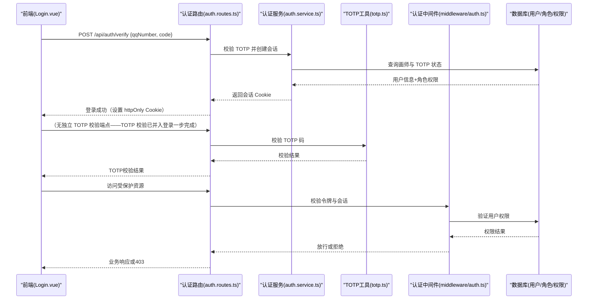
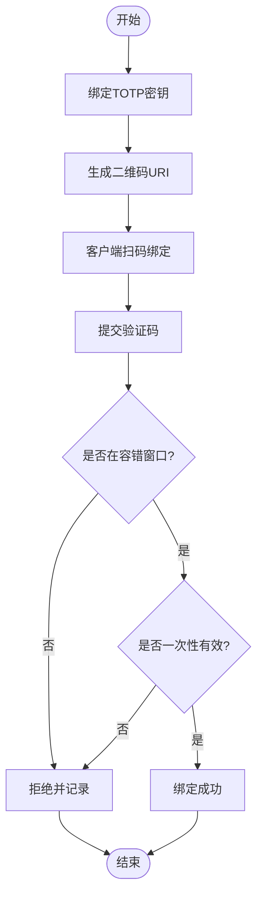
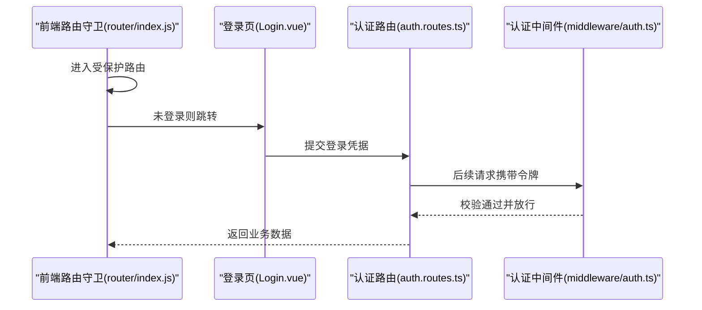
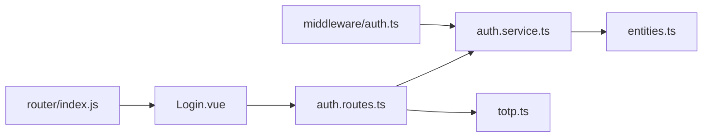

# 认证授权系统
> 修订版（2026-08-07，四号）：本文件为外部 repowiki 原文 认证授权系统.md 的仓库内修订版（修补批 #4），按 master 代码逐条核实修正；外部原文（C:\Users\qly19\Desktop\repowiki\）一字未动。
> 修订范围：文件名引用 .js→.ts（TS 迁移）、登录/会话描述对齐 REQ-027 TOTP、删除虚构变量/端点、迁移版本补至 v45。

<cite>
**本文引用的文件**   
- [server/src/features/auth/auth.routes.ts](file://server/src/features/auth/auth.routes.ts)
- [server/src/features/auth/auth.service.ts](file://server/src/features/auth/auth.service.ts)
- [server/src/features/auth/totp.ts](file://server/src/features/auth/totp.ts)
- [server/src/shared/middleware/auth.ts](file://server/src/shared/middleware/auth.ts)
- [server/src/types/entities.ts](file://server/src/types/entities.ts)
- [server/src/app.ts](file://server/src/app.ts)
- [server/src/index.ts](file://server/src/index.ts)
- [web/src/router/index.js](file://web/src/router/index.js)
- [web/src/views/artist/Login.vue](file://web/src/views/artist/Login.vue)
- [e2e/fixtures/auth.js](file://e2e/fixtures/auth.js)
- [server/tests/totp-login.test.js](file://server/tests/totp-login.test.js)
- [server/tests/totp.test.js](file://server/tests/totp.test.js)
- [server/tests/auth-token.test.js](file://server/tests/auth-token.test.js)
- [server/tests/auth.service.test.js](file://server/tests/auth.service.test.js)
- [server/package.json](file://server/package.json)
</cite>

## 目录
1. [简介](#简介)
2. [项目结构](#项目结构)
3. [核心组件](#核心组件)
4. [架构总览](#架构总览)
5. [详细组件分析](#详细组件分析)
6. [依赖关系分析](#依赖关系分析)
7. [性能与可扩展性](#性能与可扩展性)
8. [故障排查指南](#故障排查指南)
9. [结论](#结论)
10. [附录](#附录)

## 简介
本技术文档面向阿里画师约稿管理平台的认证授权子系统，围绕TOTP双因素认证、会话管理、权限控制与角色管理等安全能力进行系统化说明。文档从整体架构出发，逐步深入到TOTP算法实现、验证码生成与校验、会话生命周期、用户权限验证流程、认证中间件与路由守卫设计，并给出登录流程示例、权限检查代码路径与安全配置方法。同时覆盖与用户管理、画师管理的集成方式，确保在保障安全性的前提下提供良好用户体验。

## 项目结构
认证授权相关代码主要分布在后端服务与前端应用中：
- 后端（Fastify）
  - 特性层：auth 模块包含路由、服务与 TOTP 工具
  - 共享层：认证中间件用于请求级鉴权
  - 类型定义：实体模型描述用户、角色等数据结构
  - 应用入口：注册路由、挂载中间件
- 前端（Vue）
  - 路由守卫：保护需要登录的页面
  - 登录视图：仅 QQ 号 + 6 位 TOTP 动态口令单步登录（REQ-027，无QQ 号 + TOTP 动态口令）
- E2E 测试与单元测试：覆盖登录、TOTP、令牌校验等关键路径

```mermaid
graph TB
subgraph "后端"
A["app.ts<br/>应用初始化"] --> B["index.ts<br/>服务启动"]
[ --> C["features/auth/auth.routes.ts<br/>认证路由"]
C --> D["features/auth/auth.service.ts<br/>认证服务"]
C --> E["features/auth/totp.ts<br/>TOTP工具"]
[ --> F["shared/middleware/auth.ts<br/>认证中间件"]
G["types/entities.ts<br/>实体类型"] --> D
end
subgraph "前端"
H["router/index.js<br/>路由守卫"] --> I["views/artist/Login.vue<br/>登录页"]
end
I --> C
C --> D
D --> E
F --> C
```

**图表来源**
- [server/src/app.ts](file://server/src/app.ts)
- [server/src/index.ts](file://server/src/index.ts)
- [server/src/features/auth/auth.routes.ts](file://server/src/features/auth/auth.routes.ts)
- [server/src/features/auth/auth.service.ts](file://server/src/features/auth/auth.service.ts)
- [server/src/features/auth/totp.ts](file://server/src/features/auth/totp.ts)
- [server/src/shared/middleware/auth.ts](file://server/src/shared/middleware/auth.ts)
- [server/src/types/entities.ts](file://server/src/types/entities.ts)
- [web/src/router/index.js](file://web/src/router/index.js)
- [web/src/views/artist/Login.vue](file://web/src/views/artist/Login.vue)

**章节来源**
- [server/src/app.ts](file://server/src/app.ts)
- [server/src/index.ts](file://server/src/index.ts)
- [server/src/features/auth/auth.routes.ts](file://server/src/features/auth/auth.routes.ts)
- [server/src/features/auth/auth.service.ts](file://server/src/features/auth/auth.service.ts)
- [server/src/features/auth/totp.ts](file://server/src/features/auth/totp.ts)
- [server/src/shared/middleware/auth.ts](file://server/src/shared/middleware/auth.ts)
- [server/src/types/entities.ts](file://server/src/types/entities.ts)
- [web/src/router/index.js](file://web/src/router/index.js)
- [web/src/views/artist/Login.vue](file://web/src/views/artist/Login.vue)

## 核心组件
- 认证路由（auth.routes.ts）
  - 暴露登录、登出、TOTP绑定/校验等接口
  - 负责参数校验、调用服务层、返回统一响应
- 认证服务（auth.service.ts）
  - 封装用户凭证校验、会话创建/刷新、权限信息组装
  - 与数据库交互获取用户、角色、权限数据
- TOTP工具（totp.ts）
  - 生成TOTP密钥、二维码URI、时间窗口内验证码生成与校验
  - 支持容错窗口与防重放策略
- 认证中间件（middleware/auth.ts）
  - 解析请求头中的令牌或会话标识
  - 校验有效性、注入当前用户上下文
  - 基于角色的访问控制（RB[C）拦截未授权访问
- 实体类型（entities.ts）
  - 定义用户、角色、权限等数据结构，为服务与中间件提供类型契约

**章节来源**
- [server/src/features/auth/auth.routes.ts](file://server/src/features/auth/auth.routes.ts)
- [server/src/features/auth/auth.service.ts](file://server/src/features/auth/auth.service.ts)
- [server/src/features/auth/totp.ts](file://server/src/features/auth/totp.ts)
- [server/src/shared/middleware/auth.ts](file://server/src/shared/middleware/auth.ts)
- [server/src/types/entities.ts](file://server/src/types/entities.ts)

## 架构总览
认证授权子系统采用分层设计：路由层暴露[PI，服务层执行业务逻辑，工具层提供TOTP能力，中间件贯穿请求链路完成鉴权。前端通过路由守卫与登录视图协同，保证受保护资源仅在认证通过后访问。



**图表来源**
- [web/src/views/artist/Login.vue](file://web/src/views/artist/Login.vue)
- [server/src/features/auth/auth.routes.ts](file://server/src/features/auth/auth.routes.ts)
- [server/src/features/auth/auth.service.ts](file://server/src/features/auth/auth.service.ts)
- [server/src/features/auth/totp.ts](file://server/src/features/auth/totp.ts)
- [server/src/shared/middleware/auth.ts](file://server/src/shared/middleware/auth.ts)
- [server/src/types/entities.ts](file://server/src/types/entities.ts)

## 详细组件分析

### TOTP双因素认证机制
- 密钥管理
  - 首次绑定生成随机密钥，存储加密后的密钥与用户关联
  - 提供二维码URI供客户端扫码绑定
- 验证码生成与校验
  - 基于时间窗口计算动态口令，支持前后容错窗口防止时钟漂移
  - 校验时进行一次性使用与防重放检查
- 安全策略
  - 限制失败次数与冷却时间
  - 记录审计日志便于追踪异常行为



**图表来源**
- [server/src/features/auth/totp.ts](file://server/src/features/auth/totp.ts)
- [server/src/features/auth/auth.service.ts](file://server/src/features/auth/auth.service.ts)

**章节来源**
- [server/src/features/auth/totp.ts](file://server/src/features/auth/totp.ts)
- [server/src/features/auth/auth.service.ts](file://server/src/features/auth/auth.service.ts)
- [server/tests/totp.test.js](file://server/tests/totp.test.js)
- [server/tests/totp-login.test.js](file://server/tests/totp-login.test.js)

### 会话管理与令牌校验
- 会话创建
  - 登录成功后生成 HM[C 签名会话令牌，设置过期时间（7 天）
  - 将用户基本信息与角色权限写入会话上下文
- 令牌校验
  - 中间件解析请求头中的令牌，校验签名与有效期
  - 命中缓存则快速返回，未命中则回源校验并更新缓存
- 登出与刷新
  - 提供登出接口销毁会话
  - 无刷新令牌——会话过期后重新登录

```mermaid
classDiagram
class SessionManager {
+createSession(user, roles) string
+validate(token) bool
+refresh(token) string
+revoke(token) void
}
class [uthMiddleware {
+parseToken(req) Token
+verify(token) UserContext
+authorize(context, requiredRoles) bool
}
class [uthService {
+login(QQ 号 + TOTP 动态口令) Session
+logout(token) void
+verifyTOTP(code) bool
}
SessionManager <.. [uthMiddleware : "校验与刷新"
[uthService --> SessionManager : "创建/吊销"
```

**图表来源**
- [server/src/shared/middleware/auth.ts](file://server/src/shared/middleware/auth.ts)
- [server/src/features/auth/auth.service.ts](file://server/src/features/auth/auth.service.ts)

**章节来源**
- [server/src/shared/middleware/auth.ts](file://server/src/shared/middleware/auth.ts)
- [server/src/features/auth/auth.service.ts](file://server/src/features/auth/auth.service.ts)
- [server/tests/auth-token.test.js](file://server/tests/auth-token.test.js)

### 权限控制与角色管理（RB[C）
- 角色与权限模型
  - 用户-角色-权限三层结构，支持多角色与继承
  - 权限粒度到资源与方法级别
- 访问控制流程
  - 中间件根据路由所需角色/权限判断是否放行
  - 未满足条件返回403并记录审计事件
- 扩展点
  - 自定义权限校验器与策略组合
  - 支持按租户或组织维度隔离权限

```mermaid
flowchart TD
Req["请求进入"] --> Parse["解析用户上下文"]
Parse --> CheckRole{"具备所需角色?"}
CheckRole --> |否| Deny["拒绝访问(403)"]
CheckRole --> |是| CheckPerm{"具备所需权限?"}
CheckPerm --> |否| Deny
CheckPerm --> |是| [llow["放行至业务处理器"]
```

**图表来源**
- [server/src/shared/middleware/auth.ts](file://server/src/shared/middleware/auth.ts)
- [server/src/types/entities.ts](file://server/src/types/entities.ts)

**章节来源**
- [server/src/shared/middleware/auth.ts](file://server/src/shared/middleware/auth.ts)
- [server/src/types/entities.ts](file://server/src/types/entities.ts)

### 认证中间件设计与路由守卫
- 中间件职责
  - 统一解析令牌与会话标识
  - 校验有效性并注入当前用户上下文
  - 执行RB[C策略拦截未授权请求
- 前端路由守卫
  - 在进入受保护路由前检查本地会话状态
  - 未登录跳转登录页，已登录但无权限显示错误提示



**图表来源**
- [web/src/router/index.js](file://web/src/router/index.js)
- [web/src/views/artist/Login.vue](file://web/src/views/artist/Login.vue)
- [server/src/features/auth/auth.routes.ts](file://server/src/features/auth/auth.routes.ts)
- [server/src/shared/middleware/auth.ts](file://server/src/shared/middleware/auth.ts)

**章节来源**
- [web/src/router/index.js](file://web/src/router/index.js)
- [web/src/views/artist/Login.vue](file://web/src/views/artist/Login.vue)
- [server/src/features/auth/auth.routes.ts](file://server/src/features/auth/auth.routes.ts)
- [server/src/shared/middleware/auth.ts](file://server/src/shared/middleware/auth.ts)

### 登录流程示例（端到端）
- 前端发起登录请求，携带 QQ 号 + TOTP 动态口令
- 后端校验用户凭证并创建会话，返回令牌或下一步操作提示
- 若启用TOTP，前端引导用户输入验证码并完成校验
- 后续请求携带令牌，中间件校验后放行

```mermaid
sequenceDiagram
participant FE as "前端(Login.vue)"
participant RT as "认证路由(auth.routes.ts)"
participant SV as "认证服务(auth.service.ts)"
participant TO as "TOTP工具(totp.ts)"
participant MW as "认证中间件(middleware/auth.ts)"
FE->>RT : POST /api/auth/verify {qqNumber, code}
RT->>SV : 校验 TOTP 并创建会话
SV-->>RT : 返回会话状态
（TOTP 校验已并入登录，无两步提示）
alt 需要TOTP
FE->>RT : （无独立 TOTP 校验端点——TOTP 校验已并入登录一步完成）
RT->>TO : 校验验证码
TO-->>RT : 校验结果
RT-->>FE : 登录完成
end
FE->>RT : 访问受保护资源
RT->>MW : 校验令牌
MW-->>RT : 放行
RT-->>FE : 业务响应
```

**图表来源**
- [web/src/views/artist/Login.vue](file://web/src/views/artist/Login.vue)
- [server/src/features/auth/auth.routes.ts](file://server/src/features/auth/auth.routes.ts)
- [server/src/features/auth/auth.service.ts](file://server/src/features/auth/auth.service.ts)
- [server/src/features/auth/totp.ts](file://server/src/features/auth/totp.ts)
- [server/src/shared/middleware/auth.ts](file://server/src/shared/middleware/auth.ts)

**章节来源**
- [web/src/views/artist/Login.vue](file://web/src/views/artist/Login.vue)
- [server/src/features/auth/auth.routes.ts](file://server/src/features/auth/auth.routes.ts)
- [server/src/features/auth/auth.service.ts](file://server/src/features/auth/auth.service.ts)
- [server/src/features/auth/totp.ts](file://server/src/features/auth/totp.ts)
- [server/src/shared/middleware/auth.ts](file://server/src/shared/middleware/auth.ts)

### 安全最佳实践与防攻击措施
- 密码与令牌
  - 密码哈希存储，禁止明文；令牌签名校验与短期过期
  - 会话令牌为 HM[C-SH[256 签名（auth.service.ts），无 JWT、无刷新令牌
- 速率限制与锁定
  - 登录与TOTP校验接口限流，失败多次触发冷却
  - 记录异常登录与频繁失败事件
- 输入校验与输出编码
  - 严格校验请求体与路径参数，防止注入
  - 输出侧编码避免XSS
- 审计与可观测性
  - 关键操作记录审计日志，支持告警与回溯

[本节为通用安全建议，不直接分析具体文件]

## 依赖关系分析
- 模块耦合
  - 认证路由依赖认证服务与TOTP工具
  - 认证中间件依赖令牌解析与权限模型
  - 前端路由守卫依赖登录视图与认证[PI
- 外部依赖
  - Fastify框架与插件生态
  - 数据库驱动与ORM（由服务层抽象）
  - 前端构建与路由库



**图表来源**
- [server/src/features/auth/auth.routes.ts](file://server/src/features/auth/auth.routes.ts)
- [server/src/features/auth/auth.service.ts](file://server/src/features/auth/auth.service.ts)
- [server/src/features/auth/totp.ts](file://server/src/features/auth/totp.ts)
- [server/src/shared/middleware/auth.ts](file://server/src/shared/middleware/auth.ts)
- [server/src/types/entities.ts](file://server/src/types/entities.ts)
- [web/src/views/artist/Login.vue](file://web/src/views/artist/Login.vue)
- [web/src/router/index.js](file://web/src/router/index.js)

**章节来源**
- [server/src/features/auth/auth.routes.ts](file://server/src/features/auth/auth.routes.ts)
- [server/src/features/auth/auth.service.ts](file://server/src/features/auth/auth.service.ts)
- [server/src/features/auth/totp.ts](file://server/src/features/auth/totp.ts)
- [server/src/shared/middleware/auth.ts](file://server/src/shared/middleware/auth.ts)
- [server/src/types/entities.ts](file://server/src/types/entities.ts)
- [web/src/views/artist/Login.vue](file://web/src/views/artist/Login.vue)
- [web/src/router/index.js](file://web/src/router/index.js)

## 性能与可扩展性
- 会话缓存
  - 热点用户会话缓存减少数据库压力
  - 合理设置TTL与LRU淘汰策略
- 并发与限流
  - 登录与TOTP接口限流，避免暴力破解
  - 异步任务队列处理耗时操作（如审计日志落盘）
- 水平扩展
  - 无状态令牌校验适合多实例部署
  - 分布式锁与一致性缓存保障幂等与防重放

[本节为通用性能建议，不直接分析具体文件]

## 故障排查指南
- 常见问题定位
  - 登录失败：检查凭证校验、账户状态与锁定策略
  - TOTP校验失败：核对时间窗口、密钥绑定与设备时钟同步
  - 令牌无效：确认签名、过期时间与刷新流程
- 调试与测试
  - 使用E2E夹具模拟登录与令牌环境
  - 运行单元测试覆盖TOTP与认证服务关键路径

**章节来源**
- [e2e/fixtures/auth.js](file://e2e/fixtures/auth.js)
- [server/tests/totp-login.test.js](file://server/tests/totp-login.test.js)
- [server/tests/totp.test.js](file://server/tests/totp.test.js)
- [server/tests/auth-token.test.js](file://server/tests/auth-token.test.js)
- [server/tests/auth.service.test.js](file://server/tests/auth.service.test.js)

## 结论
本认证授权系统通过分层设计与严格的中间件鉴权，结合TOTP双因素认证与会话管理，实现了高安全性与良好用户体验的平衡。权限控制采用RB[C模型，支持细粒度访问控制与扩展。建议在部署中强化速率限制、审计日志与监控告警，持续优化会话缓存与令牌刷新策略，提升系统稳定性与可观测性。

[本节为总结性内容，不直接分析具体文件]

## 附录
- 安全配置方法
  - 环境变量：密钥盐值、令牌过期时间、限流阈值
  - 中间件开关：按需启用TOTP强制校验
  - 审计策略：敏感操作白名单与告警规则
- 集成方式
  - 与用户管理：统一用户表与角色映射
  - 与画师管理：画师专属权限集与资源隔离

[本节为补充信息，不直接分析具体文件]