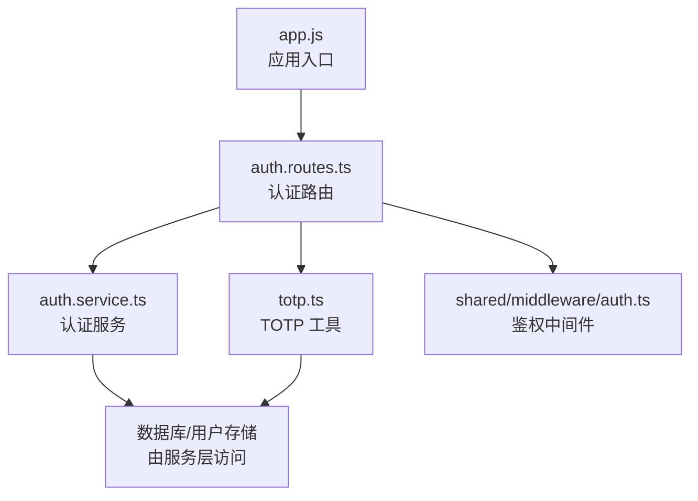
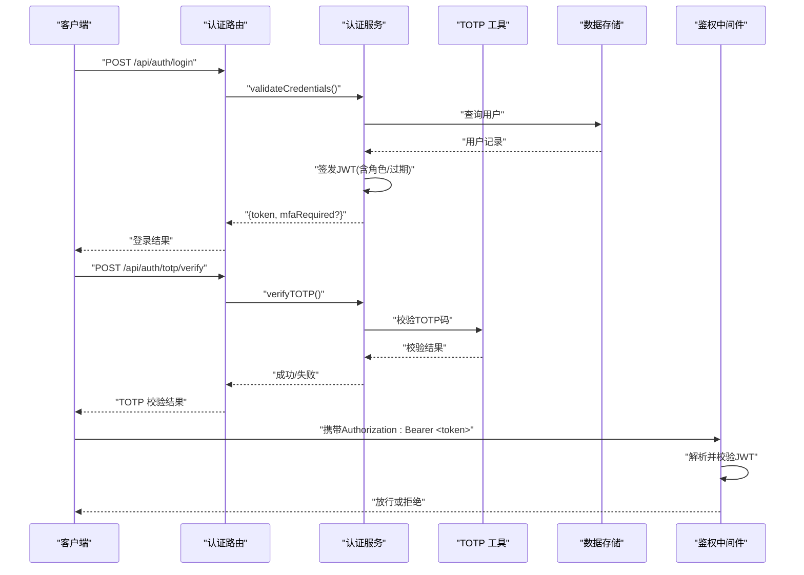
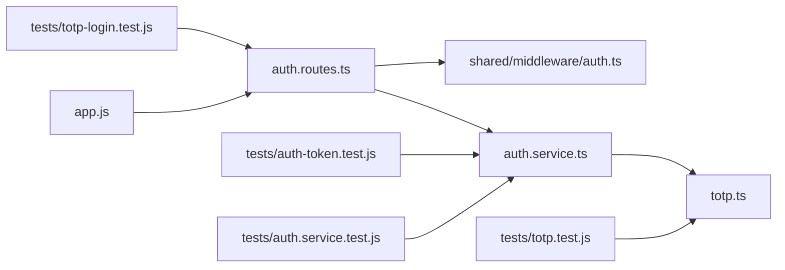

# 认证接口

<cite>
**本文引用的文件**   
- [server/src/features/auth/auth.routes.ts](file://server/src/features/auth/auth.routes.ts)
- [server/src/features/auth/auth.service.ts](file://server/src/features/auth/auth.service.ts)
- [server/src/features/auth/totp.ts](file://server/src/features/auth/totp.ts)
- [server/src/shared/middleware/auth.ts](file://server/src/shared/middleware/auth.ts)
- [server/src/app.js](file://server/src/app.js)
- [server/tests/auth-token.test.js](file://server/tests/auth-token.test.js)
- [server/tests/auth.service.test.js](file://server/tests/auth.service.test.js)
- [server/tests/totp-login.test.js](file://server/tests/totp-login.test.js)
- [server/tests/totp.test.js](file://server/tests/totp.test.js)
</cite>

## 目录
1. [简介](#简介)
2. [项目结构](#项目结构)
3. [核心组件](#核心组件)
4. [架构总览](#架构总览)
5. [详细组件分析](#详细组件分析)
6. [依赖关系分析](#依赖关系分析)
7. [性能考虑](#性能考虑)
8. [故障排查指南](#故障排查指南)
9. [结论](#结论)
10. [附录](#附录)

## 简介
本文件为阿里画师约稿管理平台的认证系统提供完整的 RESTful API 文档，覆盖用户登录、登出、TOTP 双因素认证与令牌签发/校验、会话管理等关键能力。文档包含：
- HTTP 方法与 URL 模式
- 请求/响应结构与字段说明
- JWT 令牌处理流程（签发、校验、刷新）
- TOTP 验证流程（绑定、校验、二次认证）
- 状态码与错误处理策略
- 安全注意事项与客户端最佳实践（含刷新机制与会话管理建议）

## 项目结构
认证相关代码位于后端 server 模块的 features/auth 与 shared/middleware 中，路由定义、服务逻辑、TOTP 工具与鉴权中间件分工明确。应用入口负责挂载认证路由并启用全局中间件。

图表来源
- [server/src/app.js](file://server/src/app.js)
- [server/src/features/auth/auth.routes.ts](file://server/src/features/auth/auth.routes.ts)
- [server/src/features/auth/auth.service.ts](file://server/src/features/auth/auth.service.ts)
- [server/src/features/auth/totp.ts](file://server/src/features/auth/totp.ts)
- [server/src/shared/middleware/auth.ts](file://server/src/shared/middleware/auth.ts)

章节来源
- [server/src/app.js](file://server/src/app.js)
- [server/src/features/auth/auth.routes.ts](file://server/src/features/auth/auth.routes.ts)

## 核心组件
- 认证路由 auth.routes.ts：定义所有认证相关的 REST 端点，包括登录、登出、TOTP 绑定与校验等。
- 认证服务 auth.service.ts：封装登录校验、JWT 签发、会话管理与业务规则。
- TOTP 工具 totp.ts：实现 TOTP 密钥生成、二维码链接生成、验证码校验等。
- 鉴权中间件 shared/middleware/auth.ts：解析并校验 JWT，注入当前用户上下文，保护受保护资源。

章节来源
- [server/src/features/auth/auth.routes.ts](file://server/src/features/auth/auth.routes.ts)
- [server/src/features/auth/auth.service.ts](file://server/src/features/auth/auth.service.ts)
- [server/src/features/auth/totp.ts](file://server/src/features/auth/totp.ts)
- [server/src/shared/middleware/auth.ts](file://server/src/shared/middleware/auth.ts)

## 架构总览
认证流程采用“路由 → 服务 → 工具/存储”的分层设计。登录成功后签发 JWT；后续请求通过中间件校验令牌并注入用户信息。TOTP 作为可选的第二步认证，在登录或敏感操作时触发。

图表来源
- [server/src/features/auth/auth.routes.ts](file://server/src/features/auth/auth.routes.ts)
- [server/src/features/auth/auth.service.ts](file://server/src/features/auth/auth.service.ts)
- [server/src/features/auth/totp.ts](file://server/src/features/auth/totp.ts)
- [server/src/shared/middleware/auth.ts](file://server/src/shared/middleware/auth.ts)

## 详细组件分析

### 认证路由（auth.routes.ts）
- 职责：定义认证相关 REST 端点，接收请求参数，调用服务层完成业务逻辑，返回统一响应。
- 典型端点：
  - POST /api/auth/login：用户名/密码登录，必要时返回需要 TOTP 二次认证的标志。
  - POST /api/auth/logout：注销会话，使令牌失效（服务端可维护黑名单）。
  - POST /api/auth/totp/bind：绑定 TOTP 设备，返回二维码或密钥供客户端配置。
  - POST /api/auth/totp/verify：提交 TOTP 验证码进行校验。
  - GET /api/auth/me：获取当前用户信息（需鉴权）。
- 响应格式：统一 JSON，包含 data、error、message 等字段，便于前端处理。

章节来源
- [server/src/features/auth/auth.routes.ts](file://server/src/features/auth/auth.routes.ts)

### 认证服务（auth.service.ts）
- 职责：实现登录校验、JWT 签发、令牌刷新、会话管理、TOTP 校验等业务逻辑。
- 关键点：
  - 登录：校验凭据，生成短期 JWT，必要时标记 MFA 未通过。
  - 登出：将令牌加入黑名单或清除会话，防止重用。
  - TOTP：校验一次性口令，支持窗口容忍与重试限制。
  - 刷新：基于刷新令牌或短期令牌续期，避免频繁重新登录。
- 错误处理：对无效凭据、MFA 失败、令牌过期等场景返回明确状态码与消息。

章节来源
- [server/src/features/auth/auth.service.ts](file://server/src/features/auth/auth.service.ts)

### TOTP 工具（totp.ts）
- 职责：生成 TOTP 密钥、构建二维码链接、校验 TOTP 验证码。
- 特性：
  - 支持标准 TOTP 算法（如 RFC 6238），默认时间步长与容差窗口。
  - 提供密钥编码（Base32）与二维码生成辅助方法。
  - 校验时考虑时钟漂移，允许前后若干步长的容差。

章节来源
- [server/src/features/auth/totp.ts](file://server/src/features/auth/totp.ts)

### 鉴权中间件（shared/middleware/auth.ts）
- 职责：从请求头解析 Authorization: Bearer <token>，校验 JWT 签名与有效期，注入当前用户到请求上下文。
- 行为：
  - 令牌缺失或无效：返回 401 或未授权。
  - 令牌已过期：根据策略返回 401 或提示刷新。
  - 成功：将用户信息附加到请求对象，供下游路由使用。

章节来源
- [server/src/shared/middleware/auth.ts](file://server/src/shared/middleware/auth.ts)

### 应用入口（app.js）
- 职责：初始化 Fastify 应用，注册全局中间件（如速率限制、日志、CORS），挂载认证路由与其他功能路由。
- 认证集成：确保鉴权中间件在受保护路由前生效，保证请求链路安全。

章节来源
- [server/src/app.js](file://server/src/app.js)

## 依赖关系分析
认证子系统内部依赖清晰：路由依赖服务，服务依赖 TOTP 工具与数据层，中间件独立于业务逻辑但被路由链使用。测试覆盖登录、TOTP、令牌生命周期等关键路径。

图表来源
- [server/src/features/auth/auth.routes.ts](file://server/src/features/auth/auth.routes.ts)
- [server/src/features/auth/auth.service.ts](file://server/src/features/auth/auth.service.ts)
- [server/src/features/auth/totp.ts](file://server/src/features/auth/totp.ts)
- [server/src/shared/middleware/auth.ts](file://server/src/shared/middleware/auth.ts)
- [server/src/app.js](file://server/src/app.js)
- [server/tests/auth-token.test.js](file://server/tests/auth-token.test.js)
- [server/tests/auth.service.test.js](file://server/tests/auth.service.test.js)
- [server/tests/totp-login.test.js](file://server/tests/totp-login.test.js)
- [server/tests/totp.test.js](file://server/tests/totp.test.js)

章节来源
- [server/src/features/auth/auth.routes.ts](file://server/src/features/auth/auth.routes.ts)
- [server/src/features/auth/auth.service.ts](file://server/src/features/auth/auth.service.ts)
- [server/src/features/auth/totp.ts](file://server/src/features/auth/totp.ts)
- [server/src/shared/middleware/auth.ts](file://server/src/shared/middleware/auth.ts)
- [server/src/app.js](file://server/src/app.js)
- [server/tests/auth-token.test.js](file://server/tests/auth-token.test.js)
- [server/tests/auth.service.test.js](file://server/tests/auth.service.test.js)
- [server/tests/totp-login.test.js](file://server/tests/totp-login.test.js)
- [server/tests/totp.test.js](file://server/tests/totp.test.js)

## 性能考虑
- JWT 校验开销低，建议在中间件中缓存公钥或密钥元信息以减少重复计算。
- TOTP 校验应限制尝试次数与频率，避免暴力破解。
- 登录与 TOTP 接口应启用速率限制与防重放策略。
- 短令牌 + 刷新令牌组合可降低频繁登录带来的压力。

[本节为通用指导，不直接分析具体文件]

## 故障排查指南
常见问题与定位要点：
- 401 未授权：检查 Authorization 头是否携带有效 Bearer 令牌；确认令牌未过期且未被拉黑。
- 403 禁止访问：用户权限不足或角色不匹配，检查用户角色与资源访问控制。
- 429 限流：登录或 TOTP 接口触发速率限制，稍后重试或降低请求频率。
- TOTP 校验失败：确认设备时间同步、验证码正确且在容差窗口内；检查绑定状态。
- 会话异常：登出后仍访问受保护资源，检查服务端令牌黑名单与会话清理逻辑。

章节来源
- [server/src/shared/middleware/auth.ts](file://server/src/shared/middleware/auth.ts)
- [server/src/features/auth/auth.service.ts](file://server/src/features/auth/auth.service.ts)
- [server/tests/auth-token.test.js](file://server/tests/auth-token.test.js)
- [server/tests/totp.test.js](file://server/tests/totp.test.js)

## 结论
认证系统通过清晰的分层设计与严格的中间件校验，提供了安全的登录、登出、TOTP 双因素认证与令牌管理能力。结合短令牌与刷新机制，可在保障安全的同时提升用户体验。建议在生产环境启用速率限制、审计日志与令牌黑名单，以增强整体安全性与可观测性。

[本节为总结，不直接分析具体文件]

## 附录

### API 端点清单与交互说明
- POST /api/auth/login
  - 用途：用户登录，返回 JWT 与是否需要 TOTP 的标志。
  - 请求体：用户名、密码。
  - 响应：{ token, mfaRequired } 或错误信息。
  - 状态码：200 成功，401 凭据无效，429 限流。

- POST /api/auth/logout
  - 用途：注销会话，使令牌失效。
  - 请求体：可选 token 或从请求头自动解析。
  - 响应：成功或错误信息。
  - 状态码：200 成功，401 未认证。

- POST /api/auth/totp/bind
  - 用途：绑定 TOTP 设备，返回二维码或密钥。
  - 请求体：用户标识。
  - 响应：{ secret, qrUrl } 或错误信息。
  - 状态码：200 成功，401 未认证，403 无权限。

- POST /api/auth/totp/verify
  - 用途：提交 TOTP 验证码进行校验。
  - 请求体：{ code }。
  - 响应：{ success } 或错误信息。
  - 状态码：200 成功，400 参数错误，401 未认证，403 校验失败。

- GET /api/auth/me
  - 用途：获取当前用户信息。
  - 请求头：Authorization: Bearer <token>。
  - 响应：{ user } 或错误信息。
  - 状态码：200 成功，401 未认证。

章节来源
- [server/src/features/auth/auth.routes.ts](file://server/src/features/auth/auth.routes.ts)
- [server/src/features/auth/auth.service.ts](file://server/src/features/auth/auth.service.ts)

### JWT 令牌处理与刷新机制
- 签发：登录成功后签发短期 JWT，包含用户标识与角色。
- 校验：中间件解析并验证签名与有效期。
- 刷新：基于刷新令牌或短期令牌续期，避免频繁登录。
- 失效：登出时将令牌加入黑名单或清除会话。

章节来源
- [server/src/features/auth/auth.service.ts](file://server/src/features/auth/auth.service.ts)
- [server/src/shared/middleware/auth.ts](file://server/src/shared/middleware/auth.ts)

### TOTP 验证流程
- 绑定：生成密钥与二维码，供客户端配置 TOTP 应用。
- 校验：提交验证码，服务端校验是否在容差窗口内。
- 二次认证：登录或敏感操作时要求输入 TOTP 码。

章节来源
- [server/src/features/auth/totp.ts](file://server/src/features/auth/totp.ts)
- [server/src/features/auth/auth.service.ts](file://server/src/features/auth/auth.service.ts)

### 客户端实现示例与最佳实践
- 登录流程：
  - 调用登录接口，保存返回的 token。
  - 若 mfaRequired 为真，引导用户输入 TOTP 码并调用校验接口。
- 令牌刷新：
  - 在 token 即将过期前发起刷新请求，更新本地存储的 token。
- 会话管理：
  - 登出时调用登出接口并清除本地 token。
  - 监听网络错误与 401 响应，自动跳转登录页。
- 安全建议：
  - 使用 HTTPS 传输。
  - 避免在 localStorage 长期存储敏感信息，优先使用内存或 HttpOnly Cookie。
  - 实施速率限制与失败计数，防止暴力破解。

章节来源
- [server/src/features/auth/auth.routes.ts](file://server/src/features/auth/auth.routes.ts)
- [server/src/features/auth/auth.service.ts](file://server/src/features/auth/auth.service.ts)
- [server/src/shared/middleware/auth.ts](file://server/src/shared/middleware/auth.ts)

### 错误处理策略
- 统一错误响应结构，包含 code、message、details。
- 区分业务错误与安全错误（如 401、403、429）。
- 记录关键错误日志，便于审计与排障。

章节来源
- [server/src/features/auth/auth.service.ts](file://server/src/features/auth/auth.service.ts)
- [server/src/shared/middleware/auth.ts](file://server/src/shared/middleware/auth.ts)

### 安全注意事项
- 强制 HTTPS，禁用明文传输。
- 设置合理的令牌过期时间与刷新策略。
- 启用速率限制与账户锁定策略。
- 对 TOTP 绑定与校验进行严格输入校验与重试限制。
- 定期轮换密钥与审计登录行为。

章节来源
- [server/src/features/auth/auth.service.ts](file://server/src/features/auth/auth.service.ts)
- [server/src/shared/middleware/auth.ts](file://server/src/shared/middleware/auth.ts)