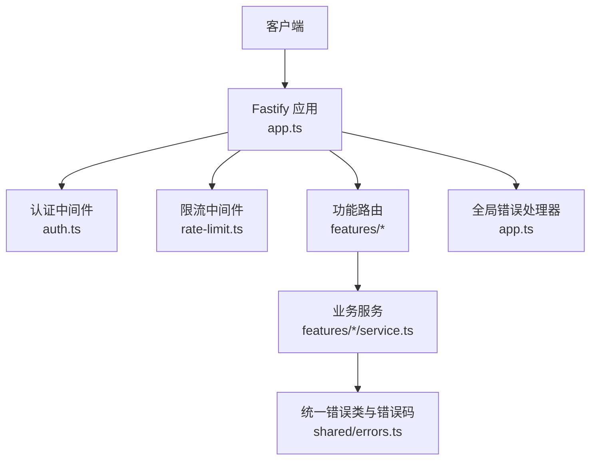
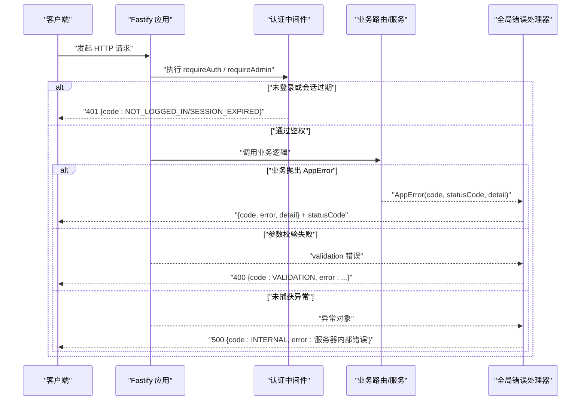
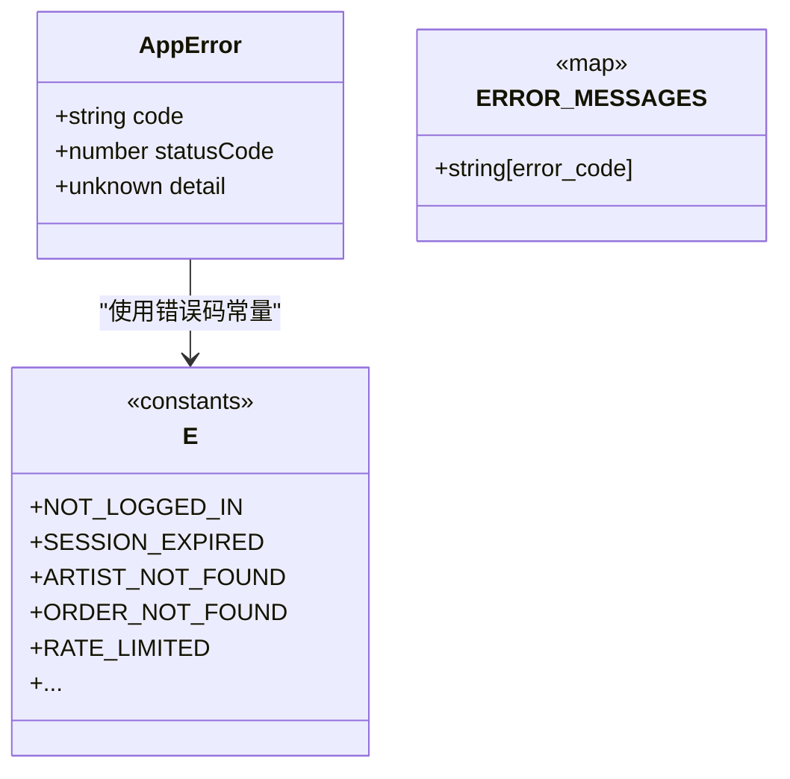
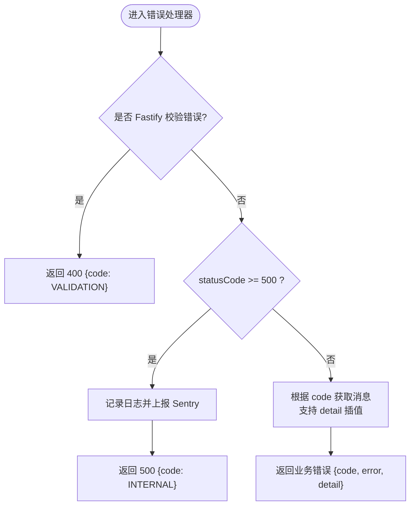
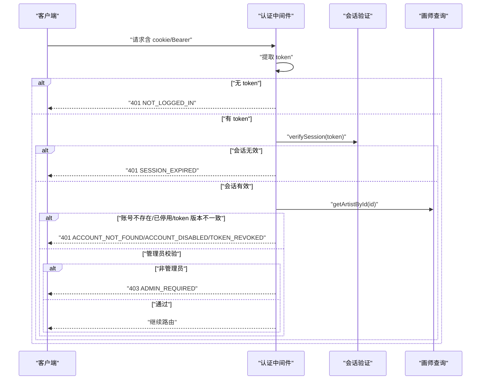
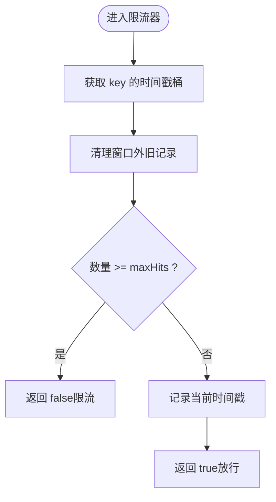
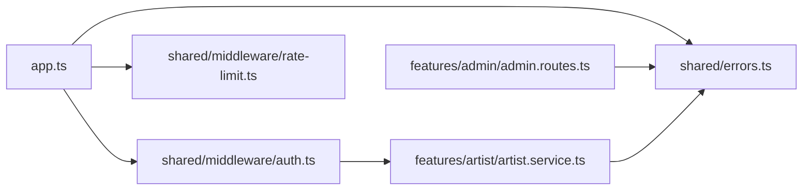

# 错误码参考
> 修订版（2026-08-07，四号）：本文件为外部 repowiki 原文 错误码参考.md 的仓库内修订版（修补批 #6），按 master 代码逐条核实修正；外部原文（C:\Users\qly19\Desktop\repowiki\）一字未动。
> 修订范围：文件名引用 .js→.ts（TS 迁移）、登录/会话描述对齐 REQ-027 TOTP、删除虚构变量/端点、迁移版本补至 v45。

<cite>
**本文引用的文件**   
- [server/src/shared/errors.ts](file://server/src/shared/errors.ts)
- [server/src/app.ts](file://server/src/app.ts)
- [server/src/shared/middleware/auth.ts](file://server/src/shared/middleware/auth.ts)
- [server/src/shared/middleware/rate-limit.ts](file://server/src/shared/middleware/rate-limit.ts)
- [server/src/features/artist/artist.service.ts](file://server/src/features/artist/artist.service.ts)
- [server/src/features/admin/admin.routes.ts](file://server/src/features/admin/admin.routes.ts)
</cite>

## 目录
1. [简介](#简介)
2. [项目结构](#项目结构)
3. [核心组件](#核心组件)
4. [架构总览](#架构总览)
5. [详细组件分析](#详细组件分析)
6. [依赖关系分析](#依赖关系分析)
7. [性能与稳定性考量](#性能与稳定性考量)
8. [故障排查指南](#故障排查指南)
9. [结论](#结论)
10. [附录：错误码分类与清单](#附录错误码分类与清单)

## 简介
本文件为阿里画师约稿管理平台的“错误码参考”，覆盖业务错误码、HTTP 状态码与自定义错误类型的定义、含义与使用场景。文档面向前后端开发者与运维人员，提供统一的错误响应格式、前端处理建议、版本兼容与废弃迁移策略，以及调试技巧与常见错误模式解决方案。

## 项目结构
后端基于 Fastify 构建，统一通过全局错误处理器输出结构化错误响应；业务层通过 AppError 抛出带 code、statusCode 与 detail 的错误对象；认证中间件负责鉴权与权限校验；限流中间件用于防刷与保护接口。

**图表来源** 
- [server/src/app.ts:222-252](file://server/src/app.ts#L222-L252)
- [server/src/shared/middleware/auth.ts:35-60](file://server/src/shared/middleware/auth.ts#L35-L60)
- [server/src/shared/middleware/rate-limit.ts:15-38](file://server/src/shared/middleware/rate-limit.ts#L15-L38)
- [server/src/shared/errors.ts:7-18](file://server/src/shared/errors.ts#L7-L18)

**章节来源**
- [server/src/app.ts:222-252](file://server/src/app.ts#L222-L252)
- [server/src/shared/errors.ts:7-18](file://server/src/shared/errors.ts#L7-L18)

## 核心组件
- 统一错误类与错误码常量
  - AppError：携带 code、statusCode、detail，默认 statusCode 为 400
  - E：集中定义所有业务错误码（字符串常量）
  - ERROR_MESSAGES：错误码到中文友好消息的映射表
- 全局错误处理器
  - 将 AppError 转换为标准 JSON 响应
  - 对 5xx 错误隐藏敏感信息并上报监控
  - 支持在消息模板中使用 detail 中的占位符进行插值
- 认证与权限中间件
  - requireAuth：校验登录态、会话有效性、账号状态与 token 版本
  - requireAdmin：在 requireAuth 基础上增加管理员权限校验
- 限流中间件
  - rateLimit：基于滑动时间窗口的 per-IP 限流，返回通用限流错误码

**章节来源**
- [server/src/shared/errors.ts:7-18](file://server/src/shared/errors.ts#L7-L18)
- [server/src/shared/errors.ts:21-227](file://server/src/shared/errors.ts#L21-L227)
- [server/src/shared/errors.ts:231-433](file://server/src/shared/errors.ts#L231-L433)
- [server/src/app.ts:222-252](file://server/src/app.ts#L222-L252)
- [server/src/shared/middleware/auth.ts:35-95](file://server/src/shared/middleware/auth.ts#L35-L95)
- [server/src/shared/middleware/rate-limit.ts:15-38](file://server/src/shared/middleware/rate-limit.ts#L15-L38)

## 架构总览
下图展示一次请求从进入 Fastify 到错误处理的完整流程，包括参数校验失败、业务异常与系统异常的分支路径。

**图表来源** 
- [server/src/app.ts:222-252](file://server/src/app.ts#L222-L252)
- [server/src/shared/middleware/auth.ts:35-60](file://server/src/shared/middleware/auth.ts#L35-L60)

**章节来源**
- [server/src/app.ts:222-252](file://server/src/app.ts#L222-L252)

## 详细组件分析

### 统一错误类与错误码（AppError 与 E）
- AppError
  - 字段：code（机器可读）、statusCode（HTTP 状态码，默认 400）、detail（上下文数据）
  - 用途：在各业务模块中统一抛错，便于全局错误处理器格式化响应
- E（错误码常量）
  - 按领域分组：认证、画师、流程、订单、上传、管理员、倍率、计算、价格、焦点图、外链、社交平台、图库、备注附图、流程跟踪、备注删除、强调色、截稿日、开工日、公告过期日、下单页模板、平台链接、灵感标签、附加工作项、名额与缓冲、作品、档位三态、折扣码、多画风、计价引擎等
- ERROR_MESSAGES（用户友好消息）
  - 提供每个错误码对应的中文提示，支持 {key} 占位符由 detail 注入

**图表来源** 
- [server/src/shared/errors.ts:7-18](file://server/src/shared/errors.ts#L7-L18)
- [server/src/shared/errors.ts:21-227](file://server/src/shared/errors.ts#L21-L227)
- [server/src/shared/errors.ts:231-433](file://server/src/shared/errors.ts#L231-L433)

**章节来源**
- [server/src/shared/errors.ts:7-18](file://server/src/shared/errors.ts#L7-L18)
- [server/src/shared/errors.ts:21-227](file://server/src/shared/errors.ts#L21-L227)
- [server/src/shared/errors.ts:231-433](file://server/src/shared/errors.ts#L231-L433)

### 全局错误处理器（app.ts）
- 参数校验失败（Fastify validation）
  - 返回 400，code 固定为 VALIDATION，error 包含字段名提示
- 业务错误（AppError）
  - 使用 statusCode 与 code，error 优先取 ERROR_MESSAGES[code]，否则回退 error.message
  - 支持 detail 中的 {key} 占位符替换
- 系统错误（5xx）
  - 不暴露 message，仅记录日志并上报 Sentry，返回 INTERNAL
- 其他异常
  - 兜底 UNKNOWN

**图表来源** 
- [server/src/app.ts:222-252](file://server/src/app.ts#L222-L252)

**章节来源**
- [server/src/app.ts:222-252](file://server/src/app.ts#L222-L252)

### 认证与权限中间件（auth.ts）
- requireAuth
  - 未登录：401 NOT_LOGGED_IN
  - 会话过期：401 SESSION_EXPIRED
  - 账号不存在：401 ACCOUNT_NOT_FOUND
  - 账号停用：401 ACCOUNT_DISABLED
  - Token 失效：401 TOKEN_REVOKED
- requireAdmin
  - 在 requireAuth 基础上增加管理员校验
  - 非管理员：403 ADMIN_REQUIRED

**图表来源** 
- [server/src/shared/middleware/auth.ts:35-95](file://server/src/shared/middleware/auth.ts#L35-L95)

**章节来源**
- [server/src/shared/middleware/auth.ts:35-95](file://server/src/shared/middleware/auth.ts#L35-L95)

### 限流中间件（rate-limit.ts）
- 基于滑动窗口统计最近 windowMs 内的请求数
- 超过阈值返回 RATE_LIMITED（通常配合业务路由返回 429）

**图表来源** 
- [server/src/shared/middleware/rate-limit.ts:15-38](file://server/src/shared/middleware/rate-limit.ts#L15-L38)

**章节来源**
- [server/src/shared/middleware/rate-limit.ts:15-38](file://server/src/shared/middleware/rate-limit.ts#L15-L38)

### 业务示例：画师服务（artist.service.ts）
- 常见抛错场景
  - 画师不存在：ARTIST_NOT_FOUND（404）
  - 子域名格式错误：SUBDOMAIN_FORMAT
  - 身份码格式错误：CODE_FORMAT
  - 身份码/QQ/子域名冲突：CODE_TAKEN/QQ_TAKEN/SUBDOMAIN_TAKEN（400，附带 detail）
  - 状态非法：INVALID_STATUS
  - 外链过多：LINKS_TOO_MANY
  - 强调色非法：INVALID_ACCENT_COLOR（400，附带 value）
  - 模板非法：INVALID_ORDER_TEMPLATE（400，附带 value）

**章节来源**
- [server/src/features/artist/artist.service.ts:57-207](file://server/src/features/artist/artist.service.ts#L57-L207)

### 业务示例：管理员路由（admin.routes.ts）
- 常见错误
  - 非法路径：ILLEGAL_PATH（400）
  - TOTP 绑定错误：TOTP_BIND_INVALID（400）
  - 频繁操作：429（限流）
  - 资源不存在：404
  - 权限不足：403

**章节来源**
- [server/src/features/admin/admin.routes.ts:655-752](file://server/src/features/admin/admin.routes.ts#L655-L752)

## 依赖关系分析
- app.ts 依赖 shared/errors.ts 的 ERROR_MESSAGES 与 AppError
- 认证中间件依赖 auth.service 与 artist.service 进行会话与账号校验
- 各业务路由与服务通过 AppError 与 E 常量统一抛错
- 限流中间件独立实现，被公开接口复用

**图表来源** 
- [server/src/app.ts:222-252](file://server/src/app.ts#L222-L252)
- [server/src/shared/middleware/auth.ts:35-95](file://server/src/shared/middleware/auth.ts#L35-L95)
- [server/src/shared/middleware/rate-limit.ts:15-38](file://server/src/shared/middleware/rate-limit.ts#L15-L38)
- [server/src/features/artist/artist.service.ts:57-207](file://server/src/features/artist/artist.service.ts#L57-L207)
- [server/src/features/admin/admin.routes.ts:655-752](file://server/src/features/admin/admin.routes.ts#L655-L752)

**章节来源**
- [server/src/app.ts:222-252](file://server/src/app.ts#L222-L252)
- [server/src/shared/middleware/auth.ts:35-95](file://server/src/shared/middleware/auth.ts#L35-L95)
- [server/src/shared/middleware/rate-limit.ts:15-38](file://server/src/shared/middleware/rate-limit.ts#L15-L38)
- [server/src/features/artist/artist.service.ts:57-207](file://server/src/features/artist/artist.service.ts#L57-L207)
- [server/src/features/admin/admin.routes.ts:655-752](file://server/src/features/admin/admin.routes.ts#L655-L752)

## 性能与稳定性考量
- 错误响应标准化减少前端解析成本，提升用户体验
- 5xx 错误不泄露细节，降低信息泄露风险
- 限流中间件内存上限保护，避免极端情况下内存膨胀
- 孤儿文件回收定时任务不影响主请求链路

[本节为通用指导，无需列出具体文件来源]

## 故障排查指南
- 快速定位错误类型
  - 查看响应体 code 字段，对照 ERROR_MESSAGES 获取中文提示
  - 若 code 为 VALIDATION，检查请求参数是否符合 Schema
  - 若 code 为 INTERNAL，查看服务端日志与 Sentry 上报
- 常见问题模式
  - 未登录/会话过期：检查 Cookie 与 Bearer Token 是否正确传递
  - 权限不足：确认是否为管理员且 QQ 匹配
  - 限流触发：观察 429 频率，适当延长重试间隔
  - 业务约束失败：如 CODE_TAKEN、QUEUE_DUPLICATE 等，检查输入唯一性与顺序
- 调试技巧
  - 在开发环境开启 CORS 与详细日志
  - 使用浏览器网络面板查看请求头与响应体
  - 针对 detail 字段打印原始上下文，辅助定位问题

**章节来源**
- [server/src/app.ts:222-252](file://server/src/app.ts#L222-L252)
- [server/src/shared/middleware/auth.ts:35-95](file://server/src/shared/middleware/auth.ts#L35-L95)
- [server/src/shared/middleware/rate-limit.ts:15-38](file://server/src/shared/middleware/rate-limit.ts#L15-L38)

## 结论
本项目通过 AppError 与集中式错误码常量实现了统一的错误表达与响应格式，结合全局错误处理器与认证/限流中间件，提供了稳定、可观测、易维护的错误处理体系。前端可依据 code 与 detail 进行精准交互与提示，同时借助日志与监控快速定位问题。

[本节为总结性内容，无需列出具体文件来源]

## 附录：错误码分类与清单

### 一、错误码分类说明
- 参数验证错误
  - 典型 code：VALIDATION、MISSING_PARAMS、STATUS_REQUIRED、NOTE_EMPTY、ORDER_INVALID_ID
  - 典型状态码：400
  - 使用场景：JSON Schema 校验失败、必填字段缺失、枚举值非法
- 业务逻辑错误
  - 典型 code：ARTIST_NOT_FOUND、ORDER_NOT_FOUND、INVALID_TRANSITION、DELIVER_WRONG_STATUS、TIER_NOT_FOUND、QUEUE_EMPTY、QUEUE_DUPLICATE、DISCOUNT_CODE_*、STYLE_*、PRICING_* 等
  - 典型状态码：400/404/422（依业务约定）
  - 使用场景：资源不存在、状态机不允许的转换、配额/限制不满足、定价计算失败
- 系统错误
  - 典型 code：INTERNAL、RATE_LIMITED、NOT_FOUND
  - 典型状态码：500/429/404
  - 使用场景：服务端异常、限流触发、资源未找到
- 权限错误
  - 典型 code：NOT_LOGGED_IN、SESSION_EXPIRED、ACCOUNT_NOT_FOUND、ACCOUNT_DISABLED、TOKEN_REVOKED、ADMIN_REQUIRED
  - 典型状态码：401/403
  - 使用场景：未登录、会话过期、账号禁用、Token 失效、非管理员访问管理接口

### 二、标准响应结构与字段说明
- 成功响应：由业务路由自行定义
- 错误响应（统一格式）
  - code：错误码（字符串），用于 i18n 与前端逻辑判断
  - error：中文友好消息（字符串），优先来自 ERROR_MESSAGES，其次回退 error.message
  - detail：可选上下文（对象/字符串），用于插值占位符与前端提示
- 示例（描述性）
  - 参数校验失败：{ code: "VALIDATION", error: "请求参数格式不正确（字段名）" }
  - 未登录：{ code: "NOT_LOGGED_IN", error: "未登录" }
  - 业务错误：{ code: "CODE_TAKEN", error: "该身份码已被使用", detail: { code: "xxx" } }
  - 系统错误：{ code: "INTERNAL", error: "服务器内部错误" }

**章节来源**
- [server/src/app.ts:222-252](file://server/src/app.ts#L222-L252)
- [server/src/shared/errors.ts:231-433](file://server/src/shared/errors.ts#L231-L433)

### 三、前端处理建议
- 根据 code 分支处理：
  - NOT_LOGGED_IN/SESSION_EXPIRED/TOKEN_REVOKED：跳转登录页重新登录（无刷新令牌机制）
  - ADMIN_REQUIRED：提示需要管理员权限
  - RATE_LIMITED：显示“操作过于频繁，请稍后再试”并延迟重试
  - VALIDATION：高亮对应字段并展示错误提示
  - 业务错误：读取 detail 进行更精确提示（如重复、超限、非法值）
- 错误提示文案
  - 直接使用 error 字段作为用户可见文案
  - 如需国际化，以 code 为键查找本地化文案
- 重试策略
  - 幂等接口可指数退避重试
  - 非幂等接口避免自动重试，引导用户手动重试

**章节来源**
- [server/src/app.ts:222-252](file://server/src/app.ts#L222-L252)
- [server/src/shared/middleware/auth.ts:35-95](file://server/src/shared/middleware/auth.ts#L35-L95)

### 四、版本兼容与废弃流程
- 新增错误码
  - 在 E 中添加新常量，并在 ERROR_MESSAGES 补充中文消息
  - 在相应业务模块抛出 AppError(code, statusCode, detail)
- 废弃错误码
  - 保留旧 code 至少一个主版本，ERROR_MESSAGES 标注废弃说明
  - 逐步迁移至新 code，保持向后兼容
- 变更影响面
  - 前端需确保对未知 code 的降级处理（显示通用错误）
  - 监控告警需覆盖新增/废弃错误码的变化趋势

[本节为通用流程指导，无需列出具体文件来源]

### 五、错误码查询工具与调试技巧
- 查询工具
  - 在后端启动后，可通过健康检查接口确认服务可用
  - 使用 Postman/curl 模拟请求，观察响应体 code 与 error
- 调试技巧
  - 打开浏览器网络面板，复制请求与响应
  - 关注 detail 字段，定位具体字段或值的问题
  - 服务端日志与 Sentry 上报用于定位 5xx 与未捕获异常

**章节来源**
- [server/src/app.ts:266-266](file://server/src/app.ts#L266-L266)
- [server/src/app.ts:222-252](file://server/src/app.ts#L222-L252)

### 六、常见错误模式与解决方案
- 参数校验失败
  - 现象：VALIDATION
  - 解决：检查请求体字段类型、必填项、枚举值范围
- 未登录/会话过期
  - 现象：NOT_LOGGED_IN/SESSION_EXPIRED
  - 解决：确保 Cookie/Bearer 正确设置，必要时重新登录
- 权限不足
  - 现象：ADMIN_REQUIRED
  - 解决：使用管理员账号或申请权限
- 限流触发
  - 现象：RATE_LIMITED
  - 解决：降低请求频率，增加重试间隔
- 业务约束失败
  - 现象：CODE_TAKEN、QUEUE_DUPLICATE、DISCOUNT_CODE_*、STYLE_* 等
  - 解决：检查输入唯一性、顺序、有效期、配置项

**章节来源**
- [server/src/shared/errors.ts:231-433](file://server/src/shared/errors.ts#L231-L433)
- [server/src/shared/middleware/rate-limit.ts:15-38](file://server/src/shared/middleware/rate-limit.ts#L15-L38)