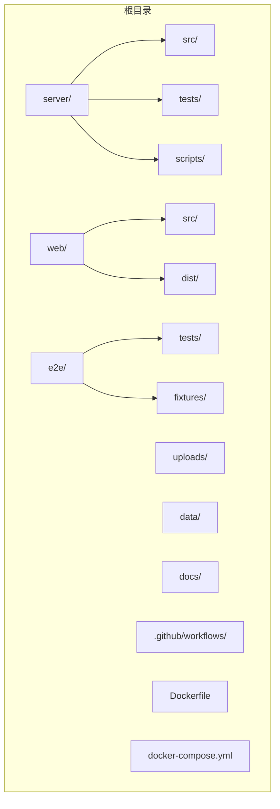
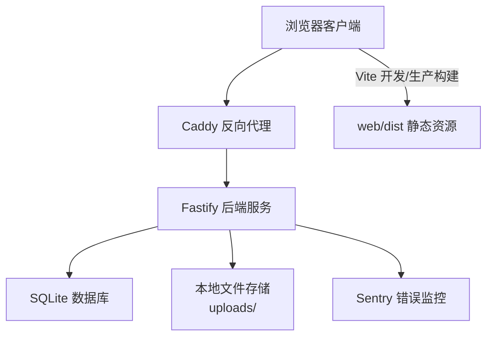
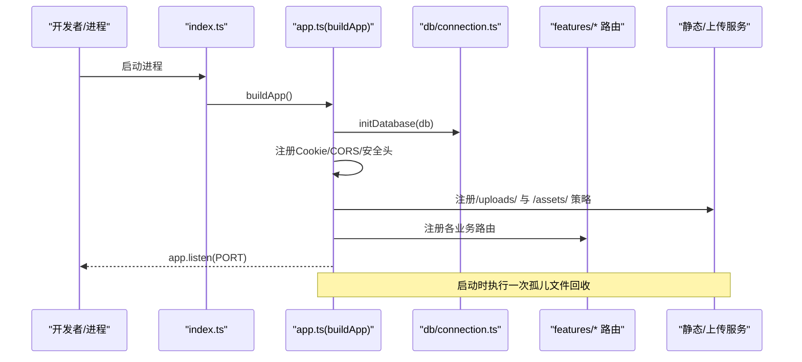
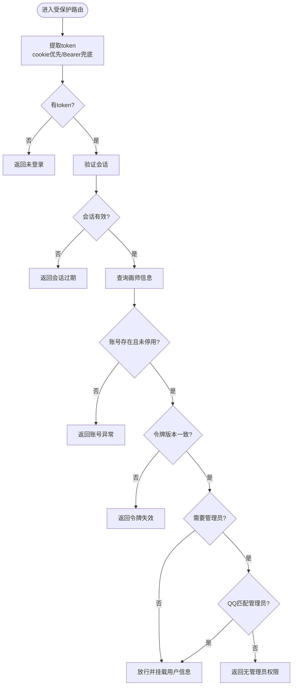
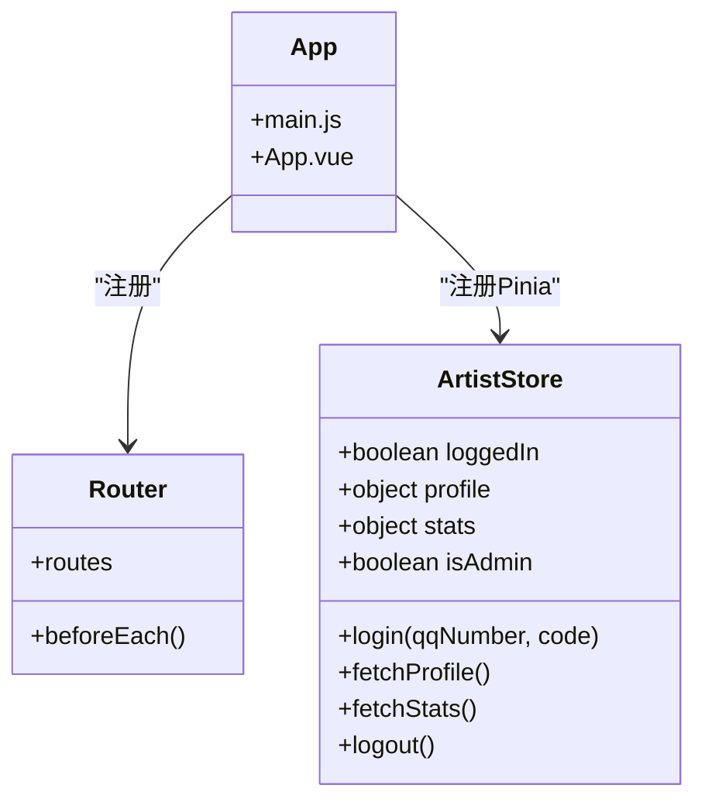
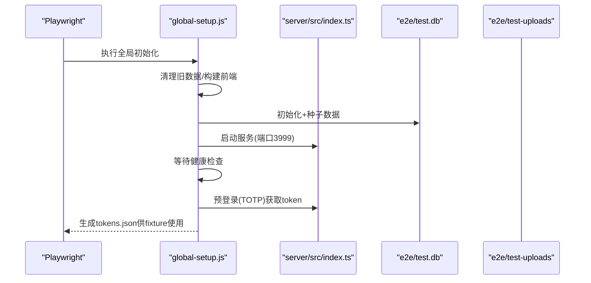
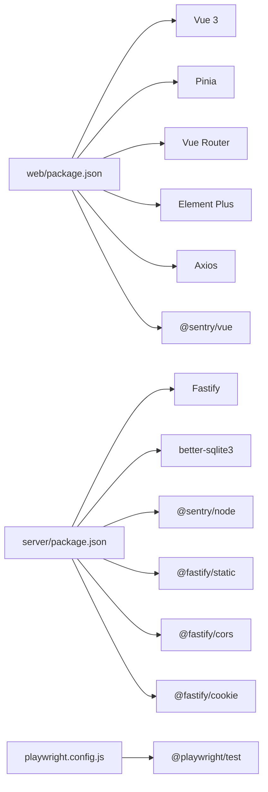

# 项目结构说明
> 修订版（2026-08-07，四号）：本文件为外部 repowiki 原文 项目结构说明.md 的仓库内修订版（修补批 #11），按 master 代码逐条核实修正；外部原文（C:\Users\qly19\Desktop\repowiki\）一字未动。
> 修订范围：文件名引用 .js→.ts（TS 迁移）、登录/会话描述对齐 REQ-027 TOTP、删除虚构变量/端点、迁移版本补至 v45。

<cite>
**本文引用的文件**   
- [package.json](file://package.json)
- [server/package.json](file://server/package.json)
- [web/package.json](file://web/package.json)
- [server/src/index.ts](file://server/src/index.ts)
- [server/src/app.ts](file://server/src/app.ts)
- [server/src/db/connection.ts](file://server/src/db/connection.ts)
- [server/src/shared/middleware/auth.ts](file://server/src/shared/middleware/auth.ts)
- [web/src/main.js](file://web/src/main.js)
- [web/src/App.vue](file://web/src/App.vue)
- [web/src/router/index.js](file://web/src/router/index.js)
- [web/src/stores/artist.js](file://web/src/stores/artist.js)
- [playwright.config.js](file://playwright.config.js)
- [e2e/global-setup.js](file://e2e/global-setup.js)
- [Dockerfile](file://Dockerfile)
- [docker-compose.yml](file://docker-compose.yml)
</cite>

## 目录
1. [简介](#简介)
2. [项目结构](#项目结构)
3. [核心组件](#核心组件)
4. [架构总览](#架构总览)
5. [详细组件分析](#详细组件分析)
6. [依赖关系分析](#依赖关系分析)
7. [性能与可维护性](#性能与可维护性)
8. [故障排查指南](#故障排查指南)
9. [结论](#结论)
10. [附录：新成员导航指引](#附录新成员导航指引)

## 简介
本项目为“阿里画师约稿管理平台”，采用前后端分离架构：后端基于 Fastify（Node.js）提供 REST API、数据库连接、中间件与功能模块；前端基于 Vue 3 + Vite，包含路由、状态管理、组件与样式。端到端测试使用 Playwright，文档集中于 docs，上传文件存放于 uploads。容器化通过 Dockerfile 与 docker-compose.yml 一键部署，支持 Caddy 反向代理与 HTTPS。

## 项目结构
整体目录组织遵循“按职责分层 + 按领域分模块”的原则：
- server：后端服务（API、数据库、中间件、功能模块、脚本、测试）
- web：前端应用（Vue 单页应用、组件、路由、状态管理、样式、构建产物）
- e2e：端到端测试（Playwright 配置、全局初始化/清理、测试用例）
- docs：项目文档（需求、设计、审计、规范等）
- uploads：运行时文件存储（图片、附件、回收站）
- data：SQLite 数据库持久化目录（由环境变量控制路径）
- scripts：辅助脚本（如数据填充、清理等）
- .github/workflows：CI/CD 工作流
- Dockerfile、docker-compose.yml、entrypoint.sh：容器化与编排

图表来源
- [Dockerfile:1-44](file://Dockerfile#L1-L44)
- [docker-compose.yml:1-64](file://docker-compose.yml#L1-L64)

章节来源
- [package.json:1-12](file://package.json#L1-L12)
- [server/package.json:1-43](file://server/package.json#L1-L43)
- [web/package.json:1-41](file://web/package.json#L1-L41)

## 核心组件
- 后端入口与生命周期
  - 启动入口负责加载环境、构建应用、注册插件与路由、监听端口、处理异常与优雅停机。
  - 应用工厂负责数据库初始化、静态资源托管、CORS/CSP、错误处理、Sentry 监控、SPA fallback。
- 数据库连接
  - 基于 better-sqlite3，自动创建目录、根据运行环境选择 WAL/DELETE 模式、开启外键约束与超时保护。
- 认证与权限中间件
  - 从 httpOnly cookie 或 Authorization 头提取 token，校验会话、账号状态、令牌版本，并区分普通用户与管理员。
- 前端应用
  - Vue 3 + Pinia + Vue Router + i18n，统一错误边界与 Sentry 上报，按需引入 Element Plus 样式。
- 端到端测试
  - Playwright 配置独立端口与数据库，全局初始化构建前端、初始化种子数据、注入 TOTP、启动服务器、预登录缓存 token。

章节来源
- [server/src/index.ts:1-62](file://server/src/index.ts#L1-L62)
- [server/src/app.ts:1-318](file://server/src/app.ts#L1-L318)
- [server/src/db/connection.ts:1-25](file://server/src/db/connection.ts#L1-L25)
- [server/src/shared/middleware/auth.ts:1-96](file://server/src/shared/middleware/auth.ts#L1-L96)
- [web/src/main.js:1-51](file://web/src/main.js#L1-L51)
- [web/src/App.vue:1-55](file://web/src/App.vue#L1-L55)
- [playwright.config.js:1-24](file://playwright.config.js#L1-L24)
- [e2e/global-setup.js:1-164](file://e2e/global-setup.js#L1-L164)

## 架构总览
系统由前端 SPA、后端 Fastify 服务、SQLite 数据库、对象存储（本地文件系统）、反向代理（Caddy）组成。前端通过 Axios 调用后端 API，后端通过中间件进行鉴权与限流，静态资源与上传文件通过签名访问控制。

图表来源
- [server/src/app.ts:1-318](file://server/src/app.ts#L1-L318)
- [docker-compose.yml:1-64](file://docker-compose.yml#L1-L64)
- [Dockerfile:1-44](file://Dockerfile#L1-L44)

## 详细组件分析

### 后端服务（Fastify）
- 启动流程
  - 读取环境变量（端口、代理信任、CORS、Sentry、上传目录等），构建 Fastify 实例，初始化数据库，执行孤儿文件回收任务，注册 Cookie/CORS/安全响应头，挂载静态资源与上传目录，注册功能路由与健康检查，最后提供 SPA fallback。
- 安全与健壮性
  - 全局错误处理器输出结构化错误码与中文消息，5xx 不泄露细节并上报 Sentry；未捕获异常记录后强制退出；优雅停机带超时保护。
- 文件访问控制
  - 公开路径（images/）允许 inline 预览与适度缓存；敏感路径（references/deliverables/notes）需签名验证，返回 attachment 且禁止缓存。

图表来源
- [server/src/index.ts:1-62](file://server/src/index.ts#L1-L62)
- [server/src/app.ts:1-318](file://server/src/app.ts#L1-L318)
- [server/src/db/connection.ts:1-25](file://server/src/db/connection.ts#L1-L25)

章节来源
- [server/src/index.ts:1-62](file://server/src/index.ts#L1-L62)
- [server/src/app.ts:1-318](file://server/src/app.ts#L1-L318)

### 数据库连接（better-sqlite3）
- 自动创建数据目录，根据是否运行在容器环境选择 journal_mode（WAL/DELETE），开启外键约束与 busy_timeout，避免并发写入阻塞。

章节来源
- [server/src/db/connection.ts:1-25](file://server/src/db/connection.ts#L1-L25)

### 认证与权限中间件
- 认证流程
  - 优先从 httpOnly cookie 读取 token，其次回退到 Authorization Bearer；校验会话有效性、账号存在与状态、令牌版本一致性；管理员接口额外校验 QQ 号匹配。
- 错误处理
  - 未登录、会话过期、账号不存在、账号停用、令牌失效均返回结构化错误码与中文提示。

图表来源
- [server/src/shared/middleware/auth.ts:1-96](file://server/src/shared/middleware/auth.ts#L1-L96)

章节来源
- [server/src/shared/middleware/auth.ts:1-96](file://server/src/shared/middleware/auth.ts#L1-L96)

### 前端应用（Vue 3 + Vite）
- 应用初始化
  - 创建 Vue 应用，注册 Pinia、Router、i18n，按需引入 Element Plus 样式，设置全局错误边界与 Sentry 上报。
- 路由与权限
  - 定义客户端、画师后台、管理员后台路由；beforeEach 中根据 meta.requiresAuth/requiresAdmin 与 localStorage 标记进行跳转控制。
- 状态管理
  - artist store 管理登录态、头像、统计与管理员标识；登录成功后仅保存非敏感标记，token 存 httpOnly cookie。

图表来源
- [web/src/main.js:1-51](file://web/src/main.js#L1-L51)
- [web/src/App.vue:1-55](file://web/src/App.vue#L1-L55)
- [web/src/router/index.js:1-92](file://web/src/router/index.js#L1-L92)
- [web/src/stores/artist.js:1-70](file://web/src/stores/artist.js#L1-L70)

章节来源
- [web/src/main.js:1-51](file://web/src/main.js#L1-L51)
- [web/src/App.vue:1-55](file://web/src/App.vue#L1-L55)
- [web/src/router/index.js:1-92](file://web/src/router/index.js#L1-L92)
- [web/src/stores/artist.js:1-70](file://web/src/stores/artist.js#L1-L70)

### 端到端测试（Playwright）
- 测试环境
  - 独立端口 3999、独立 SQLite 数据库与上传目录，禁用并行，失败截图与重试。
- 全局初始化
  - 安装依赖、构建前端、初始化种子数据、注入 TOTP 密钥、启动服务器、等待健康检查、预登录获取 token 并缓存。
- 测试隔离
  - 通过 globalSetup/globalTeardown 保证每次测试数据干净、服务器进程可控。

图表来源
- [playwright.config.js:1-24](file://playwright.config.js#L1-L24)
- [e2e/global-setup.js:1-164](file://e2e/global-setup.js#L1-L164)
- [server/src/index.ts:1-62](file://server/src/index.ts#L1-L62)

章节来源
- [playwright.config.js:1-24](file://playwright.config.js#L1-L24)
- [e2e/global-setup.js:1-164](file://e2e/global-setup.js#L1-L164)

### 容器化与部署
- 多阶段构建
  - 第一阶段构建前端 dist，第二阶段仅安装后端生产依赖，拷贝源码与构建产物，设置非 root 用户与数据卷。
- Compose 编排
  - web 服务暴露 3000 端口，挂载 data 与 uploads 目录，设置环境变量与时区；caddy 提供反向代理与 HTTPS。

章节来源
- [Dockerfile:1-44](file://Dockerfile#L1-L44)
- [docker-compose.yml:1-64](file://docker-compose.yml#L1-L64)

## 依赖关系分析
- 后端依赖
  - Fastify 生态（静态、CORS、Cookie、Multipart）、SQLite（better-sqlite3）、Sentry、工具库（nanoid、sharp、qrcode）。
- 前端依赖
  - Vue 3、Pinia、Vue Router、Element Plus、Axios、i18n、Sentry 前端 SDK。
- 测试依赖
  - Playwright、Vitest（前后端单元测试）、ESLint/Prettier。

图表来源
- [web/package.json:1-41](file://web/package.json#L1-L41)
- [server/package.json:1-43](file://server/package.json#L1-L43)
- [playwright.config.js:1-24](file://playwright.config.js#L1-L24)

章节来源
- [web/package.json:1-41](file://web/package.json#L1-L41)
- [server/package.json:1-43](file://server/package.json#L1-L43)
- [playwright.config.js:1-24](file://playwright.config.js#L1-L24)

## 性能与可维护性
- 数据库性能
  - 启用 WAL 模式（非容器环境）提升并发读写；busy_timeout 防止锁竞争；外键约束保障数据一致性。
- 静态资源缓存
  - assets 长缓存 immutable，index.html no-cache，确保发版即时生效与缓存命中平衡。
- 安全加固
  - CSP、X-Frame-Options、Referrer-Policy、Permissions-Policy 等响应头；上传路径签名访问；非 root 运行容器。
- 错误监控
  - 前后端接入 Sentry，生产环境关闭性能追踪，仅采集错误，减少开销。
- 可维护性
  - 模块化路由与服务拆分；统一的错误码与中文消息；清晰的目录结构与命名约定。

[本节为通用指导，不直接分析具体文件]

## 故障排查指南
- 启动失败
  - 检查端口占用与环境变量（PORT、DB_PATH、UPLOAD_DIR、CORS_ORIGIN、SENTRY_DSN_BACKEND）。
  - 查看 index.ts 的未捕获异常与优雅停机日志。
- 数据库问题
  - 确认 data 目录存在与可写；容器环境下 journal_mode 降级为 DELETE；检查外键约束与 busy_timeout。
- 文件访问 403
  - 确认上传路径是否需要签名；检查 sig 参数与 isPublicUploadPath 判断逻辑。
- 前端白屏
  - 检查 main.js 的全局错误边界与 Sentry 上报；确认路由守卫与登录态标记。
- E2E 测试失败
  - 确认 playwright.config.js 的 baseURL 与端口；检查 global-setup 是否成功构建前端与初始化数据库；查看 tokens.json 是否存在。

章节来源
- [server/src/index.ts:1-62](file://server/src/index.ts#L1-L62)
- [server/src/app.ts:1-318](file://server/src/app.ts#L1-L318)
- [server/src/db/connection.ts:1-25](file://server/src/db/connection.ts#L1-L25)
- [web/src/main.js:1-51](file://web/src/main.js#L1-L51)
- [playwright.config.js:1-24](file://playwright.config.js#L1-L24)
- [e2e/global-setup.js:1-164](file://e2e/global-setup.js#L1-L164)

## 结论
本项目以清晰的前后端分离架构、完善的中间件与安全策略、健壮的测试与容器化方案，为画师约稿平台提供了稳定可扩展的基础。新成员可依据本说明快速定位模块、理解依赖与通信方式，高效参与开发与迭代。

## 附录：新成员导航指引
- 后端开发
  - 入口与构建：server/src/index.ts、server/src/app.ts
  - 数据库：server/src/db/connection.ts
  - 认证与权限：server/src/shared/middleware/auth.ts
  - 功能模块：server/src/features/*（auth、artist、order、upload、admin、pricing、guestbook）
- 前端开发
  - 应用初始化：web/src/main.js、web/src/App.vue
  - 路由与权限：web/src/router/index.js
  - 状态管理：web/src/stores/artist.js
  - 组件与视图：web/src/components/*、web/src/views/*
- 测试与调试
  - E2E：playwright.config.js、e2e/global-setup.js、e2e/tests/*
  - 单元测试：server/tests/*、web/src/**/__tests__/*
- 部署与运维
  - 容器镜像：Dockerfile
  - 编排与代理：docker-compose.yml、Caddyfile（由 compose 挂载）
  - 数据与文件：data/、uploads/

[本节为概念性导航，不直接分析具体文件]